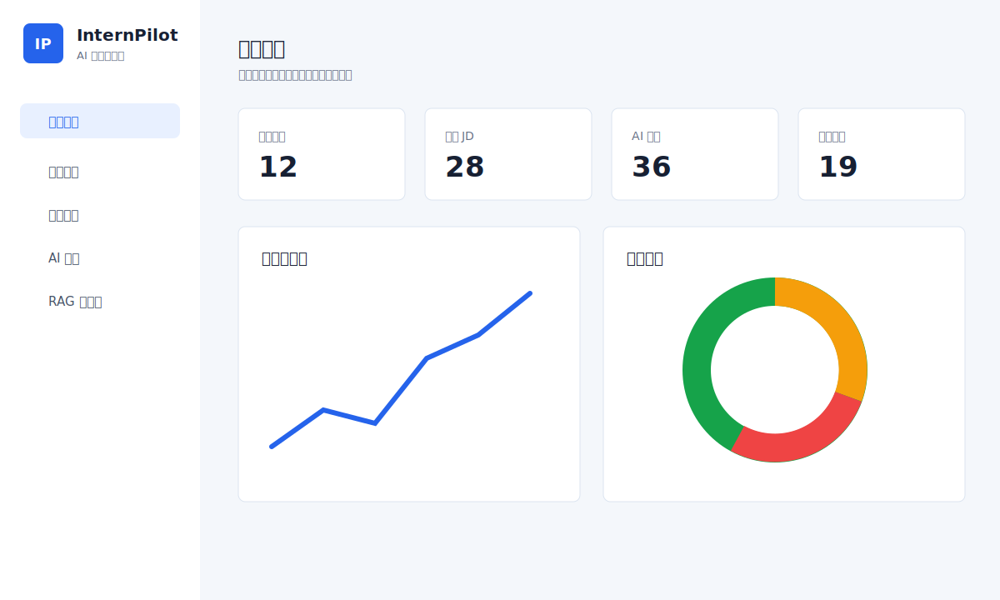
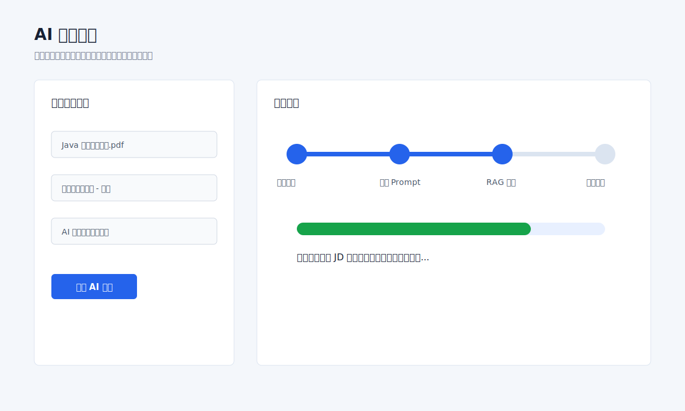
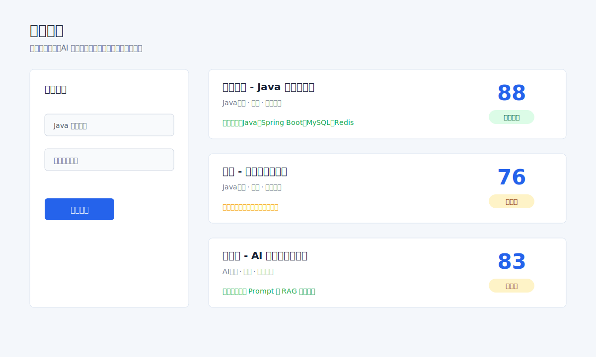
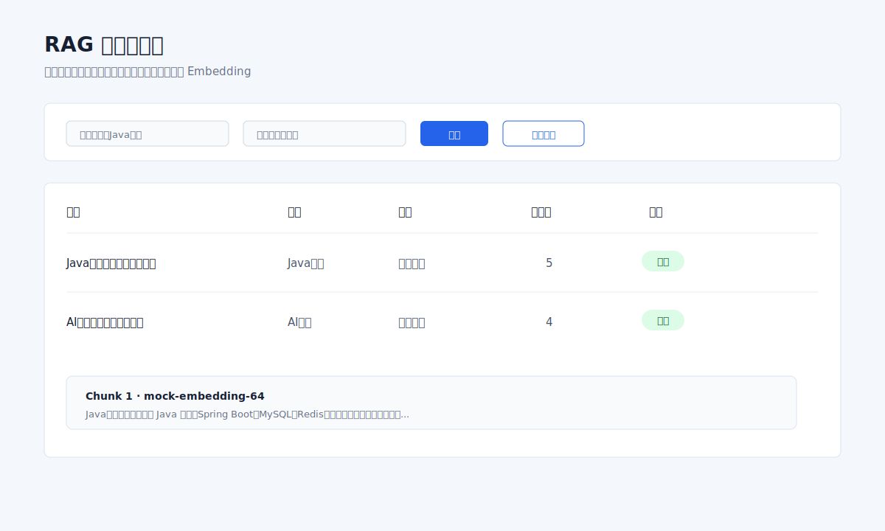
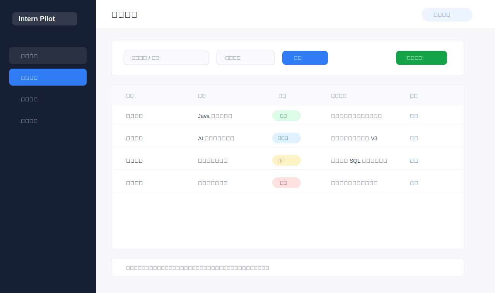
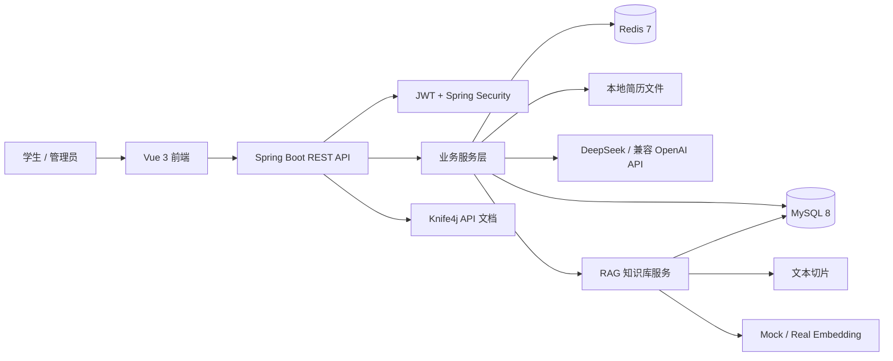
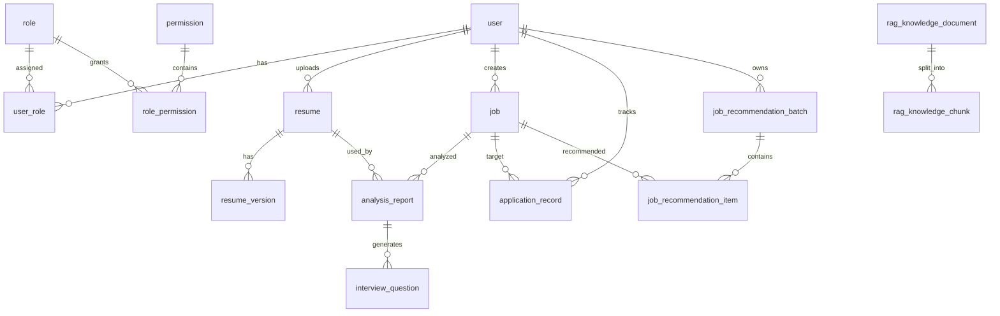

# 🚀 Intern Pilot 智能实习领航员

> 面向大学生实习求职场景的 AI 简历分析、岗位推荐、面试准备与 RAG 岗位知识库平台。

Intern Pilot 将“简历解析、岗位匹配、岗位推荐、投递跟踪、面试题生成、管理员运营、RAG 知识增强”整合到一个前后端分离系统中，帮助学生把求职准备从零散记录升级为可追踪、可解释、可持续优化的完整流程。

## 📌 项目概述

### 项目背景

大学生在寻找实习时通常会遇到这些问题：

- 简历内容与岗位 JD 之间的差距不清晰，修改方向模糊。
- 岗位信息来源分散，难以判断哪些岗位真正适合自己。
- 面试准备依赖临时搜索，缺少与个人简历、目标岗位相关的针对性题目。
- 投递进展容易遗忘，无法沉淀复盘记录。
- 管理端缺少对岗位、用户、权限、操作日志和知识库的统一维护能力。

Intern Pilot 针对上述场景构建了一个“学生求职助手 + 管理后台 + AI 能力中台”的实训级项目。当前版本在原有岗位推荐模块基础上，引入 RAG 岗位知识库：管理员可以维护岗位方向知识文档，系统自动切片、生成 Embedding，并在简历匹配分析和面试题生成时检索相关知识作为上下文。

### 核心价值与创新点

- **AI 简历匹配分析**：根据学生简历和岗位 JD 输出匹配分、优势、短板和改进建议。
- **RAG 知识增强**：把岗位方向、技能要求、面试经验沉淀为可检索知识，减少纯 Prompt 生成的空泛回答。
- **岗位推荐闭环**：从岗位录入、推荐生成、推荐理由到投递记录形成完整链路。
- **面试题生成**：结合分析报告和岗位知识库生成更贴近目标岗位的面试题。
- **权限化管理后台**：支持用户、角色、权限、操作日志、RAG 知识库等后台管理能力。
- **可扩展 AI 架构**：当前内置 Mock Embedding，后续可替换为真实 Embedding 服务和向量数据库。

### 适用人群

- 正在准备实习或校招的大学生。
- 需要演示 AI + Spring Boot + Vue 项目的课程团队。
- 想学习 RAG 工程落地、权限系统、前后端分离项目的开发者。
- 希望二次开发校园就业助手、简历分析平台或招聘推荐系统的团队。

## 📝 更新日志

| 版本 | 日期 | 更新内容 |
| --- | --- | --- |
| v0.3.0 | 2026-05-12 | 根据 `27-rag-job-knowledge-base-design.md` 接入 RAG 岗位知识库：新增知识文档/切片/Embedding 服务、管理端页面、AI 分析与面试题生成增强、README 重写。 |
| v0.2.0 | 2026-05-11 | 完成岗位推荐模块：推荐批次、推荐结果、前端推荐页面、推荐记录接口。 |
| v0.1.0 | 2026-05-06 | 完成基础前后端框架、认证注册、简历管理、岗位管理、AI 匹配分析、投递记录和管理后台雏形。 |

## 🖼️ 功能演示

> 暂无线上演示地址。可以按“快速开始”在本地启动：后端 `http://localhost:8080`，前端 `http://localhost:5173`。

### 数据看板



### AI 匹配分析



### 岗位推荐



### RAG 知识库管理



### 投递记录



### 功能特性

| 模块 | 能力说明 |
| --- | --- |
| 用户认证 | 用户注册、登录、JWT 鉴权、当前用户信息查询。 |
| 简历管理 | 上传 PDF/DOCX 简历、解析文本、设置默认简历、简历版本管理。 |
| 岗位管理 | 岗位 JD 录入、查询、编辑、删除，为匹配和推荐提供数据源。 |
| AI 匹配分析 | 结合简历、岗位 JD 和 RAG 检索结果生成结构化匹配报告。 |
| 岗位推荐 | 根据学生简历和岗位库生成推荐批次、推荐岗位和推荐理由。 |
| 投递记录 | 记录投递岗位、状态、备注、面试进展，形成求职闭环。 |
| 面试题生成 | 基于分析报告和岗位知识库生成个性化面试题。 |
| RAG 知识库 | 管理岗位知识文档、自动切片、生成向量、测试检索效果。 |
| 管理后台 | 用户管理、角色权限、操作日志、仪表盘、知识库维护。 |

## 🏗️ 技术架构

### 系统架构图



### RAG 工作流


### 技术栈与版本

| 层级 | 技术 |
| --- | --- |
| 后端 | Java 17、Spring Boot 3.3.5、Spring Security、Spring AOP、Validation |
| 数据访问 | MyBatis-Plus 3.5.9、MySQL Connector/J |
| API 文档 | Knife4j OpenAPI 3 4.5.0 |
| AI 能力 | DeepSeek 兼容接口、PromptUtils、MockEmbeddingClient |
| 缓存与会话辅助 | Redis |
| 文件解析 | Apache PDFBox、Apache POI |
| 前端 | Vue 3.5、Vite 6、TypeScript 5.7、Vue Router 4、Pinia |
| UI 与图表 | Element Plus 2.11、ECharts 5.6、Dayjs |

### 目录结构

```text
intern-pilot
├─ backend/
│  └─ intern-pilot-backend/
│     ├─ src/main/java/com/internpilot/
│     │  ├─ controller/          # REST接口与管理端接口
│     │  ├─ service/             # 业务服务接口与实现
│     │  ├─ mapper/              # MyBatis-Plus Mapper
│     │  ├─ entity/              # 数据库实体
│     │  ├─ dto/                 # 请求对象
│     │  ├─ vo/                  # 响应对象
│     │  ├─ security/            # JWT与权限控制
│     │  ├─ client/              # AI与Embedding客户端
│     │  ├─ runner/              # 启动数据补偿任务
│     │  └─ util/                # Prompt、文本切片、向量工具
│     └─ src/main/resources/
│        ├─ mapper/              # XML SQL映射
│        └─ sql/init.sql         # 表结构、权限、基础数据
├─ frontend/
│  └─ intern-pilot-frontend/
│     ├─ src/api/                # Axios接口封装
│     ├─ src/views/              # 页面视图
│     ├─ src/components/         # 通用组件与布局
│     ├─ src/router/             # 路由与权限元信息
│     └─ src/stores/             # Pinia状态管理
├─ docs/
│  ├─ 27-rag-job-knowledge-base-design.md
│  └─ assets/screenshots/        # README演示图
└─ README.md
```

### 核心模块设计

- **认证与权限模块**：`AuthController`、`SecurityConfig`、`JwtAuthenticationFilter` 负责登录注册、JWT 解析、角色权限校验。
- **简历模块**：`ResumeController` 与简历版本接口负责上传、解析、版本管理和默认简历设置。
- **岗位模块**：`JobController` 维护岗位基础数据和 JD 内容。
- **AI 分析模块**：`AnalysisServiceImpl` 调用 RAG 检索，将知识库上下文拼接进分析 Prompt。
- **岗位推荐模块**：`JobRecommendationController` 提供推荐批次生成、列表、详情和删除接口。
- **面试题模块**：`InterviewQuestionServiceImpl` 结合分析报告与 RAG 知识生成面试题。
- **RAG 知识库模块**：`RagKnowledgeServiceImpl` 负责知识文档 CRUD、切片重建、Embedding 生成、相似度检索。
- **启动补偿模块**：`RagKnowledgeBootstrapRunner` 会为已有但未生成切片的启用文档补建知识片段。
- **前端管理模块**：`AdminRagKnowledgeList.vue` 提供知识库列表、创建编辑、详情查看和检索测试。

## ⚡ 快速开始

### 环境要求

| 依赖 | 推荐版本 |
| --- | --- |
| JDK | 17 |
| Node.js | 18+ |
| npm | 9+ |
| MySQL | 8.0+ |
| Redis | 7.x |

### 克隆项目

```bash
git clone <your-gitee-repo-url>
cd intern-pilot
```

### 后端配置与启动

1. 创建数据库：

```sql
CREATE DATABASE intern_pilot DEFAULT CHARACTER SET utf8mb4 COLLATE utf8mb4_unicode_ci;
```

2. 启动 MySQL 和 Redis。

3. 配置环境变量。未配置时会使用 `application-dev.yml` 中的默认值：

| 变量 | 默认值 | 说明 |
| --- | --- | --- |
| `MYSQL_HOST` | `localhost` | MySQL主机 |
| `MYSQL_PORT` | `3306` | MySQL端口 |
| `MYSQL_DATABASE` | `intern_pilot` | 数据库名 |
| `MYSQL_USERNAME` | `root` | 数据库用户 |
| `MYSQL_PASSWORD` | `root` | 数据库密码 |
| `REDIS_HOST` | `localhost` | Redis主机 |
| `REDIS_PORT` | `6379` | Redis端口 |
| `JWT_SECRET` | 开发默认值 | 生产环境必须替换 |
| `AI_API_KEY` | 空 | DeepSeek或兼容API密钥 |
| `AI_BASE_URL` | `https://api.deepseek.com` | AI接口地址 |
| `AI_MODEL` | `deepseek-v4-pro` | AI模型名 |

4. 启动后端：

```powershell
cd backend\intern-pilot-backend
.\gradlew.bat bootRun
```

5. 验证健康检查：

```powershell
Invoke-WebRequest http://localhost:8080/api/health
```

### 前端配置与启动

```powershell
cd frontend\intern-pilot-frontend
npm install
npm run dev
```

访问前端：

```text
http://localhost:5173
```

Vite 已配置 `/api` 代理到 `http://localhost:8080`。

### 默认账号信息

当前项目支持前端注册普通用户。管理员账号建议在本地数据库中创建用户后，通过角色表和用户角色表绑定 `ADMIN` 角色。

> 注意：注册用户名长度必须为 3 到 50 位。如果浏览器控制台出现“用户名长度必须在 3 到 50 位之间”，请检查注册表单输入是否符合规则。

### 测试数据说明

系统启动时会执行 `src/main/resources/sql/init.sql`，包含：

- 基础角色：`USER`、`ADMIN`。
- 权限数据：用户、角色、岗位、简历、分析、投递、推荐、面试题、RAG 知识库等权限。
- 管理员角色授权：`ADMIN` 默认拥有全部权限。
- RAG 示例知识文档：
  - `Java后端实习岗位能力模型`
  - `AI应用开发实习岗位知识`
- RAG 表结构：`rag_knowledge_document`、`rag_knowledge_chunk`。

## 🧑‍💻 开发指南

### 本地开发流程

```powershell
# 后端编译
cd backend\intern-pilot-backend
.\gradlew.bat compileJava

# 后端测试
.\gradlew.bat test

# 前端构建
cd ..\..\frontend\intern-pilot-frontend
npm run build
```

### API 文档

后端启动后访问：

```text
http://localhost:8080/doc.html
```

常用接口示例：

| 模块 | 方法与路径 | 说明 |
| --- | --- | --- |
| 健康检查 | `GET /api/health` | 检查后端服务状态 |
| 认证 | `POST /api/auth/register` | 用户注册 |
| 认证 | `POST /api/auth/login` | 用户登录 |
| 当前用户 | `GET /api/user/me` | 获取当前用户信息 |
| 简历 | `POST /api/resumes/upload` | 上传简历 |
| 岗位 | `GET /api/jobs` | 查询岗位列表 |
| AI分析 | `POST /api/analysis/match` | 生成简历岗位匹配分析 |
| 岗位推荐 | `POST /api/job-recommendations/generate` | 生成岗位推荐 |
| 面试题 | `POST /api/interview-questions/generate` | 生成面试题 |
| RAG知识库 | `GET /api/admin/rag/knowledge` | 查询知识文档 |
| RAG知识库 | `POST /api/admin/rag/knowledge/search` | 测试知识检索 |

登录请求示例：

```http
POST /api/auth/login
Content-Type: application/json

{
  "username": "student01",
  "password": "123456"
}
```

RAG 检索请求示例：

```http
POST /api/admin/rag/knowledge/search
Authorization: Bearer <token>
Content-Type: application/json

{
  "query": "Java后端实习需要掌握哪些技能",
  "direction": "Java后端",
  "topK": 5
}
```

### 数据库设计



核心表说明：

| 表名 | 用途 |
| --- | --- |
| `user` | 用户基础信息 |
| `role` / `permission` | RBAC角色权限 |
| `resume` / `resume_version` | 简历与版本管理 |
| `job` | 岗位基础信息与JD |
| `analysis_report` | AI匹配分析报告 |
| `job_recommendation_batch` / `job_recommendation_item` | 岗位推荐批次与结果 |
| `application_record` | 投递记录 |
| `interview_question` | 面试题生成结果 |
| `operation_log` | 管理端操作日志 |
| `rag_knowledge_document` | RAG知识文档 |
| `rag_knowledge_chunk` | RAG知识切片与向量 |

### 前端组件说明

| 文件 | 说明 |
| --- | --- |
| `src/components/layout/AppLayout.vue` | 主布局容器 |
| `src/components/layout/AppSidebar.vue` | 侧边栏菜单与权限控制 |
| `src/components/common/PageContainer.vue` | 页面标题与内容容器 |
| `src/views/analysis/AnalysisPage.vue` | 简历匹配分析页面 |
| `src/views/recommendation/JobRecommendationList.vue` | 岗位推荐页面 |
| `src/views/admin/AdminRagKnowledgeList.vue` | RAG知识库管理页面 |
| `src/api/*.ts` | 后端接口封装 |
| `src/stores/auth.ts` | 登录态、Token、权限状态 |

### 单元测试与质量检查

- 后端编译：`.\gradlew.bat compileJava`
- 后端测试：`.\gradlew.bat test`
- 前端类型检查与构建：`npm run build`
- API联调：启动后端后访问 `http://localhost:8080/doc.html`

## 🚢 部署说明

### 生产环境配置

生产环境建议通过环境变量覆盖敏感配置：

```bash
MYSQL_HOST=127.0.0.1
MYSQL_PORT=3306
MYSQL_DATABASE=intern_pilot
MYSQL_USERNAME=intern_pilot
MYSQL_PASSWORD=your-strong-password
REDIS_HOST=127.0.0.1
REDIS_PORT=6379
JWT_SECRET=replace-with-long-random-secret
AI_API_KEY=your-ai-api-key
AI_BASE_URL=https://api.deepseek.com
AI_MODEL=deepseek-v4-pro
```

### 后端打包与运行

```powershell
cd backend\intern-pilot-backend
.\gradlew.bat clean bootJar
java -jar build\libs\intern-pilot-backend-0.0.1-SNAPSHOT.jar
```

### 前端构建

```powershell
cd frontend\intern-pilot-frontend
npm install
npm run build
```

构建产物位于：

```text
frontend/intern-pilot-frontend/dist
```

### Nginx 配置示例

```nginx
server {
    listen 80;
    server_name your-domain.com;

    root /var/www/intern-pilot/dist;
    index index.html;

    location / {
        try_files $uri $uri/ /index.html;
    }

    location /api/ {
        proxy_pass http://127.0.0.1:8080/api/;
        proxy_set_header Host $host;
        proxy_set_header X-Real-IP $remote_addr;
        proxy_set_header X-Forwarded-For $proxy_add_x_forwarded_for;
        proxy_set_header X-Forwarded-Proto $scheme;
    }
}
```

### 部署注意事项

- 生产环境必须修改 `JWT_SECRET`，不要使用开发默认值。
- `AI_API_KEY` 不要提交到代码仓库。
- MySQL 字符集建议使用 `utf8mb4`。
- Redis 未设置密码时只建议用于本地开发。
- RAG 当前使用 MySQL JSON 存储向量和内存相似度计算，适合课程项目与小规模演示；生产大规模知识库建议替换为 Qdrant、Milvus、pgvector 或 Elasticsearch 向量检索。
- Mock Embedding 用于开发验证，真实语义检索效果需要接入正式 Embedding 模型。

## 🧩 本次实现内容

根据 `docs/27-rag-job-knowledge-base-design.md`，当前已完成：

- 新增 RAG 知识文档与知识切片实体、Mapper、DTO、VO。
- 新增 `RagKnowledgeServiceImpl`，支持创建、编辑、删除、重建切片、分页查询、详情查询、TopK 检索。
- 新增 `RagKnowledgeBootstrapRunner`，启动时为已有知识文档补建切片。
- 新增 `rag:knowledge:read/write/delete` 权限，并纳入管理员角色。
- 新增 Java 后端、AI 应用两个默认知识文档种子数据。
- AI 匹配分析接入 RAG 检索上下文。
- 面试题生成接入 RAG 检索上下文。
- 前端新增 RAG 知识库管理页、路由、侧边栏入口。
- README 与演示截图已更新。

## 🛠️ 遇到的问题与解决方案

| 问题 | 原因 | 解决方案 |
| --- | --- | --- |
| 岗位推荐页面提示“系统内部错误” | 后端服务未更新、旧进程仍占用端口，或数据库缺少新表/字段 | 重启后端，确认 `init.sql` 执行成功，并访问 `/api/health` 验证服务。 |
| 注册时报“用户名长度必须在 3 到 50 位之间” | 表单输入未满足后端校验规则 | 用户名使用 3 到 50 位字符，例如 `student01`。 |
| 前端事件出现 `Unhandled error during execution of component event handler` | 请求异常未被页面显式捕获 | 在页面请求中增加 `try/catch`，失败时用 Element Plus 消息提示。 |
| RAG 检索语义效果有限 | 当前使用 `MockEmbeddingClient`，仅用于本地开发演示 | 后续替换真实 Embedding API，并引入专业向量数据库。 |
| Windows 终端显示中文乱码 | PowerShell 编码显示与文件 UTF-8 编码不一致 | 以构建结果、IDE显示和浏览器渲染为准，文档与源码保持 UTF-8。 |

## 🤝 贡献指南

欢迎通过 Issue 和 Pull Request 参与改进。

1. Fork 本仓库。
2. 创建功能分支：`feature/your-feature-name`。
3. 保持代码风格与现有项目一致。
4. 提交前运行后端编译和前端构建。
5. 提交 PR 时说明改动范围、验证方式和潜在影响。

代码规范建议：

- 后端接口返回统一使用项目现有响应结构。
- DTO/VO 命名保持请求与响应分离。
- 前端页面优先复用 Element Plus 与现有布局组件。
- 新增权限时同步更新 SQL 种子数据和前端路由元信息。
- AI Prompt 变更需要说明输入、输出格式和降级策略。

## 📄 许可证

当前仓库尚未包含独立 `LICENSE` 文件。若作为开源项目发布到 Gitee，建议补充 MIT License 或 Apache License 2.0，并在此处更新最终协议声明。

## 📬 联系方式

- 作者：请在 Gitee 主页或仓库信息中补充作者名称。
- 问题反馈：请通过 Gitee Issues 提交缺陷、建议或使用问题。
- 项目方向：欢迎围绕 AI 求职助手、RAG 知识库、岗位推荐算法和校园就业服务继续扩展。
