# InternPilot 智能实习领航员


> 面向大学生实习求职场景的 AI 简历优化、岗位匹配与面试准备平台

InternPilot 是一个前后端分离的 AI 实习投递与简历优化平台。系统支持简历上传解析、岗位 JD 管理、AI 简历匹配分析、WebSocket 实时进度展示、AI 面试题生成、岗位推荐、投递记录、RAG 岗位知识库、RBAC 权限管理和管理员后台。

项目采用前后端分离架构，后端基于 Spring Boot、Spring Security、MyBatis-Plus、MySQL、Redis 和 DeepSeek API，前端基于 Vue 3、TypeScript、Element Plus、Vue Router 和 Axios。

## 项目概述

### 项目背景与应用场景

大学生在找实习过程中常见的问题包括：

- 不知道自己的简历和岗位 JD 是否匹配
- 不知道岗位要求背后真正考察哪些能力
- 面试准备缺少针对性
- 投递记录分散，难以管理
- 缺少一个能把"简历、岗位、分析、面试题、投递"串起来的工具

InternPilot 希望通过 AI 技术帮助学生更高效地完成实习准备。

### 核心价值与创新点

- **AI 简历匹配分析**：根据简历和岗位 JD 输出匹配分、优势、短板、缺失技能和改进建议
- **WebSocket 实时进度**：异步分析任务进度实时推送，支持刷新恢复
- **AI 面试题生成**：结合分析报告、岗位信息和 RAG 知识库上下文，生成分类、难度、答案、追问的结构化面试题
- **RAG 岗位知识库**：管理员维护岗位方向知识，系统自动切片、生成 Embedding，在分析和面试题生成时检索相关知识增强 AI 输出
- **DeepSeek + Mock AI 双模式**：支持 DeepSeek 真实 API 和 Mock AI 本地演示，无 API Key 也能完整体验
- **RBAC 管理后台**：用户、角色、权限、操作日志、仪表盘和知识库管理
- **岗位推荐闭环**：从岗位库、推荐批次、推荐理由到投递记录形成完整求职链路
- **完整测试体系**：JUnit 5、Mockito、MockMvc、Spring Security Test、H2 和前端类型检查覆盖核心链路
- **GitHub Actions CI**：推送或 PR 时自动运行后端测试和前端构建

### 适用人群

- 正在准备实习投递的大学生
- 希望优化简历的求职者
- 希望根据岗位 JD 准备面试题的学生
- 学习 Spring Boot + Vue 前后端分离项目的开发者
- 想了解 AI 应用系统落地方式的初学者

## 更新日志

| 版本 | 日期 | 更新内容 |
| --- | --- | --- |
| v0.5.0 | 2026-05-15 | 根据 `34-product-experience-bugfix-and-acceptance-design.md` 完成产品体验验收与 P0/P1 Bug 修复，根据 `35-readme-demo-script-and-project-packaging-design.md` 整理 README 与项目最终包装 |
| v0.4.0 | 2026-05-13 | 根据 `28-testing-enhancement.md` 增强测试体系：补充 RAG 服务测试、测试运行配置、前端 `type-check` 脚本、GitHub Actions CI |
| v0.3.0 | 2026-05-12 | 根据 `27-rag-job-knowledge-base-design.md` 接入 RAG 岗位知识库，新增知识文档、切片、Embedding、检索、管理页面和 AI 上下文增强 |
| v0.2.0 | 2026-05-11 | 完成岗位推荐模块：推荐批次、推荐结果、前端推荐页面和推荐记录接口 |
| v0.1.0 | 2026-05-06 | 完成基础前后端框架、认证注册、简历管理、岗位管理、AI 匹配分析、投递记录和管理后台雏形 |

## 功能演示

### 登录页面

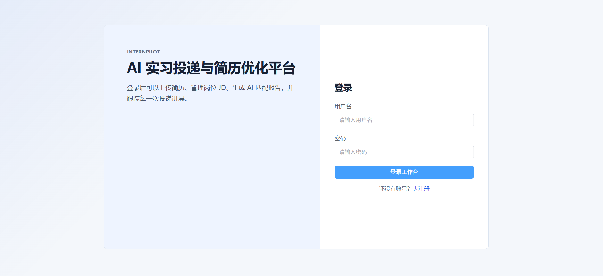

### 用户工作台

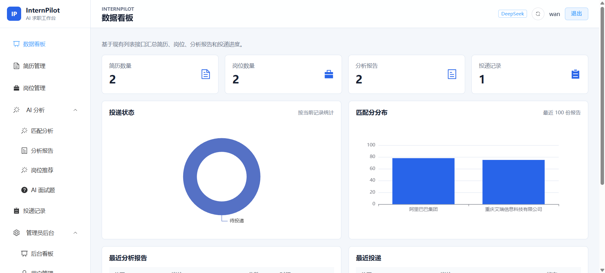

### 简历管理

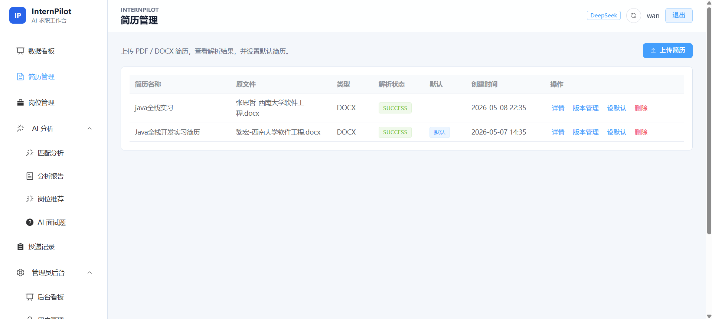

### 岗位 JD 管理

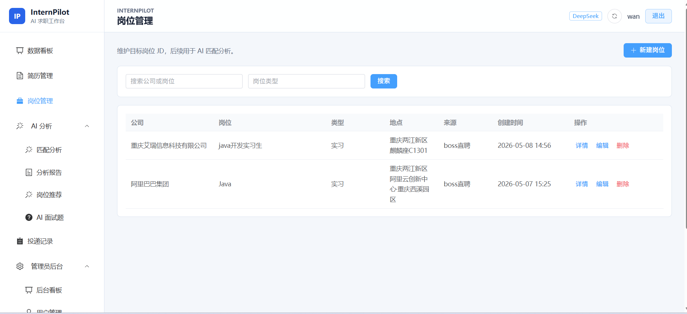

### AI 匹配分析进度

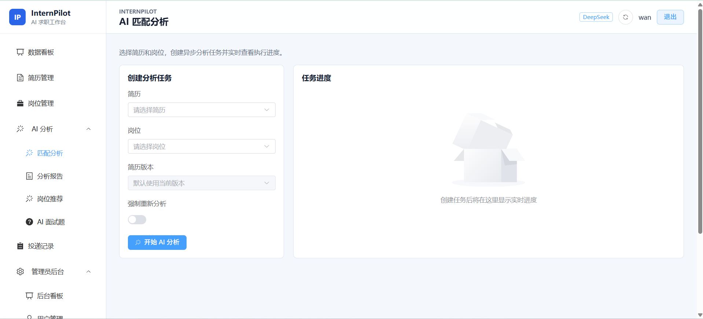

### AI 分析报告

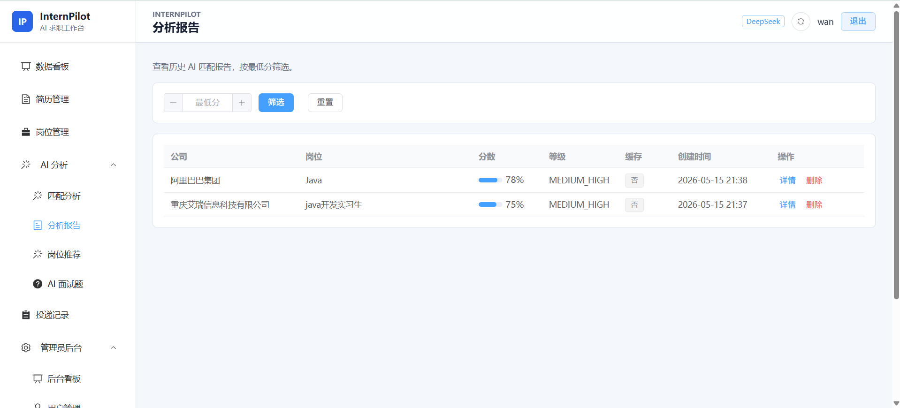

### AI 面试题列表

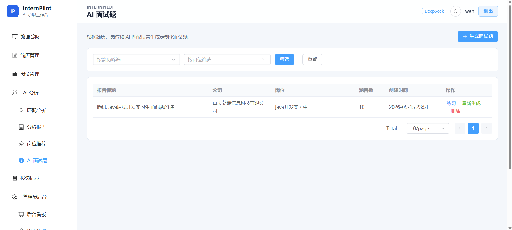

### AI 面试题详情

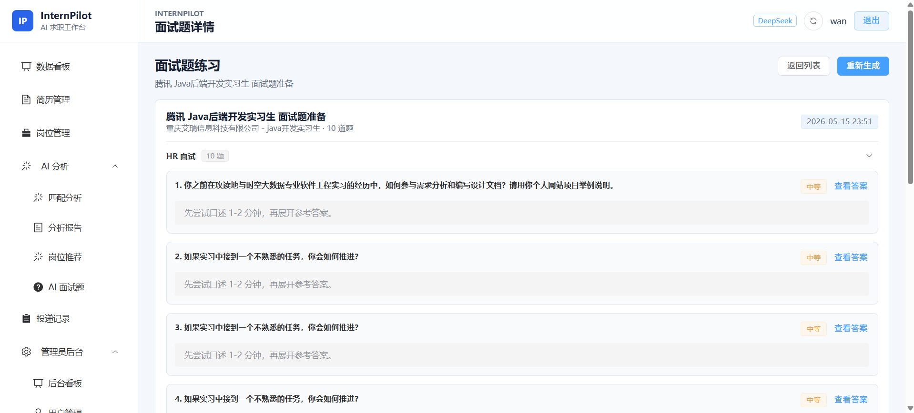

### 管理员后台 - 用户管理

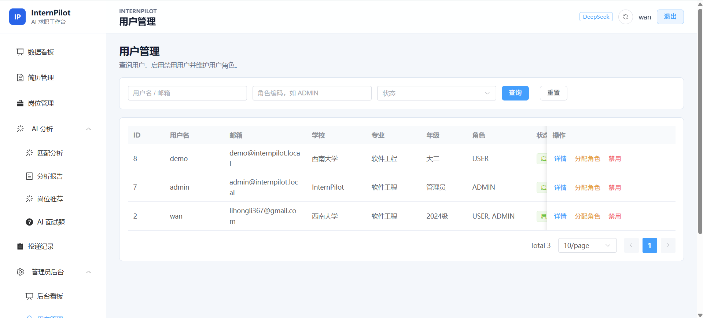

### 管理员后台 - RAG 知识库

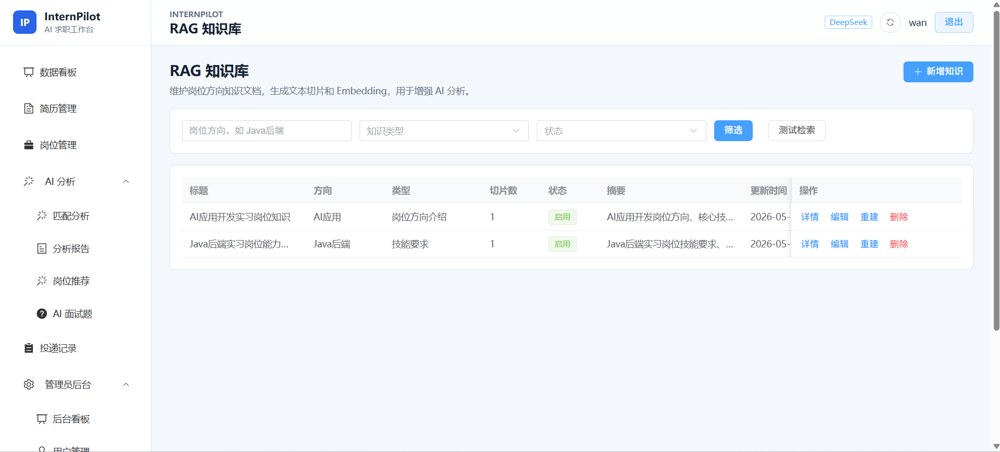

### 核心功能列表

| 模块 | 功能说明 |
| --- | --- |
| 用户认证 | 注册、登录、JWT 鉴权、当前用户信息 |
| RBAC 权限 | 用户、角色、权限、菜单和按钮权限控制 |
| 简历管理 | 简历上传、解析、默认简历、版本管理 |
| 岗位 JD 管理 | 岗位创建、编辑、删除、JD 内容维护 |
| AI 匹配分析 | 根据简历和岗位生成匹配分数、优势、短板和建议 |
| WebSocket 进度 | 实时展示 AI 分析任务进度，支持刷新恢复 |
| AI 缓存 | 使用 Redis 缓存分析结果，避免重复调用 AI |
| DeepSeek 接入 | 支持 deepseek-v4-flash 和 deepseek-v4-pro |
| Mock AI | 无 API Key 时也能本地演示和测试 |
| AI 面试题 | 生成分类、难度、答案、追问、关键词 |
| 岗位推荐 | 根据用户简历和岗位信息生成推荐结果 |
| 投递记录 | 管理投递状态、备注和时间线 |
| RAG 知识库 | 管理岗位知识，支持上下文增强 |
| 操作日志 | 记录系统关键操作 |
| 管理员后台 | 用户、角色、权限、RAG、日志管理 |

## 技术架构

### 系统架构图

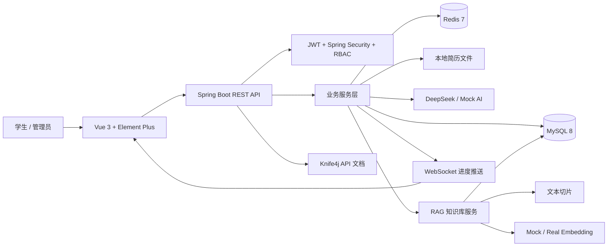

### 测试架构图

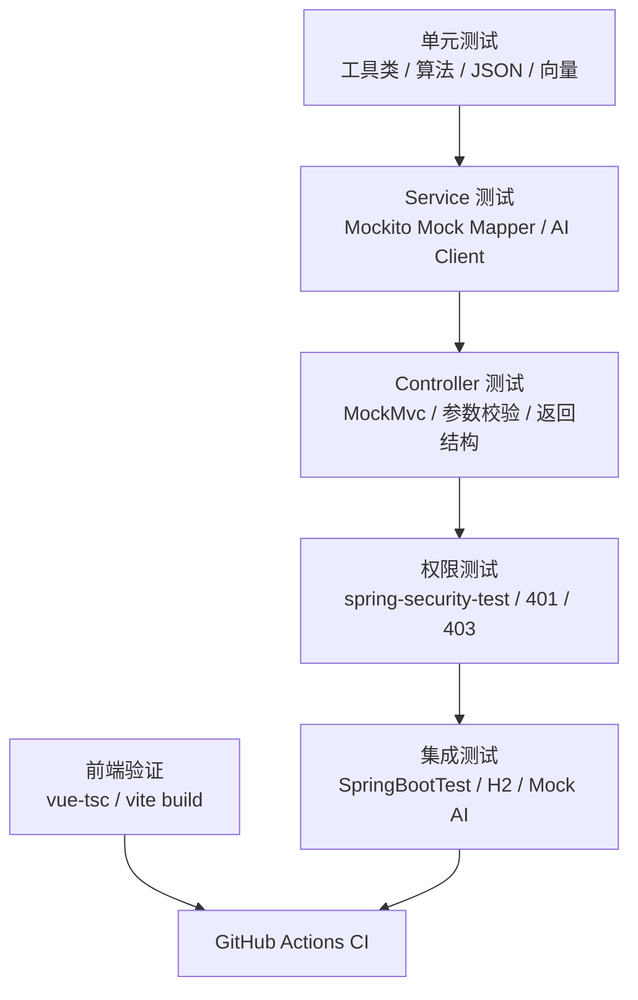

### RAG 工作流

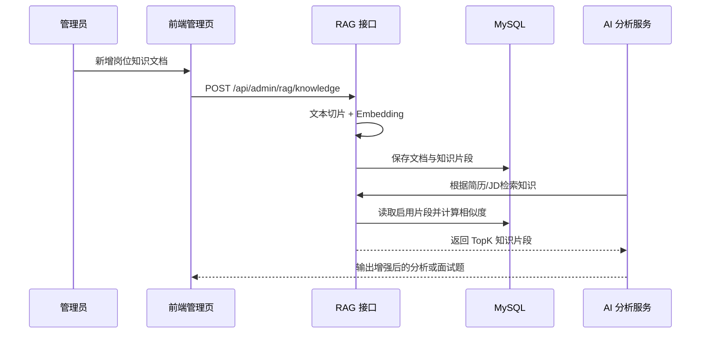

### 技术栈

| 层级 | 技术 |
| --- | --- |
| 后端框架 | Java 17、Spring Boot 3.3.5、Spring Security、Spring AOP、Validation |
| 数据访问 | MyBatis-Plus 3.5.9、MySQL Connector/J |
| API 文档 | Knife4j OpenAPI 3 4.5.0 |
| AI 能力 | DeepSeek 兼容接口、PromptUtils、MockAiClient、MockEmbeddingClient |
| 缓存 | Redis |
| 文件解析 | Apache PDFBox、Apache POI |
| 后端测试 | JUnit 5、Mockito、Spring Boot Test、MockMvc、spring-security-test、H2 |
| 前端框架 | Vue 3.5、Vite 6、TypeScript 5.7、Vue Router 4、Pinia |
| UI 与图表 | Element Plus 2.11、ECharts 5.6、Dayjs |
| CI | GitHub Actions |

### 目录结构

```text
intern-pilot
├─ .github/
│  └─ workflows/
│     ├─ ci.yml
│     └─ docker-build.yml
├─ backend/
│  └─ intern-pilot-backend/
│     ├─ src/main/java/com/internpilot/
│     │  ├─ controller/       # REST 接口
│     │  ├─ service/          # 业务服务
│     │  ├─ mapper/           # MyBatis-Plus Mapper
│     │  ├─ entity/           # 数据库实体
│     │  ├─ dto/              # 请求对象
│     │  ├─ vo/               # 响应对象
│     │  ├─ security/         # JWT 与权限控制
│     │  ├─ runner/           # 启动补偿任务
│     │  └─ util/             # Prompt、文本切片、向量、JSON 工具
│     ├─ src/test/java/       # JUnit / Mockito / MockMvc 测试
│     └─ src/test/resources/  # application-test.yml 与测试 SQL
├─ frontend/
│  └─ intern-pilot-frontend/
│     ├─ src/api/             # Axios 接口封装
│     ├─ src/views/           # 页面视图
│     ├─ src/components/      # 通用组件与布局
│     ├─ src/router/          # 路由与权限元信息
│     └─ src/stores/          # Pinia 状态管理
├─ deploy/
│  ├─ docker-compose.yml
│  └─ .env.example
├─ docs/
│  ├─ 30-rbac-permission-enhancement-local-dev-design.md
│  ├─ 31-websocket-ai-progress-enhancement-test-design.md
│  ├─ 32-ai-analysis-cache-and-mock-ai-enhancement-design.md
│  ├─ 33-interview-question-enhancement-test-design.md
│  ├─ 34-product-experience-bugfix-and-acceptance-design.md
│  ├─ 35-readme-demo-script-and-project-packaging-design.md
│  └─ assets/screenshots/
└─ README.md
```

## 快速开始

### 环境要求

| 依赖 | 推荐版本 |
| --- | --- |
| JDK | 17+ |
| Node.js | 18+ |
| MySQL | 8.0+ |
| Redis | 7.x |
| Gradle | 使用项目自带 Gradle Wrapper |

### 克隆项目

GitHub 主仓库：

```bash
git clone https://github.com/wan719/intern-pilot.git
cd intern-pilot
```

Gitee 同步仓库：

```bash
git clone https://gitee.com/你的用户名/intern-pilot.git
cd intern-pilot
```

### 后端启动

1. 创建数据库：

```sql
CREATE DATABASE intern_pilot DEFAULT CHARACTER SET utf8mb4 COLLATE utf8mb4_unicode_ci;
```

2. 启动 MySQL 和 Redis。

3. 根据需要配置环境变量：

| 变量 | 默认值 | 说明 |
| --- | --- | --- |
| `MYSQL_HOST` | `localhost` | MySQL 主机 |
| `MYSQL_PORT` | `3306` | MySQL 端口 |
| `MYSQL_DATABASE` | `intern_pilot` | 数据库名 |
| `MYSQL_USERNAME` | `root` | 数据库用户 |
| `MYSQL_PASSWORD` | `root` | 数据库密码 |
| `REDIS_HOST` | `localhost` | Redis 主机 |
| `REDIS_PORT` | `6379` | Redis 端口 |
| `JWT_SECRET` | 开发默认值 | 生产环境必须替换 |
| `AI_PROVIDER` | `deepseek` | AI 提供方，真实演示用 `deepseek`，无 Key/测试可用 `mock` |
| `DEEPSEEK_API_KEY` | 空 | DeepSeek API Key，**不要写入仓库** |
| `AI_BASE_URL` | `https://api.deepseek.com` | AI 接口地址 |
| `AI_MODEL` | `deepseek-v4-flash` | 默认 AI 模型名 |
| `AI_PRO_MODEL` | `deepseek-v4-pro` | 复杂分析模型名 |
| `AI_TIMEOUT_SECONDS` | `60` | AI 调用超时时间，单位秒 |

4. 启动后端：

```powershell
cd backend/intern-pilot-backend
.\gradlew.bat bootRun
```

5. 验证服务：

```powershell
Invoke-WebRequest http://localhost:8080/api/health
```

### 前端启动

```powershell
cd frontend/intern-pilot-frontend
npm install
npm run dev
```

访问：

```text
http://localhost:5173
```

### 默认账号与测试数据

| 账号 | 密码 | 角色 | 说明 |
| --- | --- | --- | --- |
| `admin` | `123456` | 系统管理员 | 拥有全部权限，可访问管理后台 |
| `demo` | `123456` | 普通用户 | 用于体验核心功能 |

> 以上账号仅用于本地开发和演示，生产环境请务必修改密码。

系统启动时会执行 `src/main/resources/sql/init.sql`，包含：

- 基础角色：`USER`、`ADMIN`
- 权限数据：用户、角色、岗位、简历、分析、推荐、投递、面试题、RAG 知识库等权限
- 管理员角色授权：`ADMIN` 默认拥有全部权限
- RAG 示例知识文档：`Java后端实习岗位能力模型`、`AI应用开发实习岗位知识`

## 开发指南

### DeepSeek API 配置

本地开发和真实演示默认可以使用 DeepSeek，密钥只通过环境变量注入，不要写入配置文件或提交到仓库。

PowerShell 示例：

```powershell
$env:AI_PROVIDER="deepseek"
$env:AI_BASE_URL="https://api.deepseek.com"
$env:DEEPSEEK_API_KEY="你的Key"
$env:AI_MODEL="deepseek-v4-flash"
$env:AI_PRO_MODEL="deepseek-v4-pro"
```

- `deepseek-v4-flash` 是默认模型，用于简历岗位分析、面试题生成、简历优化、岗位推荐等常规生成任务
- `deepseek-v4-pro` 用于 RAG_QA 或复杂深度分析场景
- Mock 模式仍然保留，适合测试、CI、本地无 Key 演示：

```powershell
$env:AI_PROVIDER="mock"
```

> 请不要将真实 API Key 提交到 Git 仓库。项目通过环境变量读取 API Key。

如果 `AI_PROVIDER=deepseek` 但未设置 `DEEPSEEK_API_KEY`，后端会返回明确的 AI 服务错误，提示配置环境变量。

### API 文档

后端启动后访问：

```text
http://localhost:8080/doc.html
```

常用接口：

| 模块 | 方法与路径 | 说明 |
| --- | --- | --- |
| 健康检查 | `GET /api/health` | 检查后端服务状态 |
| 认证 | `POST /api/auth/register` | 用户注册 |
| 认证 | `POST /api/auth/login` | 用户登录 |
| 当前用户 | `GET /api/user/me` | 获取当前用户信息 |
| 简历 | `POST /api/resumes/upload` | 上传简历 |
| 岗位 | `GET /api/jobs` | 查询岗位列表 |
| AI 分析 | `POST /api/analysis/match` | 生成简历岗位匹配分析 |
| 岗位推荐 | `POST /api/job-recommendations/generate` | 生成岗位推荐 |
| 面试题 | `POST /api/interview-questions/generate` | 生成面试题 |
| RAG 知识库 | `GET /api/admin/rag/knowledge` | 查询知识文档 |
| RAG 检索 | `POST /api/admin/rag/knowledge/search` | 测试知识检索 |

### 数据库设计

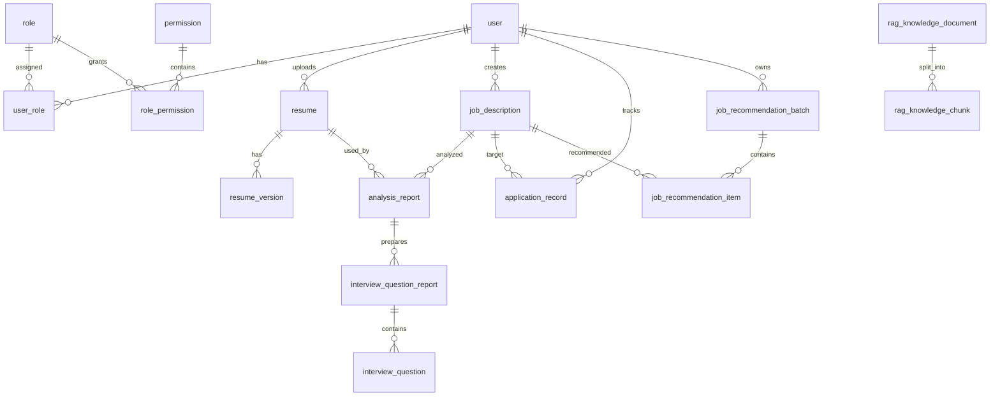

核心表：

| 表名 | 用途 |
| --- | --- |
| `user` | 用户基础信息 |
| `role` / `permission` | RBAC 角色权限 |
| `resume` / `resume_version` | 简历与版本管理 |
| `job_description` | 岗位基础信息与 JD |
| `analysis_report` | AI 匹配分析报告 |
| `job_recommendation_batch` / `job_recommendation_item` | 岗位推荐批次与结果 |
| `application_record` | 投递记录 |
| `interview_question_report` / `interview_question` | 面试题报告与题目明细 |
| `system_operation_log` | 管理端操作日志 |
| `rag_knowledge_document` | RAG 知识文档 |
| `rag_knowledge_chunk` | RAG 知识切片与向量 |

### 前端组件说明

| 文件 | 说明 |
| --- | --- |
| `src/components/layout/AppLayout.vue` | 主布局容器 |
| `src/components/layout/AppSidebar.vue` | 侧边栏菜单与权限控制 |
| `src/components/layout/AppHeader.vue` | 顶部栏，含 AI 模式指示器 |
| `src/components/common/PageContainer.vue` | 页面标题与内容容器 |
| `src/views/analysis/AnalysisMatch.vue` | 简历匹配分析页面 |
| `src/views/recommendation/JobRecommendationList.vue` | 岗位推荐页面 |
| `src/views/admin/AdminRagKnowledgeList.vue` | RAG 知识库管理页面 |
| `src/api/*.ts` | 后端接口封装 |
| `src/stores/auth.ts` | 登录态、Token、权限状态 |

## 测试与质量保障

### 已接入测试能力

| 类型 | 覆盖内容 |
| --- | --- |
| 工具类测试 | JSON 解析、技能关键词、文本切片、向量相似度、推荐分数 |
| JWT 测试 | Token 生成、解析、无效 Token 校验 |
| Controller 测试 | Auth、Resume 权限、Admin 权限 |
| Service 测试 | 简历、岗位、AI 分析、面试题、岗位推荐、投递记录、RAG 知识库 |
| AOP 测试 | 操作日志切面 |
| RBAC 权限测试 | 角色权限校验、接口鉴权、403 拦截 |
| WebSocket AI 进度测试 | 异步任务进度推送、状态流转、Redis 进度恢复 |
| AI 底座测试 | MockAiClient 多场景返回、缓存 key 版本化、AI 异常处理 |
| AI 面试题测试 | Prompt 构建、响应解析、分类/难度规范化、regenerate |
| Mock AI 测试 | 测试环境注入 MockAiClient，避免调用真实 AI API |
| 前端验证 | `vue-tsc` 类型检查、Vite 构建 |
| CI | GitHub Actions 自动执行后端测试和前端构建 |

### 本地验收命令

后端完整测试：

```powershell
cd backend/intern-pilot-backend
.\gradlew.bat test --no-daemon --max-workers=1
```

单独运行某个测试类：

```powershell
.\gradlew.bat test --tests RagKnowledgeServiceTest
```

前端类型检查与构建：

```powershell
cd frontend/intern-pilot-frontend
npm run type-check
npm run build
```

### GitHub Actions

CI 配置文件：

```text
.github/workflows/ci.yml          # 后端测试 + 前端构建
.github/workflows/docker-build.yml # Docker 镜像构建检查
```

触发条件：

- 推送到 `main` 或 `dev`
- 向 `main` 或 `dev` 发起 Pull Request

CI 执行内容：

- `./gradlew clean test`（后端单元测试与集成测试）
- `npm ci` + `npm run build`（前端类型检查与构建，`build` 内部会执行 `vue-tsc -b`）
- `docker compose build`（Docker 镜像构建验证）

## 部署说明

### Docker Compose 一键部署

项目已提供完整的 Docker Compose 编排，包含 MySQL、Redis、后端和前端四个服务，可一键启动。

**前置要求：**

- [Docker](https://docs.docker.com/get-docker/) 20.10+
- [Docker Compose](https://docs.docker.com/compose/install/) v2+

**部署步骤：**

```bash
# 1. 克隆项目
git clone https://github.com/wan719/intern-pilot.git
cd intern-pilot

# 2. 配置环境变量
cd deploy
cp .env.example .env
# 编辑 .env，填入真实的密码和 AI API Key

# 3. 一键启动
docker compose up -d --build

# 4. 查看服务状态
docker compose ps

# 5. 查看后端日志
docker compose logs -f backend
```

**服务端口：**

| 服务 | 端口 | 说明 |
| --- | --- | --- |
| 前端 (Nginx) | `80` | Vue 前端页面 |
| 后端 API | `8080` | Spring Boot REST API |
| API 文档 | `8080/doc.html` | Knife4j Swagger 文档 |
| MySQL | 容器内部 `3306` | 数据库，不暴露到宿主机 |
| Redis | 容器内部 `6379` | 缓存，不暴露到宿主机 |

**停止服务：**

```bash
docker compose down
```

### 后端打包运行

```powershell
cd backend/intern-pilot-backend
.\gradlew.bat clean bootJar
java -jar build\libs\intern-pilot-backend-0.0.1-SNAPSHOT.jar
```

### 前端构建

```powershell
cd frontend/intern-pilot-frontend
npm install
npm run build
# 构建产物位于 frontend/intern-pilot-frontend/dist
```

### Nginx 配置示例

```nginx
server {
    listen 80;
    server_name your-domain.com;

    root /var/www/intern-pilot/dist;
    index index.html;

    location / {
        try_files $uri $uri/ /index.html;
    }

    location /api/ {
        proxy_pass http://127.0.0.1:8080/api/;
        proxy_set_header Host $host;
        proxy_set_header X-Real-IP $remote_addr;
        proxy_set_header X-Forwarded-For $proxy_add_x_forwarded_for;
        proxy_set_header X-Forwarded-Proto $scheme;
    }
}
```

### 部署注意事项

- 生产环境必须修改 `JWT_SECRET`
- `DEEPSEEK_API_KEY` 不要提交到 GitHub 或 Gitee
- MySQL 建议使用 `utf8mb4`
- Redis 未设置密码时只建议用于本地开发
- 当前 RAG 使用 MySQL JSON 存储向量和内存相似度计算，适合课程项目和小规模演示；生产大规模知识库建议替换为 Qdrant、Milvus、pgvector 或 Elasticsearch 向量检索

## 团队成员与分工

| 成员 | 分工 |
| --- | --- |
| wan719 | 项目选题、需求分析、系统设计、后端开发、前端开发、数据库设计、AI 功能接入、测试编写、CI/CD 配置、Docker 部署、README 编写 |

## Git 分支与提交规范

| 分支 | 说明 |
| --- | --- |
| `main` | 稳定提交分支，用于最终课程提交 |
| `dev` | 开发集成分支 |
| `feature/*` | 功能开发分支 |

项目开发过程中按照功能模块进行提交，避免期末一次性提交。

## GitHub 主仓库 / Gitee 同步仓库说明

本项目采用双仓库策略：

| 平台 | 定位 | 地址 |
| --- | --- | --- |
| GitHub | 主仓库，主要开发、README 维护、CI/CD、提交历史保留 | `https://github.com/wan719/intern-pilot` |
| Gitee | 同步仓库，用于课程提交和国内访问 | `https://gitee.com/li-hong2006/intern-pilot` |

原则：

- README.md 以 GitHub 为主维护
- 代码以 GitHub 为主提交
- Gitee 只做同步，不在 Gitee 单独改代码

同步命令：

```bash
# 同步 main 分支到 Gitee
git checkout main
git pull origin main
git push gitee main

# 同步 dev 分支到 Gitee（可选）
git checkout dev
git pull origin dev
git push gitee dev
```

## Gitee 最终提交说明

课程最终提交内容：

| 内容 | 说明 |
| --- | --- |
| Gitee 仓库完整 URL | `https://gitee.com/li-hong2006/intern-pilot` |
| 项目名称 | InternPilot 智能实习领航员 |
| 团队成员及分工 | wan719，独立完成项目选题、需求分析、前后端开发、数据库设计、AI 接入、测试和 README 编写 |

提交前检查清单：

- [ ] Gitee 仓库公开可访问
- [ ] `main` 分支是最新稳定代码
- [ ] README 在 Gitee 上显示正常
- [ ] README 中截图路径正常
- [ ] README 中启动方式准确
- [ ] README 中测试数据和默认账号清楚
- [ ] 后端测试通过
- [ ] 前端构建通过
- [ ] 没有真实 API Key 泄露
- [ ] 没有 `.env`、`node_modules`、`dist`、`build` 被提交

## 后续规划

- 面试题收藏与刷题记录
- AI 评分与多轮模拟面试
- RAG 检索增强
- AI 调用日志和失败重试
- 前端分包优化
- 线上演示和 CI/CD

## 贡献指南

欢迎通过 GitHub Issues 和 Pull Request 参与改进。若使用 Gitee 同步仓库查看项目，建议将问题和 PR 提交到 GitHub 主仓库。

1. Fork GitHub 主仓库
2. 创建功能分支：`feature/your-feature-name`
3. 保持代码风格与现有项目一致
4. 提交前运行后端测试和前端构建
5. 提交 PR 时说明改动范围、验证方式和潜在影响

代码规范建议：

- 后端接口返回统一使用项目现有响应结构
- DTO/VO 命名保持请求与响应分离
- 前端页面优先复用 Element Plus 与现有布局组件
- 新增权限时同步更新 SQL 种子数据和前端路由元信息
- AI Prompt 变更需要说明输入、输出格式和降级策略
- 新增核心业务逻辑时优先补充单元测试或 Service 测试

## 许可证

本项目采用 MIT License。详见 [LICENSE](LICENSE) 文件。

## 联系方式

- 作者：wan719
- 问题反馈：请通过 [GitHub Issues](https://github.com/wan719/intern-pilot/issues) 提交缺陷、建议或使用问题
- Gitee：作为同步展示仓库，可用于国内访问和项目展示
