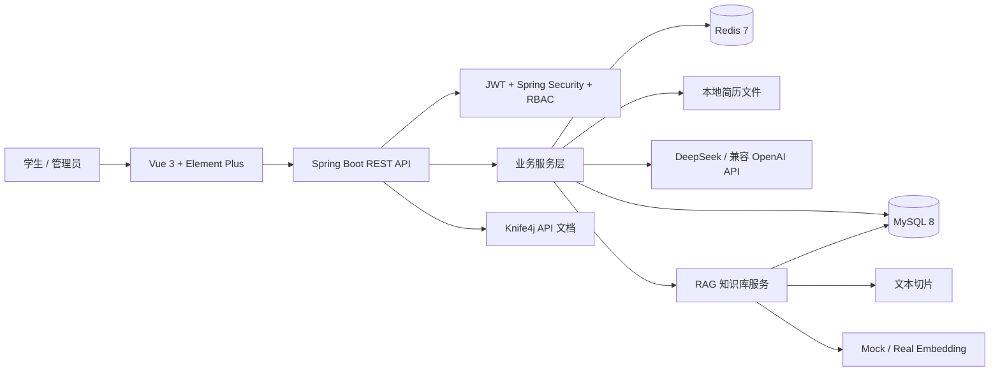
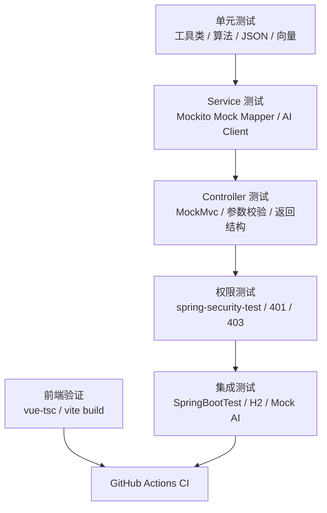
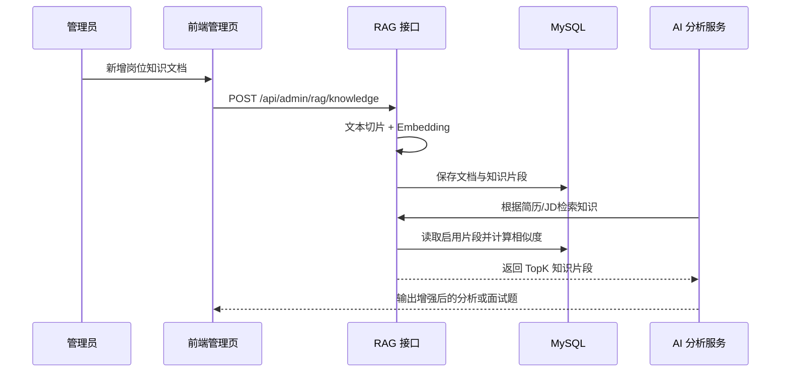
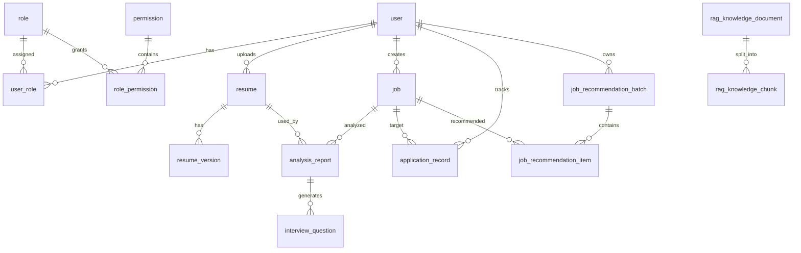

# Intern Pilot 智能实习领航员

> 面向大学生实习求职场景的 AI 简历分析、岗位推荐、面试准备、投递管理与 RAG 岗位知识库平台。

Intern Pilot 是一个前后端分离的智能实习求职辅助系统。项目主仓库使用 GitHub 维护，Gitee 仓库用于同步展示。系统围绕“简历、岗位、分析、推荐、面试、投递、管理后台、测试体系”构建完整闭环，适合作为 AI 应用开发、Spring Boot + Vue 全栈实训、RAG 工程落地和求职辅助产品原型。

## 项目概述

### 项目背景与应用场景

大学生在实习求职时经常遇到这些问题：

- 简历内容和岗位 JD 的差距不清晰，不知道该如何优化。
- 岗位信息分散，难以判断哪些岗位更适合自己。
- 面试准备依赖临时搜索，题目和个人简历、目标岗位关联不强。
- 投递进展容易遗忘，缺少持续跟踪和复盘。
- 项目功能增多后，如果没有测试体系，认证、权限、AI 调用、推荐规则很容易被后续改动影响。

Intern Pilot 通过 AI 分析、岗位推荐、RAG 知识增强和分层自动化测试，把一个“能跑的求职助手”升级为更接近工程项目的完整系统。

### 核心价值与创新点

- **AI 简历匹配分析**：根据简历和岗位 JD 输出匹配分、优势、短板、缺失技能和改进建议。
- **岗位推荐闭环**：从岗位库、推荐批次、推荐理由到投递记录形成完整求职链路。
- **RAG 岗位知识库**：管理员维护岗位方向知识，系统自动切片、生成 Embedding，并在分析和面试题生成时检索相关知识。
- **AI 面试题生成**：结合分析报告、岗位信息和知识库上下文，生成更有针对性的面试题。
- **RBAC 管理后台**：支持用户、角色、权限、操作日志、仪表盘和知识库管理。
- **测试增强体系**：使用 JUnit 5、Mockito、MockMvc、Spring Security Test、H2 和前端类型检查覆盖核心链路。
- **GitHub CI 前置**：新增 GitHub Actions，后续推送或 PR 时自动运行后端测试和前端构建。

### 适用人群

- 正在准备实习或校招的学生。
- 需要课程设计、毕业设计、项目答辩材料的开发者。
- 想学习 Spring Boot、Vue 3、RBAC、AI Mock 测试、RAG 知识库的同学。
- 希望二次开发校园就业助手或岗位推荐系统的团队。

## 更新日志

| 版本 | 日期 | 更新内容 |
| --- | --- | --- |
| v0.4.0 | 2026-05-13 | 根据 `28-testing-enhancement.md` 增强测试体系：补充 RAG 服务测试、测试运行配置、前端 `type-check` 脚本、GitHub Actions CI，并清理无用 `.txt` 输出文件。 |
| v0.3.0 | 2026-05-12 | 根据 `27-rag-job-knowledge-base-design.md` 接入 RAG 岗位知识库，新增知识文档、切片、Embedding、检索、管理页面和 AI 上下文增强。 |
| v0.2.0 | 2026-05-11 | 完成岗位推荐模块：推荐批次、推荐结果、前端推荐页面和推荐记录接口。 |
| v0.1.0 | 2026-05-06 | 完成基础前后端框架、认证注册、简历管理、岗位管理、AI 匹配分析、投递记录和管理后台雏形。 |

## 功能演示

当前暂无公开在线演示地址。可按“快速开始”在本地启动：

- 后端：`http://localhost:8080`
- 前端：`http://localhost:5173`
- API 文档：`http://localhost:8080/doc.html`

### 数据看板


### AI 匹配分析


### 岗位推荐


### RAG 知识库管理


### 投递记录


### 功能特性列表

| 模块 | 功能 |
| --- | --- |
| 用户认证 | 注册、登录、JWT 鉴权、当前用户信息查询 |
| 简历管理 | PDF/DOCX 上传、文本解析、默认简历、简历版本管理 |
| 岗位管理 | 岗位 JD 创建、查询、编辑、删除 |
| AI 匹配分析 | 简历与岗位匹配、AI 分析报告、缓存复用、RAG 上下文增强 |
| WebSocket 分析任务 | 异步分析任务、进度记录、任务状态查询 |
| 岗位推荐 | 推荐批次生成、推荐详情、推荐分数、已投递岗位过滤 |
| 投递记录 | 创建投递、状态流转、备注维护、逻辑删除 |
| 面试题生成 | 基于分析报告和知识库生成面试题 |
| RAG 知识库 | 知识文档 CRUD、文本切片、Embedding、TopK 检索 |
| 管理后台 | 用户、角色、权限、操作日志、仪表盘、知识库管理 |
| 自动化测试 | 工具类、Service、Controller、RBAC、AI Mock、RAG、前端 build |

## 技术架构

### 系统架构图



### 测试架构图



### RAG 工作流



### 技术栈

| 层级 | 技术 |
| --- | --- |
| 后端 | Java 17、Spring Boot 3.3.5、Spring Security、Spring AOP、Validation |
| 数据访问 | MyBatis-Plus 3.5.9、MySQL Connector/J |
| API 文档 | Knife4j OpenAPI 3 4.5.0 |
| AI 能力 | DeepSeek 兼容接口、PromptUtils、MockAiClient、MockEmbeddingClient |
| 缓存 | Redis |
| 文件解析 | Apache PDFBox、Apache POI |
| 后端测试 | JUnit 5、Mockito、Spring Boot Test、MockMvc、spring-security-test、H2 |
| 前端 | Vue 3.5、Vite 6、TypeScript 5.7、Vue Router 4、Pinia |
| UI 与图表 | Element Plus 2.11、ECharts 5.6、Dayjs |
| CI | GitHub Actions |

### 目录结构

```text
intern-pilot
├─ .github/
│  └─ workflows/ci.yml
├─ backend/
│  └─ intern-pilot-backend/
│     ├─ src/main/java/com/internpilot/
│     │  ├─ controller/       # REST 接口
│     │  ├─ service/          # 业务服务
│     │  ├─ mapper/           # MyBatis-Plus Mapper
│     │  ├─ entity/           # 数据库实体
│     │  ├─ dto/              # 请求对象
│     │  ├─ vo/               # 响应对象
│     │  ├─ security/         # JWT 与权限控制
│     │  ├─ runner/           # 启动补偿任务
│     │  └─ util/             # Prompt、文本切片、向量、JSON 工具
│     ├─ src/test/java/       # JUnit / Mockito / MockMvc 测试
│     └─ src/test/resources/  # application-test.yml 与测试 SQL
├─ frontend/
│  └─ intern-pilot-frontend/
│     ├─ src/api/             # Axios 接口封装
│     ├─ src/views/           # 页面视图
│     ├─ src/components/      # 通用组件与布局
│     ├─ src/router/          # 路由与权限元信息
│     └─ src/stores/          # Pinia 状态管理
├─ deploy/
│  └─ docker-compose.yml
├─ docs/
│  ├─ 27-rag-job-knowledge-base-design.md
│  ├─ 28-testing-enhancement.md
│  └─ assets/screenshots/
└─ README.md
```

## 快速开始

### 环境要求

| 依赖 | 推荐版本 |
| --- | --- |
| JDK | 17 |
| Node.js | 18+ |
| npm | 9+ |
| MySQL | 8.0+ |
| Redis | 7.x |

### 克隆项目

GitHub 主仓库：

```bash
git clone <your-github-repo-url>
cd intern-pilot
```

如果你是从 Gitee 镜像仓库查看项目，也可以直接克隆 Gitee 地址；但开发与 CI 说明以 GitHub 仓库为主。

### 后端启动

1. 创建数据库：

```sql
CREATE DATABASE intern_pilot DEFAULT CHARACTER SET utf8mb4 COLLATE utf8mb4_unicode_ci;
```

2. 启动 MySQL 和 Redis。

3. 根据需要配置环境变量：

| 变量 | 默认值 | 说明 |
| --- | --- | --- |
| `MYSQL_HOST` | `localhost` | MySQL 主机 |
| `MYSQL_PORT` | `3306` | MySQL 端口 |
| `MYSQL_DATABASE` | `intern_pilot` | 数据库名 |
| `MYSQL_USERNAME` | `root` | 数据库用户 |
| `MYSQL_PASSWORD` | `root` | 数据库密码 |
| `REDIS_HOST` | `localhost` | Redis 主机 |
| `REDIS_PORT` | `6379` | Redis 端口 |
| `JWT_SECRET` | 开发默认值 | 生产环境必须替换 |
| `AI_API_KEY` | 空 | DeepSeek 或兼容 API 密钥 |
| `AI_BASE_URL` | `https://api.deepseek.com` | AI 接口地址 |
| `AI_MODEL` | `deepseek-v4-pro` | AI 模型名 |

4. 启动后端：

```powershell
cd backend\intern-pilot-backend
.\gradlew.bat bootRun
```

5. 验证服务：

```powershell
Invoke-WebRequest http://localhost:8080/api/health
```

### 前端启动

```powershell
cd frontend\intern-pilot-frontend
npm install
npm run dev
```

访问：

```text
http://localhost:5173
```

### 默认账号与测试数据

项目支持前端注册普通用户。管理员账号建议在本地数据库中创建用户后，通过角色表和用户角色表绑定 `ADMIN` 角色。

系统启动时会执行 `src/main/resources/sql/init.sql`，包含：

- 基础角色：`USER`、`ADMIN`
- 权限数据：用户、角色、岗位、简历、分析、推荐、投递、面试题、RAG 知识库等权限
- 管理员角色授权：`ADMIN` 默认拥有全部权限
- RAG 示例知识文档：`Java后端实习岗位能力模型`、`AI应用开发实习岗位知识`

## 开发指南

### API 文档

后端启动后访问：

```text
http://localhost:8080/doc.html
```

常用接口：

| 模块 | 方法与路径 | 说明 |
| --- | --- | --- |
| 健康检查 | `GET /api/health` | 检查后端服务状态 |
| 认证 | `POST /api/auth/register` | 用户注册 |
| 认证 | `POST /api/auth/login` | 用户登录 |
| 当前用户 | `GET /api/user/me` | 获取当前用户信息 |
| 简历 | `POST /api/resumes/upload` | 上传简历 |
| 岗位 | `GET /api/jobs` | 查询岗位列表 |
| AI 分析 | `POST /api/analysis/match` | 生成简历岗位匹配分析 |
| 岗位推荐 | `POST /api/job-recommendations/generate` | 生成岗位推荐 |
| 面试题 | `POST /api/interview-questions/generate` | 生成面试题 |
| RAG 知识库 | `GET /api/admin/rag/knowledge` | 查询知识文档 |
| RAG 检索 | `POST /api/admin/rag/knowledge/search` | 测试知识检索 |

登录请求示例：

```http
POST /api/auth/login
Content-Type: application/json

{
  "username": "student01",
  "password": "123456"
}
```

RAG 检索示例：

```http
POST /api/admin/rag/knowledge/search
Authorization: Bearer <token>
Content-Type: application/json

{
  "query": "Java后端实习需要掌握哪些技能",
  "direction": "Java后端",
  "topK": 5
}
```

### 数据库设计



核心表：

| 表名 | 用途 |
| --- | --- |
| `user` | 用户基础信息 |
| `role` / `permission` | RBAC 角色权限 |
| `resume` / `resume_version` | 简历与版本管理 |
| `job` | 岗位基础信息与 JD |
| `analysis_report` | AI 匹配分析报告 |
| `job_recommendation_batch` / `job_recommendation_item` | 岗位推荐批次与结果 |
| `application_record` | 投递记录 |
| `interview_question` | 面试题结果 |
| `operation_log` | 管理端操作日志 |
| `rag_knowledge_document` | RAG 知识文档 |
| `rag_knowledge_chunk` | RAG 知识切片与向量 |

### 前端组件说明

| 文件 | 说明 |
| --- | --- |
| `src/components/layout/AppLayout.vue` | 主布局容器 |
| `src/components/layout/AppSidebar.vue` | 侧边栏菜单与权限控制 |
| `src/components/common/PageContainer.vue` | 页面标题与内容容器 |
| `src/views/analysis/AnalysisMatch.vue` | 简历匹配分析页面 |
| `src/views/recommendation/JobRecommendationList.vue` | 岗位推荐页面 |
| `src/views/admin/AdminRagKnowledgeList.vue` | RAG 知识库管理页面 |
| `src/api/*.ts` | 后端接口封装 |
| `src/stores/auth.ts` | 登录态、Token、权限状态 |

## 测试与质量保障

### 已接入测试能力

| 类型 | 覆盖内容 |
| --- | --- |
| 工具类测试 | JSON 解析、技能关键词、文本切片、向量相似度、推荐分数 |
| JWT 测试 | Token 生成、解析、无效 Token 校验 |
| Controller 测试 | Auth、Resume 权限、Admin 权限 |
| Service 测试 | 简历、岗位、AI 分析、面试题、岗位推荐、投递记录、RAG 知识库 |
| AOP 测试 | 操作日志切面 |
| Mock AI 测试 | 测试环境注入 MockAiClient，避免调用真实 AI API |
| 前端验证 | `vue-tsc` 类型检查、Vite 构建 |
| CI | GitHub Actions 自动执行后端测试和前端构建 |

### 本地验收命令

后端完整测试：

```powershell
cd backend\intern-pilot-backend
.\gradlew.bat clean test
```

单独运行某个测试类：

```powershell
.\gradlew.bat test --tests RagKnowledgeServiceTest
```

前端类型检查与构建：

```powershell
cd frontend\intern-pilot-frontend
npm run type-check
npm run build
```

### GitHub Actions

CI 配置文件：

```text
.github/workflows/ci.yml
```

触发条件：

- 推送到 `main` 或 `dev`
- 向 `main` 或 `dev` 发起 Pull Request

CI 执行内容：

- `./gradlew clean test`
- `npm ci`
- `npm run type-check`
- `npm run build`

## 部署说明

### 后端打包运行

```powershell
cd backend\intern-pilot-backend
.\gradlew.bat clean bootJar
java -jar build\libs\intern-pilot-backend-0.0.1-SNAPSHOT.jar
```

### 前端构建

```powershell
cd frontend\intern-pilot-frontend
npm install
npm run build
```

构建产物：

```text
frontend/intern-pilot-frontend/dist
```

### Nginx 配置示例

```nginx
server {
    listen 80;
    server_name your-domain.com;

    root /var/www/intern-pilot/dist;
    index index.html;

    location / {
        try_files $uri $uri/ /index.html;
    }

    location /api/ {
        proxy_pass http://127.0.0.1:8080/api/;
        proxy_set_header Host $host;
        proxy_set_header X-Real-IP $remote_addr;
        proxy_set_header X-Forwarded-For $proxy_add_x_forwarded_for;
        proxy_set_header X-Forwarded-Proto $scheme;
    }
}
```

### 部署注意事项

- 生产环境必须修改 `JWT_SECRET`。
- `AI_API_KEY` 不要提交到 GitHub 或 Gitee。
- MySQL 建议使用 `utf8mb4`。
- Redis 未设置密码时只建议用于本地开发。
- 当前 RAG 使用 MySQL JSON 存储向量和内存相似度计算，适合课程项目和小规模演示；生产大规模知识库建议替换为 Qdrant、Milvus、pgvector 或 Elasticsearch 向量检索。

## 本次测试增强完成内容

根据 `docs/28-testing-enhancement.md`，本次完成：

- 调整测试依赖：H2 改为测试运行时依赖，并增加测试日志输出。
- 新增 `RagKnowledgeServiceTest`，覆盖 RAG 文档创建、无效知识类型校验、TopK 相似度排序检索。
- 前端新增 `type-check` 脚本。
- 新增 GitHub Actions CI，执行后端测试、前端类型检查和前端构建。
- README 从 Gitee 主仓库表述改为 GitHub 主仓库、Gitee 同步展示。
- 清理项目根目录和后端目录下无用 `.txt` 测试输出文件。

## 遇到的问题与解决方案

| 问题 | 原因 | 解决方案 |
| --- | --- | --- |
| README 中仓库平台描述不准确 | 项目主仓库实际是 GitHub，Gitee 只是同步展示 | README 改为 GitHub 主仓库，Gitee 镜像/同步仓库。 |
| `.txt` 输出文件过多 | 前期调试 Gradle、测试、编译时留下了临时日志 | 删除根目录和后端目录下无用 `.txt` 输出文件，保留依赖包许可证文本。 |
| 测试不应调用真实 AI | AI API 慢、贵、不稳定，且返回不可控 | 测试环境使用 MockAiClient / MockEmbeddingClient。 |
| RAG 服务缺少单独测试 | 之前只验证编译和接口接入，缺少 Service 规则测试 | 新增 RAG 创建、校验、检索排序测试。 |
| CI 需要适配 GitHub | 当前主仓库在 GitHub，不能只写 Gitee 说明 | 新增 `.github/workflows/ci.yml`。 |

## 贡献指南

欢迎通过 GitHub Issues 和 Pull Request 参与改进。若使用 Gitee 同步仓库查看项目，建议将问题和 PR 提交到 GitHub 主仓库。

1. Fork GitHub 主仓库。
2. 创建功能分支：`feature/your-feature-name`。
3. 保持代码风格与现有项目一致。
4. 提交前运行后端测试和前端构建。
5. 提交 PR 时说明改动范围、验证方式和潜在影响。

代码规范建议：

- 后端接口返回统一使用项目现有响应结构。
- DTO/VO 命名保持请求与响应分离。
- 前端页面优先复用 Element Plus 与现有布局组件。
- 新增权限时同步更新 SQL 种子数据和前端路由元信息。
- AI Prompt 变更需要说明输入、输出格式和降级策略。
- 新增核心业务逻辑时优先补充单元测试或 Service 测试。

## 许可证

当前仓库尚未包含独立 `LICENSE` 文件。若作为开源项目发布，建议补充 MIT License 或 Apache License 2.0，并在此处更新最终协议声明。

## 联系方式

- 作者：请在 GitHub 主页或仓库信息中补充作者名称。
- 问题反馈：请通过 GitHub Issues 提交缺陷、建议或使用问题。
- Gitee：作为同步展示仓库，可用于国内访问和项目展示。
