# InternPilot 智能实习领航员


[中文简体 README](README.md) | [English README](README_EN.md)

- 演示视频：[InternPilot v1.3.1 功能演示](https://github.com/wan719/intern-pilot/releases/tag/v1.3.1)


---
> 面向大学生实习求职场景的 AI 简历优化、岗位匹配、面试准备与投递管理平台

InternPilot 是一个前后端分离的 AI 实习投递与简历优化平台。系统支持简历上传解析、岗位 JD 管理、AI 简历匹配分析、WebSocket 实时进度展示、AI 任务中心、AI 面试题生成、岗位推荐、投递记录、用户反馈、RAG 岗位知识库、RBAC 权限管理和管理员后台。

项目采用前后端分离架构，后端基于 Spring Boot、Spring Security、MyBatis-Plus、MySQL、Redis、WebSocket 和 DeepSeek API，前端基于 Vue 3、TypeScript、Element Plus、Vue Router、Pinia、Axios 和 ECharts。

当前稳定演示版本：`v1.3.1`。在线演示地址：`http://43.136.182.179`。线上管理员账号与密码不在 README、截图、提交记录或示例配置中公开。

## 项目概述

### 项目背景与应用场景

大学生在找实习过程中常见的问题包括：

- 不知道自己的简历和岗位 JD 是否匹配
- 不知道岗位要求背后真正考察哪些能力
- 面试准备缺少针对性
- 投递记录分散，难以管理
- AI 分析任务耗时较长，缺少清晰的进度与结果入口
- 缺少一个能把“简历、岗位、分析、面试题、推荐、投递”串起来的工具

InternPilot 希望通过 AI 技术帮助学生更高效地完成实习准备，并为课程答辩展示提供完整、稳定、可演示的业务闭环。

### 核心价值与创新点

- **AI 简历匹配分析**：根据简历和岗位 JD 输出匹配分、优势、短板、缺失技能和改进建议
- **WebSocket 实时进度**：异步分析任务进度实时推送，支持刷新恢复
- **全局 AI 任务中心**：统一展示长任务状态、完成提醒、结果入口和红点提示
- **AI 面试题生成**：结合分析报告、岗位信息和 RAG 知识库上下文，生成分类、难度、答案、追问的结构化面试题
- **RAG 岗位知识库**：管理员维护岗位方向知识，系统自动切片、生成 Embedding，在分析和面试题生成时检索相关知识增强 AI 输出
- **DeepSeek + Mock AI 双模式**：线上默认使用 DeepSeek 真实 API，Mock AI 仅保留给 test / CI
- **AI 模型路由与 Prompt 版本管理**：按简历分析、岗位推荐、面试题、RAG 等场景选择模型，缓存 key 包含模型、Prompt 版本和 promptHash
- **AI 报告 PDF 导出**：分析报告支持独立打印页和浏览器保存 PDF，便于答辩演示和求职资料归档
- **RBAC 管理后台**：用户、角色、权限、操作日志、RAG 知识库、用户反馈和后台看板管理
- **岗位推荐闭环**：从岗位库、推荐批次、推荐理由到投递记录形成完整求职链路
- **产品级前端体验**：用户工作台与管理员后台分离，统一页面标题、卡片布局、空状态、loading、错误提示、删除确认和多端适配
- **Spring Boot 工程增强**：接入 Actuator、Validation、全局异常处理、AOP 耗时日志、操作日志脱敏和 Docker healthcheck
- **前端性能优化**：路由懒加载、Vite manualChunks 拆包、Logo 资源压缩、Nginx gzip 与静态资源缓存
- **完整测试体系**：JUnit 5、Mockito、MockMvc、Spring Security Test、H2、JaCoCo 和前端类型检查覆盖核心链路
- **GitHub Actions CI**：推送或 PR 时自动运行后端测试和前端构建

### 适用人群

- 正在准备实习投递的大学生
- 希望优化简历的求职者
- 希望根据岗位 JD 准备面试题的学生
- 学习 Spring Boot + Vue 前后端分离项目的开发者
- 想了解 AI 应用系统落地方式的初学者

## 更新日志

| 版本 | 日期 | 更新内容 |
| --- | --- | --- |
| v1.3.1 | 2026-05-22 | 根据 `44-ai-report-pdf-export-and-frontend-performance-design.md` 完成 AI 报告 PDF 导出、打印页、前端路由懒加载、Vite 拆包、Logo 资源优化和 Nginx gzip / 缓存配置 |
| v1.3.0 | 2026-05-22 | 根据 `43-spring-boot-engineering-enhancement-design.md` 完成 Actuator、参数校验、全局异常处理、AOP 耗时日志、操作日志脱敏、Redis key 规范、定时清理和 Docker healthcheck |
| v1.2.0 | 2026-05-21 | 根据 `42-ai-model-router-and-prompt-optimization-design.md` 完成 AI 场景枚举、模型路由、Prompt 模板版本管理、AI JSON 清洗、缓存 key 优化、重试与 fallback |
| v1.1.0 | 2026-05-21 | 根据 `41-project-architecture-review-and-interview-preparation.md` 完成架构复盘、答辩材料、面试问答和 Release 前项目包装 |
| v1.0.0 | 2026-05-20 | 根据 `40-final-acceptance-release-and-deployment.md` 完成最终验收、发布收尾、README 更新、Docker 部署说明、数据库迁移说明和安全检查 |
| v0.7.0 | 2026-05-20 | 根据 `39-ai-task-center-and-feedback-design.md` 完成 AI 任务中心、右下角结果提醒、用户反馈入口和管理员反馈管理 |
| v0.6.0 | 2026-05-20 | 根据 `38-frontend-ui-polish-and-user-experience-design.md` 完成前端 UI 统一、管理员独立后台、多端适配和品牌图标替换 |
| v0.5.0 | 2026-05-15 | 根据 `34-product-experience-bugfix-and-acceptance-design.md` 完成产品体验验收与 P0/P1 Bug 修复，根据 `35-readme-demo-script-and-project-packaging-design.md` 整理 README 与项目最终包装 |
| v0.4.0 | 2026-05-13 | 根据 `28-testing-enhancement.md` 增强测试体系：补充 RAG 服务测试、测试运行配置、前端 `type-check` 脚本、GitHub Actions CI |
| v0.3.0 | 2026-05-12 | 根据 `27-rag-job-knowledge-base-design.md` 接入 RAG 岗位知识库，新增知识文档、切片、Embedding、检索、管理页面和 AI 上下文增强 |
| v0.2.0 | 2026-05-11 | 完成岗位推荐模块：推荐批次、推荐结果、前端推荐页面和推荐记录接口 |
| v0.1.0 | 2026-05-06 | 完成基础前后端框架、认证注册、简历管理、岗位管理、AI 匹配分析、投递记录和管理后台雏形 |

## 功能演示

### 登录页面

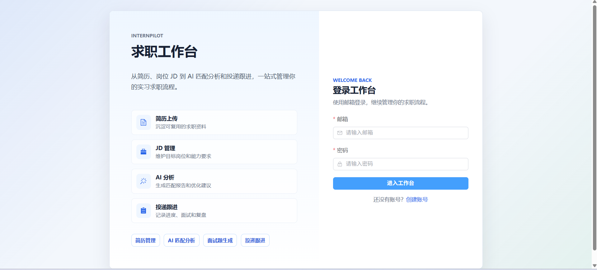

### 用户工作台

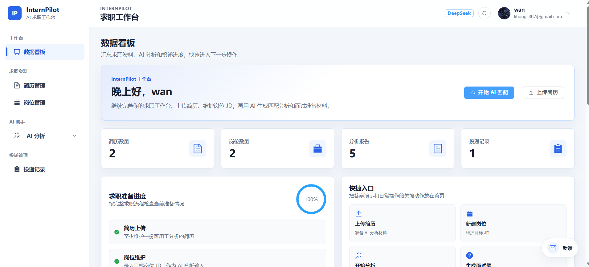

### 简历管理

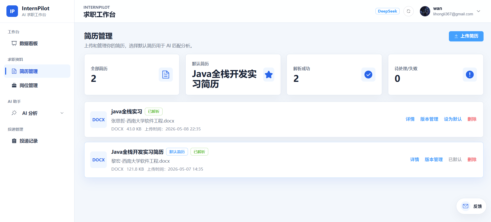

### 岗位 JD 管理

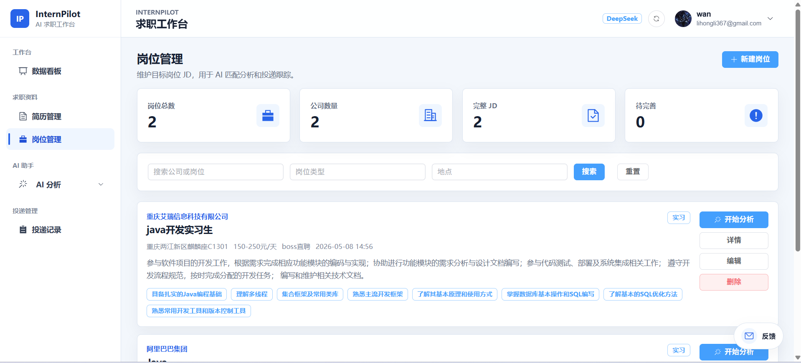

### AI 匹配分析进度

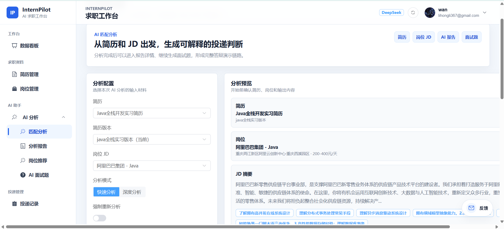

### AI 分析报告

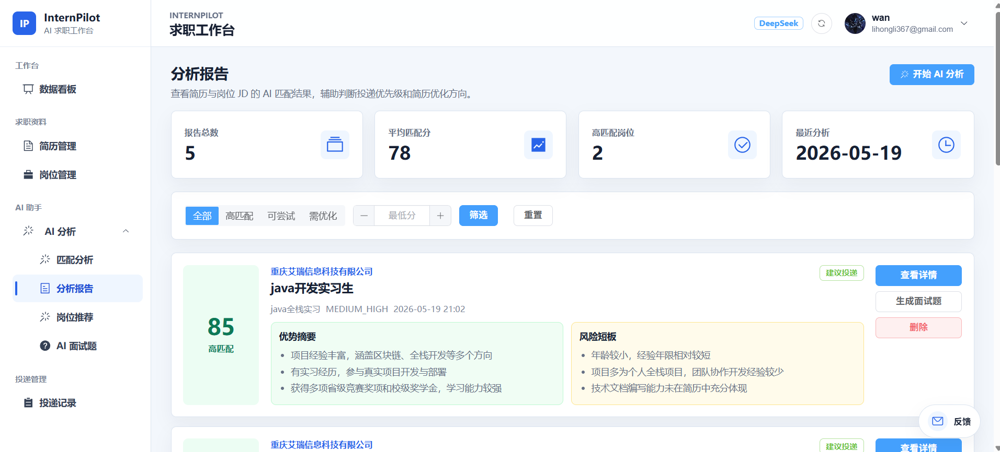

AI 分析报告支持独立打印页 `/analysis/reports/{id}/print`，可通过浏览器打印或保存为 PDF。打印页复用报告详情接口，不展示侧边栏、顶部导航、AI 任务中心和反馈按钮。

### AI 面试题列表

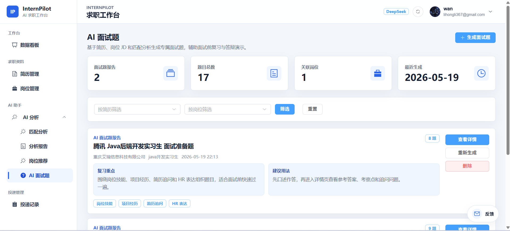

### AI 面试题详情

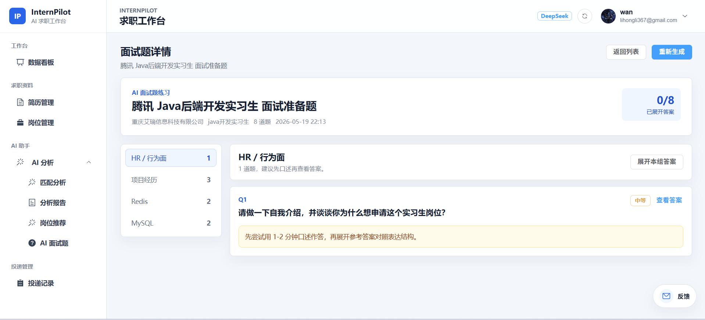

### 管理员后台 - 用户管理

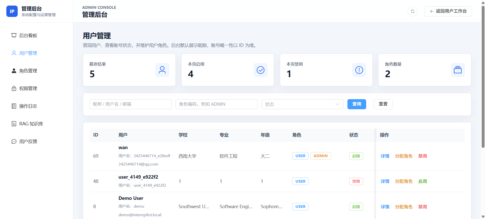

### 管理员后台 - RAG 知识库

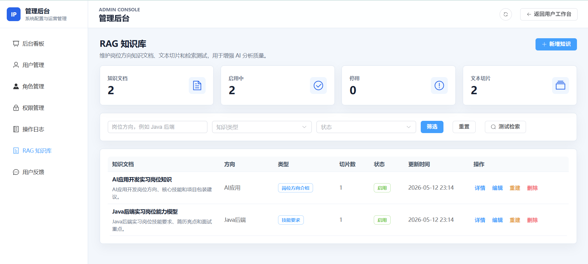

### 核心功能列表

| 模块 | 功能说明 |
| --- | --- |
| 用户认证 | 邮箱验证码注册、登录、JWT 鉴权、当前用户信息 |
| 用户中心 | 昵称、学校、专业、年级等个人资料维护 |
| RBAC 权限 | 用户、角色、权限、菜单和按钮权限控制 |
| 简历管理 | 简历上传、解析、默认简历、版本管理、AI 优化 |
| 岗位 JD 管理 | 岗位创建、编辑、删除、技能要求、JD 内容维护 |
| AI 匹配分析 | 根据简历和岗位生成匹配分数、优势、短板和建议 |
| WebSocket 进度 | 实时展示 AI 分析任务进度，支持刷新恢复 |
| AI 任务中心 | 展示长任务状态、完成提醒、结果入口和红点 |
| AI 缓存 | 使用 Redis 缓存分析结果，避免重复调用 AI |
| DeepSeek 接入 | 支持 deepseek-v4-flash 和 deepseek-v4-pro |
| Mock AI | 仅用于 test / CI，线上不允许启用 |
| AI 面试题 | 生成分类、难度、答案、追问、关键词 |
| 岗位推荐 | 根据用户简历和岗位信息生成推荐结果 |
| 投递记录 | 管理投递状态、备注和时间线 |
| 用户反馈 | 用户提交问题反馈，管理员处理、回复和删除 |
| RAG 知识库 | 管理岗位知识，支持上下文增强 |
| 操作日志 | 记录系统关键操作 |
| 管理员后台 | 后台看板、用户、角色、权限、RAG、日志、反馈管理 |

## 技术架构

### 系统架构图

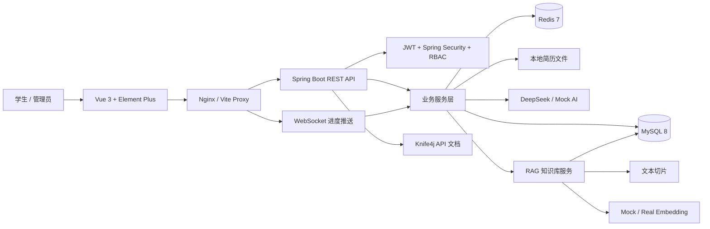
```mermaid
flowchart LR
    User["学生 / 管理员"] --> Web["Vue 3 + Element Plus"]
    Web --> Nginx["Nginx / Vite Proxy"]
    Nginx --> Api["Spring Boot REST API"]
    Nginx --> WS["WebSocket 进度推送"]
    Api --> Security["JWT + Spring Security + RBAC"]
    Api --> Service["业务服务层"]
    Service --> MySQL[("MySQL 8")]
    Service --> Redis[("Redis 7")]
    Service --> FileStore["本地简历文件"]
    Service --> AI["DeepSeek / Mock AI"]
    Service --> RAG["RAG 知识库服务"]
    RAG --> Chunk["文本切片"]
    RAG --> Embedding["Mock / Real Embedding"]
    RAG --> MySQL
    Api --> Docs["Knife4j API 文档"]
    WS --> Service
```

### 测试架构图

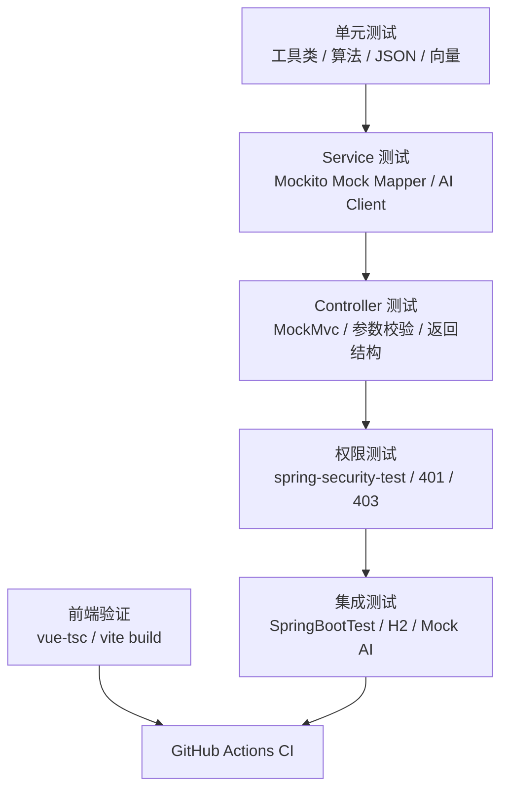
```mermaid
flowchart TB
    Unit["单元测试\n工具类 / 算法 / JSON / 向量"] --> ServiceTest["Service 测试\nMockito Mock Mapper / AI Client"]
    ServiceTest --> ControllerTest["Controller 测试\nMockMvc / 参数校验 / 返回结构"]
    ControllerTest --> SecurityTest["权限测试\nspring-security-test / 401 / 403"]
    SecurityTest --> Integration["集成测试\nSpringBootTest / H2 / Mock AI"]
    Frontend["前端验证\nvue-tsc / vite build"] --> CI["GitHub Actions CI"]
    Integration --> CI
```

### RAG 工作流

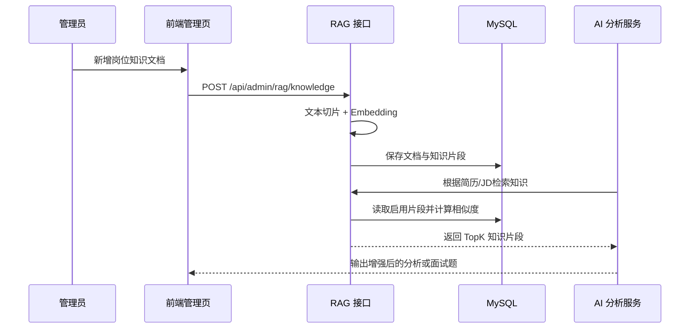
```mermaid
sequenceDiagram
    participant Admin as 管理员
    participant UI as 前端管理页
    participant API as RAG 接口
    participant DB as MySQL
    participant AI as AI 分析服务

    Admin->>UI: 新增岗位知识文档
    UI->>API: POST /api/admin/rag/knowledge
    API->>API: 文本切片 + Embedding
    API->>DB: 保存文档与知识片段
    AI->>API: 根据简历/JD检索知识
    API->>DB: 读取启用片段并计算相似度
    API-->>AI: 返回 TopK 知识片段
    AI-->>UI: 输出增强后的分析或面试题
```

### 技术栈

| 层级 | 技术 |
| --- | --- |
| 后端框架 | Java 17、Spring Boot 3.3.5、Spring Security、Spring AOP、Validation、WebSocket |
| 数据访问 | MyBatis-Plus 3.5.9、MySQL Connector/J |
| API 文档 | Knife4j OpenAPI 3 4.5.0 |
| AI 能力 | DeepSeek 兼容接口、PromptUtils、MockAiClient、MockEmbeddingClient |
| 缓存 | Redis |
| 文件解析 | Apache PDFBox、Apache POI |
| 后端测试 | JUnit 5、Mockito、Spring Boot Test、MockMvc、spring-security-test、H2 |
| 前端框架 | Vue 3.5、Vite 6、TypeScript 5.7、Vue Router 4、Pinia |
| UI 与图表 | Element Plus 2.11、ECharts 5.6、Dayjs、Sass |
| 部署 | Docker、Docker Compose、Nginx |
| CI | GitHub Actions |

### 目录结构

```text
intern-pilot
├─ .github/
│  └─ workflows/
│     ├─ ci.yml
│     └─ docker-build.yml
├─ backend/
│  └─ intern-pilot-backend/
│     ├─ src/main/java/com/internpilot/
│     │  ├─ controller/       # REST 接口
│     │  ├─ service/          # 业务服务
│     │  ├─ mapper/           # MyBatis-Plus Mapper
│     │  ├─ entity/           # 数据库实体
│     │  ├─ dto/              # 请求对象
│     │  ├─ vo/               # 响应对象
│     │  ├─ security/         # JWT 与权限控制
│     │  ├─ runner/           # 启动补偿任务
│     │  └─ util/             # Prompt、文本切片、向量、JSON 工具
│     ├─ src/main/resources/sql/
│     │  ├─ init.sql
│     │  ├─ prod-single-admin-reset.sql
│     │  └─ migration/
│     │     └─ V40__final_release_update.sql
│     ├─ src/test/java/       # JUnit / Mockito / MockMvc 测试
│     └─ src/test/resources/  # application-test.yml 与测试 SQL
├─ frontend/
│  └─ intern-pilot-frontend/
│     ├─ public/              # favicon 等静态资源
│     ├─ src/api/             # Axios 接口封装
│     ├─ src/assets/          # 品牌图标资源
│     ├─ src/views/           # 页面视图
│     ├─ src/components/      # 通用组件与布局
│     ├─ src/router/          # 路由与权限元信息
│     ├─ src/stores/          # Pinia 状态管理
│     ├─ src/styles/          # 全局样式
│     └─ src/utils/           # 通用工具
├─ deploy/
│  ├─ docker-compose.yml
│  └─ .env.example
├─ docs/
│  ├─ 38-frontend-ui-polish-and-user-experience-design.md
│  ├─ 39-ai-task-center-and-feedback-design.md
│  ├─ 40-final-acceptance-release-and-deployment.md
│  ├─ 41-project-architecture-review-and-interview-preparation.md
│  └─ assets/screenshots/
└─ README.md
```

## 快速开始

### 环境要求

| 依赖 | 推荐版本 |
| --- | --- |
| JDK | 17+ |
| Node.js | 18+ |
| MySQL | 8.0+ |
| Redis | 7.x |
| Gradle | 使用项目自带 Gradle Wrapper |

### 克隆项目

GitHub 主仓库：

```bash
git clone https://github.com/wan719/intern-pilot.git
cd intern-pilot
```

Gitee 同步仓库：

```bash
git clone https://gitee.com/li-hong2006/intern-pilot.git
cd intern-pilot
```

### 后端启动

1. 创建数据库：

```sql
CREATE DATABASE intern_pilot DEFAULT CHARACTER SET utf8mb4 COLLATE utf8mb4_unicode_ci;
```

2. 启动 MySQL 和 Redis。

3. 根据需要配置环境变量：

| 变量 | 默认值 | 说明 |
| --- | --- | --- |
| `MYSQL_HOST` | `localhost` | MySQL 主机 |
| `MYSQL_PORT` | `3306` | MySQL 端口 |
| `MYSQL_DATABASE` | `intern_pilot` | 数据库名 |
| `MYSQL_USERNAME` | `root` | 数据库用户 |
| `MYSQL_PASSWORD` | 本地自定义 | 数据库密码，不要提交真实值 |
| `REDIS_HOST` | `localhost` | Redis 主机 |
| `REDIS_PORT` | `6379` | Redis 端口 |
| `REDIS_PASSWORD` | 本地自定义 | Redis 密码，不要提交真实值 |
| `JWT_SECRET` | 开发默认值 | 生产环境必须替换为强随机值 |
| `AI_PROVIDER` | `deepseek` | AI 提供方，线上必须使用 `deepseek`，`mock` 仅用于 test / CI |
| `DEEPSEEK_API_KEY` | 空 | DeepSeek API Key，**不要写入仓库** |
| `AI_BASE_URL` | `https://api.deepseek.com` | AI 接口地址 |
| `AI_MODEL` | `deepseek-v4-flash` | 默认 AI 模型名 |
| `AI_PRO_MODEL` | `deepseek-v4-pro` | 复杂分析模型名 |
| `AI_TIMEOUT_SECONDS` | `60` | AI 调用超时时间，单位秒 |

4. 启动后端：

```powershell
cd backend/intern-pilot-backend
.\gradlew.bat bootRun
```

5. 验证服务：

```powershell
Invoke-WebRequest http://localhost:8080/api/health
```

### 前端启动

```powershell
cd frontend/intern-pilot-frontend
npm install
npm run dev
```

访问：

```text
http://localhost:5173
```

### 默认账号与线上管理员

线上系统不公开默认账号和管理员密码。管理员账号与初始密码由部署人员在安全渠道中维护，README、截图、提交记录和示例配置中不记录明文密码。

本阶段不再初始化公开演示账号或旧默认管理员账号。已有服务器数据如需清理，请先备份数据库，再执行 `backend/intern-pilot-backend/src/main/resources/sql/prod-single-admin-reset.sql` 或重建 Docker 数据卷。

系统启动时会执行 `src/main/resources/sql/init.sql`，包含：

- 基础角色：`USER`、`ADMIN`
- 权限数据：用户、角色、岗位、简历、分析、推荐、投递、面试题、RAG 知识库、用户反馈等权限
- 管理员角色授权：`ADMIN` 默认拥有全部权限
- RAG 示例知识文档：`Java后端实习岗位能力模型`、`AI应用开发实习岗位知识`

## 开发指南

### DeepSeek API 配置

本地开发和真实演示默认可以使用 DeepSeek，密钥只通过环境变量注入，不要写入配置文件或提交到仓库。

PowerShell 示例：

```powershell
$env:AI_PROVIDER="deepseek"
$env:AI_BASE_URL="https://api.deepseek.com"
# 按需填写 DeepSeek API Key，不要提交到仓库
$env:DEEPSEEK_API_KEY = ""
$env:AI_MODEL="deepseek-v4-flash"
$env:AI_PRO_MODEL="deepseek-v4-pro"
```

- `deepseek-v4-flash` 是默认模型，用于简历岗位分析、面试题生成、简历优化、岗位推荐等常规生成任务
- `deepseek-v4-pro` 用于 RAG_QA 或复杂深度分析场景
- Mock 模式仍然保留，但仅适合 test / CI；线上环境不允许运行 `AI_PROVIDER=mock`

测试环境示例：

```powershell
$env:AI_PROVIDER="mock"
$env:SPRING_PROFILES_ACTIVE="test"
```

> 请不要将真实 API Key 提交到 Git 仓库。项目通过环境变量读取 API Key。

如果 `AI_PROVIDER=deepseek` 但未设置 `DEEPSEEK_API_KEY`，后端会返回明确的 AI 服务错误，提示配置环境变量。

### 邮箱验证码配置

本阶段只开放邮箱注册验证码，手机验证码 provider 固定为 `disabled`。生产环境使用 SMTP 真实发送验证码，测试环境继续使用 MockCaptchaSender，不会真实发送邮件。

以 QQ 邮箱 SMTP 为例，服务器 `.env` 需要配置：

```env
AUTH_EMAIL_CAPTCHA_PROVIDER=smtp
AUTH_SMS_CAPTCHA_PROVIDER=disabled
MAIL_HOST=smtp.qq.com
MAIL_PORT=465
MAIL_USERNAME=你的邮箱
MAIL_PASSWORD=
MAIL_FROM=你的邮箱
MAIL_SSL_ENABLED=true
MAIL_STARTTLS_ENABLED=false
```

`MAIL_PASSWORD` 是邮箱 SMTP 授权码，不是邮箱登录密码。不要把真实授权码写入代码、README、提交记录或截图。

测试环境使用：

```env
AUTH_EMAIL_CAPTCHA_PROVIDER=mock
AUTH_SMS_CAPTCHA_PROVIDER=disabled
```

不要把 `MAIL_PASSWORD` 或真实 API Key 写入代码、README 或提交记录。

### API 文档

后端启动后访问：

```text
http://localhost:8080/doc.html
```

常用接口：

| 模块 | 方法与路径 | 说明 |
| --- | --- | --- |
| 健康检查 | `GET /api/health` | 检查后端服务状态 |
| 认证 | `POST /api/auth/register` | 用户注册 |
| 认证 | `POST /api/auth/login` | 用户登录 |
| 当前用户 | `GET /api/user/me` | 获取当前用户信息 |
| 用户反馈 | `POST /api/feedback` | 提交用户反馈 |
| 简历 | `POST /api/resumes/upload` | 上传简历 |
| 岗位 | `GET /api/jobs` | 查询岗位列表 |
| AI 分析 | `POST /api/analysis/match` | 生成简历岗位匹配分析 |
| 岗位推荐 | `POST /api/job-recommendations/generate` | 生成岗位推荐 |
| 面试题 | `POST /api/interview-questions/generate` | 生成面试题 |
| RAG 知识库 | `GET /api/admin/rag/knowledge` | 查询知识文档 |
| RAG 检索 | `POST /api/admin/rag/knowledge/search` | 测试知识检索 |
| 反馈管理 | `GET /api/admin/feedback` | 管理员查询用户反馈 |

### 数据库设计

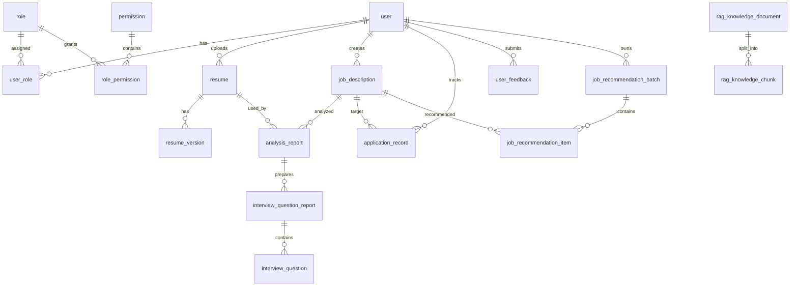
```mermaid
erDiagram
    user ||--o{ user_role : has
    role ||--o{ user_role : assigned
    role ||--o{ role_permission : grants
    permission ||--o{ role_permission : contains
    user ||--o{ resume : uploads
    resume ||--o{ resume_version : has
    user ||--o{ job_description : creates
    job_description ||--o{ analysis_report : analyzed
    resume ||--o{ analysis_report : used_by
    user ||--o{ application_record : tracks
    user ||--o{ user_feedback : submits
    job_description ||--o{ application_record : target
    user ||--o{ job_recommendation_batch : owns
    job_recommendation_batch ||--o{ job_recommendation_item : contains
    job_description ||--o{ job_recommendation_item : recommended
    analysis_report ||--o{ interview_question_report : prepares
    interview_question_report ||--o{ interview_question : contains
    rag_knowledge_document ||--o{ rag_knowledge_chunk : split_into
```

核心表：

| 表名 | 用途 |
| --- | --- |
| `user` | 用户基础信息 |
| `role` / `permission` | RBAC 角色权限 |
| `resume` / `resume_version` | 简历与版本管理 |
| `job_description` | 岗位基础信息与 JD |
| `analysis_report` | AI 匹配分析报告 |
| `job_recommendation_batch` / `job_recommendation_item` | 岗位推荐批次与结果 |
| `application_record` | 投递记录 |
| `interview_question_report` / `interview_question` | 面试题报告与题目明细 |
| `system_operation_log` | 管理端操作日志 |
| `rag_knowledge_document` | RAG 知识文档 |
| `rag_knowledge_chunk` | RAG 知识切片与向量 |
| `user_feedback` | 用户反馈与管理员处理记录 |

### 前端组件说明

| 文件 | 说明 |
| --- | --- |
| `src/components/layout/AppLayout.vue` | 用户工作台主布局容器 |
| `src/components/layout/AppSidebar.vue` | 用户工作台侧边栏菜单与权限控制 |
| `src/components/layout/AppHeader.vue` | 顶部栏，含用户入口、管理后台入口和 AI 模式指示 |
| `src/components/layout/AdminLayout.vue` | 独立管理员后台布局 |
| `src/components/common/PageContainer.vue` | 页面标题与内容容器 |
| `src/components/common/AppPageHeader.vue` | 页面标题、说明和操作区 |
| `src/components/common/AppEmpty.vue` | 通用空状态 |
| `src/components/common/StatusTag.vue` | 状态标签 |
| `src/components/common/AppConfirmButton.vue` | 带确认的操作按钮 |
| `src/components/ai-task/AiTaskFloat.vue` | AI 任务中心浮动入口 |
| `src/views/analysis/AnalysisMatch.vue` | 简历匹配分析页面 |
| `src/views/recommendation/JobRecommendationList.vue` | 岗位推荐页面 |
| `src/views/admin/AdminRagKnowledgeList.vue` | RAG 知识库管理页面 |
| `src/views/admin/AdminFeedbackList.vue` | 用户反馈管理页面 |
| `src/api/*.ts` | 后端接口封装 |
| `src/stores/auth.ts` | 登录态、Token、权限状态 |

## 测试与质量保障

### 已接入测试能力

| 类型 | 覆盖内容 |
| --- | --- |
| 工具类测试 | JSON 解析、技能关键词、文本切片、向量相似度、推荐分数 |
| JWT 测试 | Token 生成、解析、无效 Token 校验 |
| Controller 测试 | Auth、Resume 权限、Admin 权限 |
| Service 测试 | 简历、岗位、AI 分析、面试题、岗位推荐、投递记录、RAG 知识库 |
| AOP 测试 | 操作日志切面 |
| RBAC 权限测试 | 角色权限校验、接口鉴权、403 拦截 |
| WebSocket AI 进度测试 | 异步任务进度推送、状态流转、Redis 进度恢复 |
| AI 底座测试 | MockAiClient 多场景返回、缓存 key 版本化、AI 异常处理 |
| AI 面试题测试 | Prompt 构建、响应解析、分类/难度规范化、regenerate |
| 用户反馈测试 | 反馈表结构、权限、管理员处理接口 |
| Mock AI 测试 | 测试环境注入 MockAiClient，避免调用真实 AI API |
| 前端验证 | `vue-tsc` 类型检查、Vite 构建 |
| CI | GitHub Actions 自动执行后端测试和前端构建 |

### 当前覆盖率与测试规模

最近一次本地执行 `.\gradlew.bat test jacocoTestReport --no-daemon --max-workers=1` 通过，当前后端测试规模与 JaCoCo 覆盖率如下：

| 指标 | 当前结果 |
| --- | ---: |
| 测试文件 | 54 个 |
| `@Test` 用例 | 296 个 |
| Instruction Coverage | 91.85% |
| Line Coverage | 91.86% |
| Method Coverage | 92.76% |
| Branch Coverage | 70.48% |
| Class Coverage | 97.37% |

JaCoCo HTML 报告生成后可在 `backend/intern-pilot-backend/build/reports/jacoco/test/html/index.html` 查看。

### 本地验收命令

后端完整测试：

```powershell
cd backend/intern-pilot-backend
.\gradlew.bat test --no-daemon --max-workers=1
```

生成 JaCoCo 覆盖率报告：

```powershell
.\gradlew.bat test jacocoTestReport --no-daemon --max-workers=1
```

报告路径：

```text
backend/intern-pilot-backend/build/reports/jacoco/test/html/index.html
backend/intern-pilot-backend/build/reports/jacoco/test/jacocoTestReport.xml
```

单独运行某个测试类：

```powershell
.\gradlew.bat test --tests RagKnowledgeServiceTest
```

前端类型检查与构建：

```powershell
cd frontend/intern-pilot-frontend
npm install
npm run build
```

`npm run build` 内部会执行 `vue-tsc -b && vite build`。Vite 如果提示部分 chunk 大于 500 kB，属于构建体积提醒，不等同于构建失败。

### GitHub Actions

CI 配置文件：

```text
.github/workflows/ci.yml           # 后端测试 + 前端构建
.github/workflows/docker-build.yml # Docker 镜像构建检查
```

触发条件：

- 推送到 `main` 或 `dev`
- 向 `main` 或 `dev` 发起 Pull Request

CI 执行内容：

- `./gradlew clean test`（后端单元测试与集成测试）
- `npm ci` + `npm run build`（前端类型检查与构建，`build` 内部会执行 `vue-tsc -b`）
- `docker compose build`（Docker 镜像构建验证）

## 部署说明

### Docker Compose 一键部署

项目已提供完整的 Docker Compose 编排，包含 MySQL、Redis、后端和前端 Nginx 四个服务，可一键启动。

当前线上演示版本为 `v1.3.1`，部署在 `http://43.136.182.179`。生产环境 `.env` 只保留在服务器，不提交到 GitHub 或 Gitee。

**前置要求：**

- [Docker](https://docs.docker.com/get-docker/) 20.10+
- [Docker Compose](https://docs.docker.com/compose/install/) v2+

**部署步骤：**

```bash
# 1. 克隆项目
git clone https://github.com/wan719/intern-pilot.git
cd intern-pilot

# 2. 配置环境变量
cd deploy
cp .env.example .env
# 编辑 .env，填入真实的数据库密码、Redis 密码、JWT_SECRET、DeepSeek API Key 和邮箱 SMTP 配置

# 3. 一键启动
docker compose --env-file .env -f docker-compose.yml up -d --build

# 4. 查看服务状态
docker compose --env-file .env -f docker-compose.yml ps

# 5. 查看后端日志
docker compose --env-file .env -f docker-compose.yml logs -f backend
```

**服务端口：**

| 服务 | 端口 | 说明 |
| --- | --- | --- |
| 前端 (Nginx) | `80` | Vue 前端页面 |
| 后端 API | `8080` | Spring Boot REST API |
| API 文档 | `8080/doc.html` | Knife4j Swagger 文档 |
| MySQL | 容器内部 `3306` | 数据库，不暴露到宿主机 |
| Redis | 容器内部 `6379` | 缓存，不暴露到宿主机 |

**停止服务：**

```bash
docker compose --env-file .env -f docker-compose.yml down
```

### 后端打包运行

```powershell
cd backend/intern-pilot-backend
.\gradlew.bat clean bootJar
java -jar build\libs\intern-pilot-backend-0.0.1-SNAPSHOT.jar
```

### 前端构建

```powershell
cd frontend/intern-pilot-frontend
npm install
npm run build
# 构建产物位于 frontend/intern-pilot-frontend/dist
```

### Nginx 配置示例

项目 Docker 前端镜像使用 `frontend/intern-pilot-frontend/nginx.conf`。核心代理规则如下：

```nginx
server {
    listen 80;
    server_name _;

    root /usr/share/nginx/html;
    index index.html;

    gzip on;
    gzip_vary on;
    gzip_min_length 1024;
    gzip_comp_level 5;
    gzip_types text/plain text/css application/json application/javascript application/xml image/svg+xml;

    location = /index.html {
        add_header Cache-Control "no-store, no-cache, must-revalidate";
        try_files /index.html =404;
    }

    location /assets/ {
        access_log off;
        expires 1y;
        add_header Cache-Control "public, max-age=31536000, immutable";
        try_files $uri =404;
    }

    location / {
        add_header Cache-Control "no-cache";
        try_files $uri $uri/ /index.html;
    }

    location /api/ {
        proxy_pass http://backend:8080/api/;
        proxy_set_header Host $host;
        proxy_set_header X-Real-IP $remote_addr;
        proxy_set_header X-Forwarded-For $proxy_add_x_forwarded_for;
    }

    location /actuator/ {
        proxy_pass http://backend:8080/actuator/;
        proxy_set_header Host $host;
        proxy_set_header X-Real-IP $remote_addr;
        proxy_set_header X-Forwarded-For $proxy_add_x_forwarded_for;
    }

    location /uploads/ {
        proxy_pass http://backend:8080/uploads/;
        proxy_set_header Host $host;
        proxy_set_header X-Real-IP $remote_addr;
        proxy_set_header X-Forwarded-For $proxy_add_x_forwarded_for;
    }

    location /ws/ {
        proxy_pass http://backend:8080/ws/;
        proxy_http_version 1.1;
        proxy_set_header Upgrade $http_upgrade;
        proxy_set_header Connection "upgrade";
        proxy_set_header Host $host;
    }
}
```

### 部署注意事项

- 生产环境必须修改 `JWT_SECRET`
- 生产环境必须使用 `SPRING_PROFILES_ACTIVE=prod`
- 生产环境必须使用 `AI_PROVIDER=deepseek`，不要使用 Mock AI 作为正式演示
- `DEEPSEEK_API_KEY` 不要提交到 GitHub 或 Gitee
- `MAIL_PASSWORD` 是 SMTP 授权码，不要提交到 GitHub 或 Gitee
- `.env` 只保留在服务器，不要提交到仓库
- MySQL 建议使用 `utf8mb4`
- Docker MySQL volume 只会在首次初始化时执行 `init.sql`
- 如果线上库已经存在，请先备份数据库，再手动执行 `backend/intern-pilot-backend/src/main/resources/sql/migration/V40__final_release_update.sql`，用于补齐 `user_feedback` 表和 `feedback:*` 权限
- Redis 未设置密码时只建议用于本地开发
- 当前 RAG 使用 MySQL JSON 存储向量和内存相似度计算，适合课程项目和小规模演示；生产大规模知识库建议替换为 Qdrant、Milvus、pgvector 或 Elasticsearch 向量检索

## 团队成员与分工

| 成员 | 分工 |
| --- | --- |
| wan719 | 项目选题、需求分析、系统设计、后端开发、前端开发、数据库设计、AI 功能接入、测试编写、CI/CD 配置、Docker 部署、README 编写 |

## Git 分支与提交规范

| 分支 | 说明 |
| --- | --- |
| `main` | 稳定提交分支，用于最终课程提交 |
| `dev` | 开发集成分支 |
| `feature/*` | 功能开发分支 |

项目开发过程中按照功能模块进行提交，避免期末一次性提交。

发布建议：

```text
dev 完成本地验收
  -> 合并 main
  -> 打正式 tag
  -> 推送 GitHub / Gitee
  -> 服务器执行 Docker Compose 部署
  -> 线上验收核心链路
```

## GitHub 主仓库 / Gitee 同步仓库说明

本项目采用双仓库策略：

| 平台 | 定位 | 地址 |
| --- | --- | --- |
| GitHub | 主仓库，主要开发、README 维护、CI/CD、提交历史保留 | `https://github.com/wan719/intern-pilot` |
| Gitee | 同步仓库，用于课程提交和国内访问 | `https://gitee.com/li-hong2006/intern-pilot` |

原则：

- README.md 以 GitHub 为主维护
- 代码以 GitHub 为主提交
- Gitee 只做同步，不在 Gitee 单独改代码

同步命令：

```bash
# 同步 main 分支到 Gitee
git checkout main
git pull origin main
git push gitee main

# 同步 dev 分支到 Gitee（可选）
git checkout dev
git pull origin dev
git push gitee dev
```

## 后续规划

- 面试题收藏与刷题记录
- AI 评分与多轮模拟面试
- RAG 向量检索引擎替换
- AI 调用日志后台与质量分析
- 更细粒度的前端首屏加载指标采集
- 更完善的自动化端到端回归测试

## 贡献指南

欢迎通过 GitHub Issues 和 Pull Request 参与改进。若使用 Gitee 同步仓库查看项目，建议将问题和 PR 提交到 GitHub 主仓库。

1. Fork GitHub 主仓库
2. 创建功能分支：`feature/your-feature-name`
3. 保持代码风格与现有项目一致
4. 提交前运行后端测试和前端构建
5. 提交 PR 时说明改动范围、验证方式和潜在影响

代码规范建议：

- 后端接口返回统一使用项目现有响应结构
- DTO/VO 命名保持请求与响应分离
- 前端页面优先复用 Element Plus 与现有布局组件
- 新增权限时同步更新 SQL 种子数据和前端路由元信息
- AI Prompt 变更需要说明输入、输出格式和降级策略
- 新增核心业务逻辑时优先补充单元测试或 Service 测试

## 许可证

本项目采用 MIT License。详见 [LICENSE](LICENSE) 文件。

## 联系方式

- 作者：wan719
- 问题反馈：请通过 [GitHub Issues](https://github.com/wan719/intern-pilot/issues) 提交缺陷、建议或使用问题
- Gitee：作为同步展示仓库，可用于国内访问和项目展示

## 运维与健康检查

后端已接入 Spring Boot Actuator，默认健康检查地址：

```bash
curl http://localhost:8080/actuator/health
```

正常返回应包含：

```json
{"status":"UP"}
```

本地开发环境和生产环境默认仅暴露 `health` 和 `info`，避免公开过多运行细节。`/actuator/health` 已在 Spring Security 中放行，可用于 Docker Compose healthcheck。

生产环境必须通过环境变量提供敏感配置，包括：

- `JWT_SECRET`
- `MYSQL_ROOT_PASSWORD` / `MYSQL_PASSWORD`
- `REDIS_PASSWORD`
- `DEEPSEEK_API_KEY`
- `MAIL_PASSWORD`
- `TENCENT_SMS_SECRET_KEY`（如启用短信）

`prod` profile 启动时会校验：

- AI provider 不能是 `mock`
- `DEEPSEEK_API_KEY` 不能为空
- `JWT_SECRET` 至少 32 个字符
- 验证码不能使用 mock provider

Docker Compose 已为 `mysql`、`redis`、`backend`、`frontend` 配置 healthcheck。常用检查命令：

```bash
docker compose -f deploy/docker-compose.yml ps
docker compose -f deploy/docker-compose.yml logs -f backend
curl http://localhost:8080/actuator/health
```

本地开发时可用以下命令查看后端启动和业务日志：

```powershell
cd backend/intern-pilot-backend
.\gradlew.bat bootRun --no-daemon
```

Docker 部署后可用以下命令查看服务日志：

```bash
docker compose -f deploy/docker-compose.yml logs -f backend
docker compose -f deploy/docker-compose.yml logs -f frontend
docker compose -f deploy/docker-compose.yml logs --tail=200 mysql
docker compose -f deploy/docker-compose.yml logs --tail=200 redis
```

## 评分与答辩证据

本项目按课程最终评分维度整理了可展示证据，方便答辩和仓库检查：

| 评分项 | 项目证据 |
| --- | --- |
| 功能完整性 | 登录注册、简历管理、岗位管理、AI 分析、岗位推荐、面试题、RAG、任务中心、PDF 导出、用户反馈、管理员后台 |
| 技术实现 | Spring Boot、Gradle、Swagger/Knife4j、MyBatis-Plus、Redis、WebSocket、DeepSeek、Actuator、Docker、JaCoCo；后端当前 296 个 `@Test`，Line Coverage 91.86%，Branch Coverage 70.48% |
| Git 提交历史 | `main / dev / feature/*` 分支模型、110+ 次提交、`v1.0.0` 到 `v1.3.1` tag、GitHub Release |
| README 文档 | 中文 README、[English README](README_EN.md)、架构图、10 张截图、快速开始、测试与部署说明 |
| 创新与实用性 | AI 模型路由、Prompt 版本管理、RAG 检索增强、AI 任务中心、报告 PDF 导出、AI 调用重试与 fallback |
| 加分项 | 在线部署、英文 README、演示视频、Docker Compose、GitHub Actions CI |
