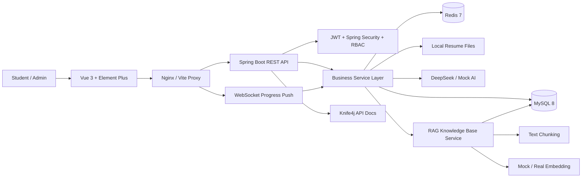
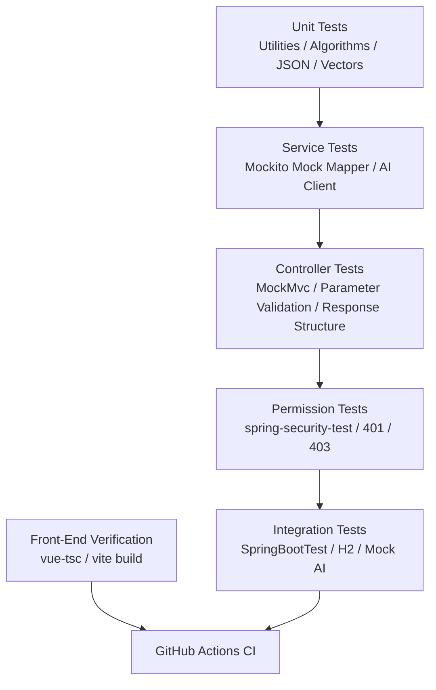
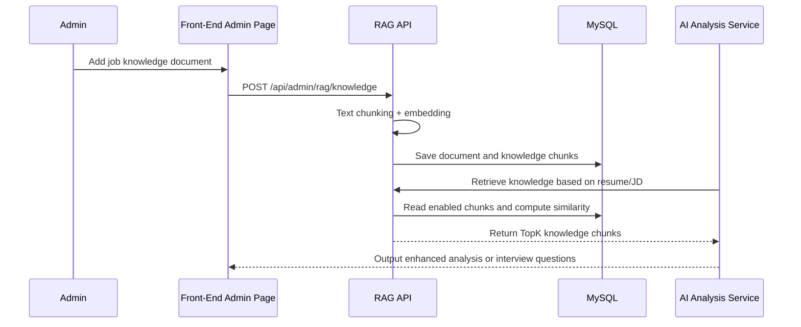
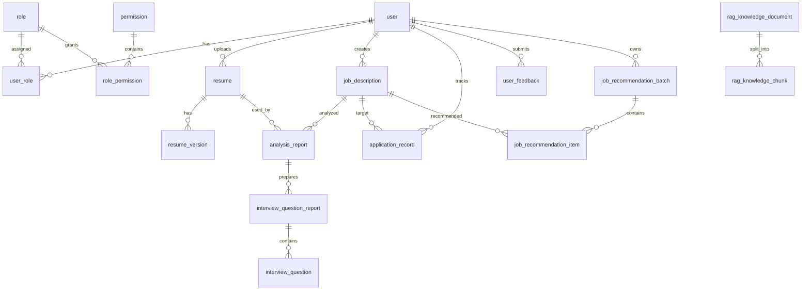

# InternPilot AI Internship Navigator


[中文简体 README](README.md) | [English README](README_EN.md)

- 演示视频：[InternPilot v1.3.1 功能演示](https://github.com/wan719/intern-pilot/releases/tag/v1.3.1)

---
> An AI-powered resume optimization, job matching, interview preparation, and application management platform for college students seeking internships.

InternPilot is a front-end/back-end separated AI internship application and resume optimization platform. It supports resume upload and parsing, job description management, AI-powered resume-job matching analysis, real-time WebSocket progress updates, an AI task center, AI interview question generation, job recommendations, application records, user feedback, a RAG job knowledge base, RBAC permission management, and an admin console.

The project uses a front-end/back-end separated architecture. The back end is built with Spring Boot, Spring Security, MyBatis-Plus, MySQL, Redis, WebSocket, and the DeepSeek API. The front end is built with Vue 3, TypeScript, Element Plus, Vue Router, Pinia, Axios, and ECharts.

Current stable demo version: `v1.3.1`. The production administrator account and password are not disclosed in the README, screenshots, commit history, or sample configuration files.

## Live Demo

- Live Site: https://internpilot.com.cn
- GitHub Repository: https://github.com/wan719/intern-pilot

## Project Overview

### Background and Use Cases

College students often face the following problems when applying for internships:

- They do not know whether their resumes match specific job descriptions.
- They do not know which abilities are truly assessed behind job requirements.
- Their interview preparation lacks focus.
- Application records are scattered and difficult to manage.
- AI analysis tasks take a long time, but users lack clear progress updates and result entry points.
- There is no unified tool that connects resumes, jobs, analysis, interview questions, recommendations, and applications.

InternPilot aims to help students prepare for internships more efficiently through AI technology, while also providing a complete, stable, and demonstrable business workflow for course defense presentations.

### Core Value and Highlights

- **AI Resume Matching Analysis**: Generates a matching score, strengths, weaknesses, missing skills, and improvement suggestions based on a resume and a job description.
- **Real-Time WebSocket Progress**: Pushes asynchronous analysis task progress in real time and supports progress recovery after page refresh.
- **Global AI Task Center**: Centrally displays long-running task status, completion notifications, result entry points, and red-dot reminders.
- **AI Interview Question Generation**: Combines analysis reports, job information, and RAG knowledge base context to generate structured interview questions with categories, difficulty levels, answers, and follow-up questions.
- **RAG Job Knowledge Base**: Allows administrators to maintain job-related domain knowledge. The system automatically chunks documents, generates embeddings, and retrieves relevant knowledge to enhance AI outputs during analysis and interview question generation.
- **DeepSeek + Mock AI Dual Mode**: The production environment uses the real DeepSeek API by default. Mock AI is kept only for tests and CI.
- **AI Model Routing and Prompt Version Management**: Selects models by scenario, such as resume analysis, job recommendation, interview questions, and RAG. Cache keys include the model, prompt version, and promptHash.
- **AI Report PDF Export**: Analysis reports support a standalone print page and browser-based PDF saving, making them convenient for defense demos and job-search documentation.
- **RBAC Admin Console**: Manages users, roles, permissions, operation logs, the RAG knowledge base, user feedback, and admin dashboards.
- **Closed Job Recommendation Loop**: Forms a complete job-search workflow from the job library, recommendation batches, and recommendation reasons to application records.
- **Product-Level Front-End Experience**: Separates the user workspace from the admin console, with unified page titles, card layouts, empty states, loading states, error messages, deletion confirmation, and responsive design.
- **Spring Boot Engineering Enhancements**: Integrates Actuator, Validation, global exception handling, AOP latency logging, operation log desensitization, and Docker healthchecks.
- **Front-End Performance Optimization**: Uses route lazy loading, Vite manualChunks splitting, logo asset compression, Nginx gzip, and static asset caching.
- **Complete Testing System**: Covers core workflows with JUnit 5, Mockito, MockMvc, Spring Security Test, H2, JaCoCo, and front-end type checking.
- **GitHub Actions CI**: Automatically runs back-end tests and front-end builds on push or pull request.

### Target Users

- College students preparing for internship applications
- Job seekers who want to improve their resumes
- Students who want to prepare interview questions based on job descriptions
- Developers learning Spring Boot + Vue front-end/back-end separated projects
- Beginners who want to understand how AI application systems are implemented in practice

## Changelog

| Version | Date | Updates |
| --- | --- | --- |
| v1.3.1 | 2026-05-22 | Completed AI report PDF export, print page, front-end route lazy loading, Vite chunk splitting, logo asset optimization, and Nginx gzip/cache configuration based on `44-ai-report-pdf-export-and-frontend-performance-design.md` |
| v1.3.0 | 2026-05-22 | Completed Actuator, parameter validation, global exception handling, AOP latency logging, operation log desensitization, Redis key standardization, scheduled cleanup, and Docker healthcheck based on `43-spring-boot-engineering-enhancement-design.md` |
| v1.2.0 | 2026-05-21 | Completed AI scenario enum, model routing, prompt template version management, AI JSON sanitization, cache key optimization, retry, and fallback based on `42-ai-model-router-and-prompt-optimization-design.md` |
| v1.1.0 | 2026-05-21 | Completed architecture review, defense materials, interview Q&A, and pre-release project packaging based on `41-project-architecture-review-and-interview-preparation.md` |
| v1.0.0 | 2026-05-20 | Completed final acceptance, release wrap-up, README updates, Docker deployment instructions, database migration instructions, and security checks based on `40-final-acceptance-release-and-deployment.md` |
| v0.7.0 | 2026-05-20 | Completed the AI task center, bottom-right result notifications, user feedback entry point, and admin feedback management based on `39-ai-task-center-and-feedback-design.md` |
| v0.6.0 | 2026-05-20 | Completed front-end UI unification, independent admin console, responsive adaptation, and brand icon replacement based on `38-frontend-ui-polish-and-user-experience-design.md` |
| v0.5.0 | 2026-05-15 | Completed product experience acceptance and P0/P1 bug fixes based on `34-product-experience-bugfix-and-acceptance-design.md`, and organized the README and final project packaging based on `35-readme-demo-script-and-project-packaging-design.md` |
| v0.4.0 | 2026-05-13 | Enhanced the testing system based on `28-testing-enhancement.md`: added RAG service tests, test runtime configuration, front-end `type-check` script, and GitHub Actions CI |
| v0.3.0 | 2026-05-12 | Integrated the RAG job knowledge base based on `27-rag-job-knowledge-base-design.md`, adding knowledge documents, chunking, embeddings, retrieval, management pages, and AI context enhancement |
| v0.2.0 | 2026-05-11 | Completed the job recommendation module: recommendation batches, recommendation results, front-end recommendation page, and recommendation record APIs |
| v0.1.0 | 2026-05-06 | Completed the basic front-end/back-end framework, authentication and registration, resume management, job management, AI matching analysis, application records, and the initial admin console |

## Feature Demo

### Login Page


### User Dashboard


### Resume Management


### Job Description Management


### AI Matching Analysis Progress


### AI Analysis Report


AI analysis reports support a standalone print page at `/analysis/reports/{id}/print`, which can be printed or saved as a PDF through the browser. The print page reuses the report detail API and does not display the sidebar, top navigation, AI task center, or feedback button.

### AI Interview Question List


### AI Interview Question Details


### Admin Console - User Management


### Admin Console - RAG Knowledge Base


### Core Feature List

| Module | Description |
| --- | --- |
| User Authentication | Email verification code registration, login, JWT authentication, and current user information |
| User Center | Profile maintenance, including nickname, school, major, grade, and other personal information |
| RBAC Permissions | User, role, permission, menu, and button-level access control |
| Resume Management | Resume upload, parsing, default resume, version management, and AI optimization |
| Job Description Management | Job creation, editing, deletion, skill requirements, and JD content maintenance |
| AI Matching Analysis | Generates matching scores, strengths, weaknesses, and suggestions based on a resume and a job |
| WebSocket Progress | Displays AI analysis task progress in real time and supports recovery after refresh |
| AI Task Center | Displays long-running task status, completion reminders, result entry points, and red-dot reminders |
| AI Cache | Uses Redis to cache analysis results and avoid duplicate AI calls |
| DeepSeek Integration | Supports `deepseek-v4-flash` and `deepseek-v4-pro` |
| Mock AI | Used only for test and CI; not allowed in production |
| AI Interview Questions | Generates categories, difficulty levels, answers, follow-up questions, and keywords |
| Job Recommendations | Generates job recommendation results based on user resumes and job information |
| Application Records | Manages application status, notes, and timelines |
| User Feedback | Allows users to submit feedback and administrators to process, reply to, and delete feedback |
| RAG Knowledge Base | Manages job knowledge and supports context enhancement |
| Operation Logs | Records key system operations |
| Admin Console | Admin dashboard, user, role, permission, RAG, log, and feedback management |

## Technical Architecture

### System Architecture Diagram



### Testing Architecture Diagram



### RAG Workflow



### Tech Stack

| Layer | Technologies |
| --- | --- |
| Back-End Framework | Java 17, Spring Boot 3.3.5, Spring Security, Spring AOP, Validation, WebSocket |
| Data Access | MyBatis-Plus 3.5.9, MySQL Connector/J |
| API Documentation | Knife4j OpenAPI 3 4.5.0 |
| AI Capabilities | DeepSeek-compatible API, PromptUtils, MockAiClient, MockEmbeddingClient |
| Cache | Redis |
| File Parsing | Apache PDFBox, Apache POI |
| Back-End Testing | JUnit 5, Mockito, Spring Boot Test, MockMvc, spring-security-test, H2 |
| Front-End Framework | Vue 3.5, Vite 6, TypeScript 5.7, Vue Router 4, Pinia |
| UI and Charts | Element Plus 2.11, ECharts 5.6, Dayjs, Sass |
| Deployment | Docker, Docker Compose, Nginx |
| CI | GitHub Actions |

### Directory Structure

```text
intern-pilot
├─ .github/
│  └─ workflows/
│     ├─ ci.yml
│     └─ docker-build.yml
├─ backend/
│  └─ intern-pilot-backend/
│     ├─ src/main/java/com/internpilot/
│     │  ├─ controller/       # REST APIs
│     │  ├─ service/          # Business services
│     │  ├─ mapper/           # MyBatis-Plus mappers
│     │  ├─ entity/           # Database entities
│     │  ├─ dto/              # Request objects
│     │  ├─ vo/               # Response objects
│     │  ├─ security/         # JWT and permission control
│     │  ├─ runner/           # Startup compensation tasks
│     │  └─ util/             # Prompt, text chunking, vector, and JSON utilities
│     ├─ src/main/resources/sql/
│     │  ├─ init.sql
│     │  ├─ prod-single-admin-reset.sql
│     │  └─ migration/
│     │     └─ V40__final_release_update.sql
│     ├─ src/test/java/       # JUnit / Mockito / MockMvc tests
│     └─ src/test/resources/  # application-test.yml and test SQL
├─ frontend/
│  └─ intern-pilot-frontend/
│     ├─ public/              # Static assets such as favicon
│     ├─ src/api/             # Axios API wrappers
│     ├─ src/assets/          # Brand icon assets
│     ├─ src/views/           # Page views
│     ├─ src/components/      # Common components and layouts
│     ├─ src/router/          # Routes and permission metadata
│     ├─ src/stores/          # Pinia state management
│     ├─ src/styles/          # Global styles
│     └─ src/utils/           # Common utilities
├─ deploy/
│  ├─ docker-compose.yml
│  └─ .env.example
├─ docs/
│  ├─ 38-frontend-ui-polish-and-user-experience-design.md
│  ├─ 39-ai-task-center-and-feedback-design.md
│  ├─ 40-final-acceptance-release-and-deployment.md
│  ├─ 41-project-architecture-review-and-interview-preparation.md
│  └─ assets/screenshots/
└─ README.md
```

## Quick Start

### Requirements

| Dependency | Recommended Version |
| --- | --- |
| JDK | 17+ |
| Node.js | 18+ |
| MySQL | 8.0+ |
| Redis | 7.x |
| Gradle | Use the Gradle Wrapper included in the project |

### Clone the Project

GitHub main repository:

```bash
git clone https://github.com/wan719/intern-pilot.git
cd intern-pilot
```

Gitee synchronized repository:

```bash
git clone https://gitee.com/li-hong2006/intern-pilot.git
cd intern-pilot
```

### Start the Back End

1. Create the database:

```sql
CREATE DATABASE intern_pilot DEFAULT CHARACTER SET utf8mb4 COLLATE utf8mb4_unicode_ci;
```

2. Start MySQL and Redis.

3. Configure environment variables as needed:

| Variable | Default Value | Description |
| --- | --- | --- |
| `MYSQL_HOST` | `localhost` | MySQL host |
| `MYSQL_PORT` | `3306` | MySQL port |
| `MYSQL_DATABASE` | `intern_pilot` | Database name |
| `MYSQL_USERNAME` | `root` | Database user |
| `MYSQL_PASSWORD` | Custom local value | Database password. Do not commit real values |
| `REDIS_HOST` | `localhost` | Redis host |
| `REDIS_PORT` | `6379` | Redis port |
| `REDIS_PASSWORD` | Custom local value | Redis password. Do not commit real values |
| `JWT_SECRET` | Development default value | Must be replaced with a strong random value in production |
| `AI_PROVIDER` | `deepseek` | AI provider. Production must use `deepseek`; `mock` is only for test and CI |
| `DEEPSEEK_API_KEY` | Empty | DeepSeek API Key. **Do not write it into the repository** |
| `AI_BASE_URL` | `https://api.deepseek.com` | AI API base URL |
| `AI_MODEL` | `deepseek-v4-flash` | Default AI model name |
| `AI_PRO_MODEL` | `deepseek-v4-pro` | Complex analysis model name |
| `AI_TIMEOUT_SECONDS` | `60` | AI call timeout in seconds |

4. Start the back end:

```powershell
cd backend/intern-pilot-backend
.\gradlew.bat bootRun
```

5. Verify the service:

```powershell
Invoke-WebRequest http://localhost:8080/api/health
```

### Start the Front End

```powershell
cd frontend/intern-pilot-frontend
npm install
npm run dev
```

Open:

```text
http://localhost:5173
```

### Default Accounts and Production Administrator

The online system does not disclose default accounts or administrator passwords. The administrator account and initial password are maintained by the deployment personnel through secure channels. Plaintext passwords are not recorded in the README, screenshots, commit history, or sample configuration files.

At this stage, the system no longer initializes public demo accounts or old default administrator accounts. If existing server data needs to be cleaned, back up the database first, then execute `backend/intern-pilot-backend/src/main/resources/sql/prod-single-admin-reset.sql` or rebuild the Docker volume.

When the system starts, it executes `src/main/resources/sql/init.sql`, which includes:

- Basic roles: `USER` and `ADMIN`
- Permission data: permissions for users, roles, jobs, resumes, analysis, recommendations, applications, interview questions, the RAG knowledge base, user feedback, and more
- Administrator role authorization: `ADMIN` has all permissions by default
- RAG sample knowledge documents: `Java Backend Internship Position Capability Model` and `AI Application Development Internship Position Knowledge`

## Development Guide

### DeepSeek API Configuration

Local development and real demos can use DeepSeek by default. The API key is injected only through environment variables. Do not write it into configuration files or commit it to the repository.

PowerShell example:

```powershell
$env:AI_PROVIDER="deepseek"
$env:AI_BASE_URL="https://api.deepseek.com"
# Fill in the DeepSeek API Key as needed. Do not commit it to the repository.
$env:DEEPSEEK_API_KEY = ""
$env:AI_MODEL="deepseek-v4-flash"
$env:AI_PRO_MODEL="deepseek-v4-pro"
```

- `deepseek-v4-flash` is the default model for regular generation tasks, such as resume-job analysis, interview question generation, resume optimization, and job recommendations.
- `deepseek-v4-pro` is used for RAG_QA or complex deep analysis scenarios.
- Mock mode is still retained, but it is suitable only for test and CI. The online environment is not allowed to run with `AI_PROVIDER=mock`.

Test environment example:

```powershell
$env:AI_PROVIDER="mock"
$env:SPRING_PROFILES_ACTIVE="test"
```

> Do not commit real API keys to the Git repository. The project reads API keys through environment variables.

If `AI_PROVIDER=deepseek` but `DEEPSEEK_API_KEY` is not set, the back end returns a clear AI service error indicating that the environment variable must be configured.

### Email Verification Code Configuration

At this stage, only email registration verification codes are enabled. The SMS verification provider is fixed to `disabled`. The production environment uses SMTP to send real verification codes, while the test environment continues to use `MockCaptchaSender` and does not send real emails.

Using QQ Mail SMTP as an example, the server `.env` should be configured as follows:

```env
AUTH_EMAIL_CAPTCHA_PROVIDER=smtp
AUTH_SMS_CAPTCHA_PROVIDER=disabled
MAIL_HOST=smtp.qq.com
MAIL_PORT=465
MAIL_USERNAME=your_email
MAIL_PASSWORD=
MAIL_FROM=your_email
MAIL_SSL_ENABLED=true
MAIL_STARTTLS_ENABLED=false
```

`MAIL_PASSWORD` is the SMTP authorization code, not the email login password. Do not write the real authorization code into code, the README, commit history, or screenshots.

The test environment uses:

```env
AUTH_EMAIL_CAPTCHA_PROVIDER=mock
AUTH_SMS_CAPTCHA_PROVIDER=disabled
```

Do not write `MAIL_PASSWORD` or real API keys into code, the README, or commit history.

### API Documentation

After the back end starts, visit:

```text
http://localhost:8080/doc.html
```

Common APIs:

| Module | Method and Path | Description |
| --- | --- | --- |
| Health Check | `GET /api/health` | Checks back-end service status |
| Authentication | `POST /api/auth/register` | User registration |
| Authentication | `POST /api/auth/login` | User login |
| Current User | `GET /api/user/me` | Gets current user information |
| User Feedback | `POST /api/feedback` | Submits user feedback |
| Resume | `POST /api/resumes/upload` | Uploads a resume |
| Job | `GET /api/jobs` | Queries the job list |
| AI Analysis | `POST /api/analysis/match` | Generates resume-job matching analysis |
| Job Recommendation | `POST /api/job-recommendations/generate` | Generates job recommendations |
| Interview Questions | `POST /api/interview-questions/generate` | Generates interview questions |
| RAG Knowledge Base | `GET /api/admin/rag/knowledge` | Queries knowledge documents |
| RAG Retrieval | `POST /api/admin/rag/knowledge/search` | Tests knowledge retrieval |
| Feedback Management | `GET /api/admin/feedback` | Admin queries user feedback |

### Database Design



Core tables:

| Table | Purpose |
| --- | --- |
| `user` | Basic user information |
| `role` / `permission` | RBAC roles and permissions |
| `resume` / `resume_version` | Resume and version management |
| `job_description` | Basic job information and job descriptions |
| `analysis_report` | AI matching analysis reports |
| `job_recommendation_batch` / `job_recommendation_item` | Job recommendation batches and results |
| `application_record` | Application records |
| `interview_question_report` / `interview_question` | Interview question reports and question details |
| `system_operation_log` | Admin operation logs |
| `rag_knowledge_document` | RAG knowledge documents |
| `rag_knowledge_chunk` | RAG knowledge chunks and vectors |
| `user_feedback` | User feedback and admin processing records |

### Front-End Component Description

| File | Description |
| --- | --- |
| `src/components/layout/AppLayout.vue` | Main layout container for the user workspace |
| `src/components/layout/AppSidebar.vue` | Sidebar menu and permission control for the user workspace |
| `src/components/layout/AppHeader.vue` | Top bar, including user entry, admin console entry, and AI mode indicator |
| `src/components/layout/AdminLayout.vue` | Independent admin console layout |
| `src/components/common/PageContainer.vue` | Page title and content container |
| `src/components/common/AppPageHeader.vue` | Page title, description, and action area |
| `src/components/common/AppEmpty.vue` | Common empty state |
| `src/components/common/StatusTag.vue` | Status tag |
| `src/components/common/AppConfirmButton.vue` | Action button with confirmation |
| `src/components/ai-task/AiTaskFloat.vue` | Floating entry for the AI task center |
| `src/views/analysis/AnalysisMatch.vue` | Resume matching analysis page |
| `src/views/recommendation/JobRecommendationList.vue` | Job recommendation page |
| `src/views/admin/AdminRagKnowledgeList.vue` | RAG knowledge base management page |
| `src/views/admin/AdminFeedbackList.vue` | User feedback management page |
| `src/api/*.ts` | Back-end API wrappers |
| `src/stores/auth.ts` | Login state, token, and permission state |

## Testing and Quality Assurance

### Integrated Testing Capabilities

| Type | Coverage |
| --- | --- |
| Utility Tests | JSON parsing, skill keywords, text chunking, vector similarity, recommendation scores |
| JWT Tests | Token generation, parsing, and invalid token validation |
| Controller Tests | Auth, resume permissions, and admin permissions |
| Service Tests | Resumes, jobs, AI analysis, interview questions, job recommendations, application records, and RAG knowledge base |
| AOP Tests | Operation log aspect |
| RBAC Permission Tests | Role permission validation, API authentication, and 403 interception |
| WebSocket AI Progress Tests | Asynchronous task progress push, status transitions, and Redis progress recovery |
| AI Foundation Tests | MockAiClient multi-scenario responses, cache key versioning, and AI exception handling |
| AI Interview Question Tests | Prompt construction, response parsing, category/difficulty normalization, and regenerate |
| User Feedback Tests | Feedback table structure, permissions, and admin processing APIs |
| Mock AI Tests | Injects MockAiClient in the test environment to avoid calling real AI APIs |
| Front-End Verification | `vue-tsc` type checking and Vite build |
| CI | GitHub Actions automatically runs back-end tests and front-end builds |

### Current Coverage and Test Scale

The latest local run of `.\gradlew.bat test jacocoTestReport --no-daemon --max-workers=1` passed. The current back-end test scale and JaCoCo coverage are:

| Metric | Current Result |
| --- | ---: |
| Test files | 54 |
| `@Test` cases | 296 |
| Instruction Coverage | 91.85% |
| Line Coverage | 91.86% |
| Method Coverage | 92.76% |
| Branch Coverage | 70.48% |
| Class Coverage | 97.37% |

After generating the JaCoCo HTML report, open `backend/intern-pilot-backend/build/reports/jacoco/test/html/index.html` to inspect details.

### Local Acceptance Commands

Full back-end tests:

```powershell
cd backend/intern-pilot-backend
.\gradlew.bat test --no-daemon --max-workers=1
```

Generate JaCoCo coverage report:

```powershell
.\gradlew.bat test jacocoTestReport --no-daemon --max-workers=1
```

Report paths:

```text
backend/intern-pilot-backend/build/reports/jacoco/test/html/index.html
backend/intern-pilot-backend/build/reports/jacoco/test/jacocoTestReport.xml
```

Run a specific test class:

```powershell
.\gradlew.bat test --tests RagKnowledgeServiceTest
```

Front-end type checking and build:

```powershell
cd frontend/intern-pilot-frontend
npm install
npm run build
```

`npm run build` internally runs `vue-tsc -b && vite build`. If Vite warns that some chunks are larger than 500 kB, it is a bundle size warning, not a build failure.

### GitHub Actions

CI configuration files:

```text
.github/workflows/ci.yml           # Back-end tests + front-end build
.github/workflows/docker-build.yml # Docker image build check
```

Trigger conditions:

- Push to `main` or `dev`
- Pull Request to `main` or `dev`

CI tasks:

- `./gradlew clean test` for back-end unit and integration tests
- `npm ci` + `npm run build` for front-end type checking and build. The `build` script internally runs `vue-tsc -b`
- `docker compose build` for Docker image build verification

## Deployment Guide

### One-Click Deployment with Docker Compose

The project provides complete Docker Compose orchestration, including four services: MySQL, Redis, the back end, and the front-end Nginx service. It can be started with one command.

The current online demo version is `v1.3.1`, deployed at `https://internpilot.com.cn`. The production `.env` file is kept only on the server and is not committed to GitHub or Gitee.

**Prerequisites:**

- [Docker](https://docs.docker.com/get-docker/) 20.10+
- [Docker Compose](https://docs.docker.com/compose/install/) v2+

**Deployment steps:**

```bash
# 1. Clone the project
git clone https://github.com/wan719/intern-pilot.git
cd intern-pilot

# 2. Configure environment variables
cd deploy
cp .env.example .env
# Edit .env and fill in the real database password, Redis password, JWT_SECRET, DeepSeek API Key, and email SMTP configuration

# 3. Start everything with one command
docker compose --env-file .env -f docker-compose.yml up -d --build

# 4. Check service status
docker compose --env-file .env -f docker-compose.yml ps

# 5. View back-end logs
docker compose --env-file .env -f docker-compose.yml logs -f backend
```

**Service ports:**

| Service | Port | Description |
| --- | --- | --- |
| Front End (Nginx) | `80` | Vue front-end pages |
| Back-End API | `8080` | Spring Boot REST API |
| API Docs | `8080/doc.html` | Knife4j Swagger documentation |
| MySQL | Internal container port `3306` | Database, not exposed to the host |
| Redis | Internal container port `6379` | Cache, not exposed to the host |

**Stop services:**

```bash
docker compose --env-file .env -f docker-compose.yml down
```

### Build and Run the Back End

```powershell
cd backend/intern-pilot-backend
.\gradlew.bat clean bootJar
java -jar build\libs\intern-pilot-backend-0.0.1-SNAPSHOT.jar
```

### Build the Front End

```powershell
cd frontend/intern-pilot-frontend
npm install
npm run build
# Build output is located at frontend/intern-pilot-frontend/dist
```

### Nginx Configuration Example

The project Docker front-end image uses `frontend/intern-pilot-frontend/nginx.conf`. The core proxy rules are as follows:

```nginx
server {
    listen 80;
    server_name _;

    root /usr/share/nginx/html;
    index index.html;

    gzip on;
    gzip_vary on;
    gzip_min_length 1024;
    gzip_comp_level 5;
    gzip_types text/plain text/css application/json application/javascript application/xml image/svg+xml;

    location = /index.html {
        add_header Cache-Control "no-store, no-cache, must-revalidate";
        try_files /index.html =404;
    }

    location /assets/ {
        access_log off;
        expires 1y;
        add_header Cache-Control "public, max-age=31536000, immutable";
        try_files $uri =404;
    }

    location / {
        add_header Cache-Control "no-cache";
        try_files $uri $uri/ /index.html;
    }

    location /api/ {
        proxy_pass http://backend:8080/api/;
        proxy_set_header Host $host;
        proxy_set_header X-Real-IP $remote_addr;
        proxy_set_header X-Forwarded-For $proxy_add_x_forwarded_for;
    }

    location /actuator/ {
        proxy_pass http://backend:8080/actuator/;
        proxy_set_header Host $host;
        proxy_set_header X-Real-IP $remote_addr;
        proxy_set_header X-Forwarded-For $proxy_add_x_forwarded_for;
    }

    location /uploads/ {
        proxy_pass http://backend:8080/uploads/;
        proxy_set_header Host $host;
        proxy_set_header X-Real-IP $remote_addr;
        proxy_set_header X-Forwarded-For $proxy_add_x_forwarded_for;
    }

    location /ws/ {
        proxy_pass http://backend:8080/ws/;
        proxy_http_version 1.1;
        proxy_set_header Upgrade $http_upgrade;
        proxy_set_header Connection "upgrade";
        proxy_set_header Host $host;
    }
}
```

### Deployment Notes

- `JWT_SECRET` must be changed in production.
- `SPRING_PROFILES_ACTIVE=prod` must be used in production.
- `AI_PROVIDER=deepseek` must be used in production. Do not use Mock AI for official demos.
- Do not commit `DEEPSEEK_API_KEY` to GitHub or Gitee.
- `MAIL_PASSWORD` is an SMTP authorization code. Do not commit it to GitHub or Gitee.
- `.env` should be kept only on the server and should not be committed to the repository.
- MySQL is recommended to use `utf8mb4`.
- The Docker MySQL volume executes `init.sql` only during first initialization.
- If the online database already exists, back up the database first, then manually execute `backend/intern-pilot-backend/src/main/resources/sql/migration/V40__final_release_update.sql` to add the `user_feedback` table and `feedback:*` permissions.
- Redis without a password is recommended only for local development.
- The current RAG implementation stores vectors in MySQL JSON and calculates similarity in memory. It is suitable for course projects and small-scale demos. For a large-scale production knowledge base, replace it with Qdrant, Milvus, pgvector, or Elasticsearch vector retrieval.

## Team Members and Responsibilities

| Member | Responsibilities |
| --- | --- |
| wan719 | Project topic selection, requirements analysis, system design, back-end development, front-end development, database design, AI feature integration, test writing, CI/CD configuration, Docker deployment, and README writing |

## Git Branching and Commit Convention

| Branch | Description |
| --- | --- |
| `main` | Stable submission branch for final course submission |
| `dev` | Development integration branch |
| `feature/*` | Feature development branches |

During development, commits are made by feature module to avoid one-time end-of-semester commits.

Recommended release workflow:

```text
Complete local acceptance on dev
  -> Merge into main
  -> Create an official tag
  -> Push to GitHub / Gitee
  -> Run Docker Compose deployment on the server
  -> Verify core workflows online
```

## GitHub Main Repository / Gitee Sync Repository

This project uses a dual-repository strategy:

| Platform | Purpose | URL |
| --- | --- | --- |
| GitHub | Main repository for primary development, README maintenance, CI/CD, and commit history preservation | `https://github.com/wan719/intern-pilot` |
| Gitee | Synchronized repository for course submission and domestic access | `https://gitee.com/li-hong2006/intern-pilot` |

Principles:

- Maintain `README.md` primarily on GitHub.
- Commit code primarily to GitHub.
- Use Gitee only for synchronization. Do not make separate code changes on Gitee.

Synchronization commands:

```bash
# Sync the main branch to Gitee
git checkout main
git pull origin main
git push gitee main

# Sync the dev branch to Gitee (optional)
git checkout dev
git pull origin dev
git push gitee dev
```

## Roadmap

- Interview question favorites and practice records
- AI scoring and multi-round mock interviews
- Replacement of the RAG vector retrieval engine
- AI call log admin console and quality analysis
- More fine-grained front-end first-screen performance metrics
- More complete automated end-to-end regression tests

## Contribution Guide

Contributions through GitHub Issues and Pull Requests are welcome. If you view the project through the Gitee sync repository, it is recommended to submit issues and PRs to the GitHub main repository.

1. Fork the GitHub main repository.
2. Create a feature branch: `feature/your-feature-name`.
3. Keep the code style consistent with the existing project.
4. Run back-end tests and front-end builds before submitting.
5. When submitting a PR, describe the change scope, verification method, and potential impact.

Code convention recommendations:

- Back-end API responses should use the existing unified response structure.
- DTO/VO naming should keep request and response objects separated.
- Front-end pages should prioritize reusing Element Plus and existing layout components.
- When adding new permissions, update SQL seed data and front-end route metadata at the same time.
- AI prompt changes should describe the input, output format, and fallback strategy.
- When adding core business logic, prioritize adding unit tests or service tests.

## License

This project uses the MIT License. See the [LICENSE](LICENSE) file for details.

## Contact

- Author: wan719
- Feedback: Please submit bugs, suggestions, or usage issues through [GitHub Issues](https://github.com/wan719/intern-pilot/issues)
- Gitee: Used as a synchronized display repository for domestic access and project showcase

## Operations and Health Checks

The back end integrates Spring Boot Actuator. The default health check endpoint is:

```bash
curl http://localhost:8080/actuator/health
```

A normal response should include:

```json
{"status":"UP"}
```

By default, the local development environment and production environment expose only `health` and `info` to avoid exposing too many runtime details. `/actuator/health` is allowed in Spring Security and can be used for Docker Compose healthchecks.

In production, sensitive configurations must be provided through environment variables, including:

- `JWT_SECRET`
- `MYSQL_ROOT_PASSWORD` / `MYSQL_PASSWORD`
- `REDIS_PASSWORD`
- `DEEPSEEK_API_KEY`
- `MAIL_PASSWORD`
- `TENCENT_SMS_SECRET_KEY` if SMS is enabled

When the `prod` profile starts, it validates that:

- The AI provider cannot be `mock`.
- `DEEPSEEK_API_KEY` cannot be empty.
- `JWT_SECRET` must contain at least 32 characters.
- The verification code provider cannot be mock.

Docker Compose configures healthchecks for `mysql`, `redis`, `backend`, and `frontend`. Common check commands:

```bash
docker compose -f deploy/docker-compose.yml ps
docker compose -f deploy/docker-compose.yml logs -f backend
curl http://localhost:8080/actuator/health
```

During local development, you can view back-end startup and business logs with:

```powershell
cd backend/intern-pilot-backend
.\gradlew.bat bootRun --no-daemon
```

After Docker deployment, you can view service logs with:

```bash
docker compose -f deploy/docker-compose.yml logs -f backend
docker compose -f deploy/docker-compose.yml logs -f frontend
docker compose -f deploy/docker-compose.yml logs --tail=200 mysql
docker compose -f deploy/docker-compose.yml logs --tail=200 redis
```

## Grading and Defense Evidence

This project organizes demonstrable evidence according to the final course grading criteria, making it convenient for defense presentations and repository review:

| Grading Item | Project Evidence |
| --- | --- |
| Functional Completeness | Login and registration, resume management, job management, AI analysis, job recommendations, interview questions, RAG, task center, PDF export, user feedback, and admin console |
| Technical Implementation | Spring Boot, Gradle, Swagger/Knife4j, MyBatis-Plus, Redis, WebSocket, DeepSeek, Actuator, Docker, and JaCoCo; currently 296 back-end `@Test` cases, 91.86% line coverage, and 70.48% branch coverage |
| Git Commit History | `main / dev / feature/*` branch model, 110+ commits, tags from `v1.0.0` to `v1.3.1`, and GitHub Release |
| README Documentation | Chinese README, [English README](README_EN.md), architecture diagrams, 10 screenshots, quick start, testing, and deployment instructions |
| Innovation and Practicality | AI model routing, prompt version management, RAG retrieval enhancement, AI task center, report PDF export, AI call retry, and fallback |
| Bonus Items | Online deployment, English README, demo video, Docker Compose, and GitHub Actions CI |
