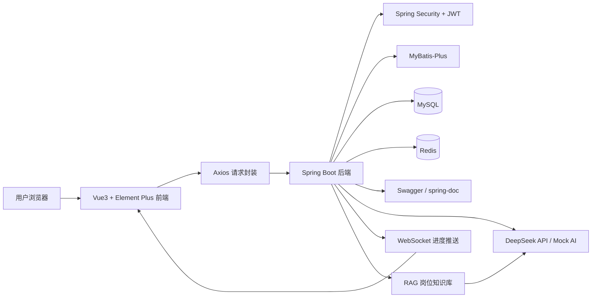

# InternPilot README、Gitee 提交与项目包装设计文档

## 一、文档目的

本文档用于指导 InternPilot 项目进入课程最终提交阶段。

根据课程期末项目要求，本项目最终提交方式不是线下答辩，也不是提交压缩包，而是在指定位置提交：

1. Gitee 仓库完整 URL
2. 项目名称
3. 团队成员及分工说明

因此，本阶段的核心目标是：

> 将 InternPilot 整理成一个公开可访问、README 完整、截图真实、运行说明清晰、Git 提交历史规范、能够满足课程评分标准的 Web 应用项目。

当前项目以 GitHub 为主仓库，Gitee 为同步仓库。README.md 以 GitHub 版本为主维护，然后同步到 Gitee。

---

## 二、当前阶段定位

### 2.1 当前项目状态

InternPilot 已经完成主要功能开发和体验 Bug 收敛，当前进入最终提交前的项目包装阶段。

项目已具备：

1. 用户认证与 JWT 鉴权
2. RBAC 权限系统
3. 简历上传与解析
4. 简历版本管理
5. 岗位 JD 管理
6. AI 简历匹配分析
7. WebSocket AI 分析进度推送
8. Redis 任务状态保存与刷新恢复
9. DeepSeek 真实 API 接入
10. Mock AI 多场景适配
11. AI 面试题生成增强
12. 岗位推荐
13. RAG 岗位知识库
14. 投递记录
15. 系统操作日志
16. 管理员后台
17. Swagger 接口文档
18. 后端单元测试与集成测试
19. 前端 TypeScript 类型检查与构建
20. GitHub Actions CI
21. Docker Compose 本地部署

当前阶段不再继续增加大功能，而是重点完成：

```text
README 整理
真实截图展示
Gitee 同步
仓库公开检查
Git 提交历史整理
运行说明校验
测试命令校验
最终提交信息准备
````

---

## 三、老师提交要求解读

### 3.1 最终提交内容

课程最终要求提交：

|内容|是否必须|说明|
|---|---|---|
|Gitee 仓库完整 URL|必须|仓库需要公开可访问|
|项目名称|必须|与 README 项目名保持一致|
|团队成员及分工说明|必须|README 中也建议体现|
|README.md|必须|根目录完整中文说明文档|
|源代码|必须|前后端完整代码|
|演示视频|可选|加分项，不强制|
|在线部署地址|可选|加分项，不强制|
|PPT|可选|不要求线下答辩，可不做|

### 3.2 对本项目的影响

由于老师只要求提交仓库地址，因此本阶段重点不是打包 zip，而是保证：

1. Gitee 仓库公开
    
2. Gitee 仓库内容和 GitHub 主仓库同步
    
3. README 在 Gitee 上显示正常
    
4. README 中截图路径正常
    
5. README 中启动方式准确
    
6. README 中测试数据和默认账号清楚
    
7. Git 提交历史能体现开发过程
    
8. 项目没有敏感信息泄露
    
9. 项目能在本地按 README 跑起来
    

---

## 四、评分标准对齐

### 4.1 功能完整性 30%

本项目需要在 README 中突出完整业务闭环：

```text
登录注册
  ↓
简历管理
  ↓
岗位 JD 管理
  ↓
AI 匹配分析
  ↓
WebSocket 进度展示
  ↓
AI 分析报告
  ↓
AI 面试题生成
  ↓
投递记录 / 岗位推荐
  ↓
管理员后台
```

README 中应重点说明：

1. 核心功能全部可用
    
2. 普通用户和管理员有不同功能
    
3. AI 分析、面试题生成、RAG、WebSocket 是扩展亮点
    
4. 有真实截图证明功能完成
    
5. 有测试数据和默认账号便于老师检查
    

---

### 4.2 技术实现 25%

README 中需要明确体现课程要求的技术栈：

|课程要求|项目对应|
|---|---|
|Spring Boot|后端使用 Spring Boot|
|MyBatis-Plus|数据访问层使用 MyBatis-Plus|
|MySQL / H2|MySQL 用于开发，H2 用于测试|
|Gradle|后端构建工具为 Gradle|
|Swagger / spring-doc|提供可交互 API 文档|
|单元测试|后端包含丰富测试用例|
|测试数据|SQL 初始化 admin/demo 和业务演示数据|
|Vue 3|前端使用 Vue 3|
|Element Plus|前端 UI 使用 Element Plus|
|Vue Router|前端路由管理|
|Axios|前端异步请求|
|前后端分离|后端 REST API，前端独立工程|

README 技术架构部分必须写清楚这些对应关系。

---

### 4.3 Git 提交历史 20%

本阶段要保证 Git 提交历史不要像“期末一次性提交”。

建议在 README 中简要说明开发过程采用：

```text
main：稳定分支
dev：开发集成分支
feature/*：功能开发分支
```

并确保提交记录中能看到类似：

```text
认证模块
简历模块
岗位模块
AI 分析
RBAC 权限
WebSocket 进度
RAG 知识库
面试题生成
测试增强
README 整理
```

---

### 4.4 README 文档 15%

README 是本次提交的重点。

老师要求 README 包含：

1. 项目概述
    
2. 更新日志
    
3. 功能演示
    
4. 技术架构
    
5. 快速开始
    
6. 开发指南
    
7. 部署说明
    
8. 贡献指南
    
9. 许可证
    
10. 联系方式
    

本项目 README 必须严格覆盖这些章节。

---

### 4.5 创新与实用性 10%

README 需要突出项目创新点：

1. 面向大学生实习求职真实场景
    
2. AI 简历匹配分析
    
3. WebSocket 实时展示 AI 分析进度
    
4. AI 面试题生成
    
5. RAG 岗位知识库
    
6. DeepSeek 真实 API + Mock AI 双模式
    
7. RBAC 管理后台
    
8. 求职流程闭环
    

---

## 五、仓库策略

### 5.1 主仓库与同步仓库

当前项目仓库策略：

|平台|定位|
|---|---|
|GitHub|主仓库，主要开发、README 维护、提交历史保留|
|Gitee|同步仓库，用于课程提交和老师检查|

原则：

```text
README.md 以 GitHub 为主维护
代码以 GitHub 为主提交
Gitee 只做同步，不在 Gitee 单独改代码
```

---

### 5.2 远程仓库建议

推荐远程配置：

```bash
git remote -v
```

期望类似：

```text
origin  git@github.com:xxx/intern-pilot.git
gitee   git@gitee.com:xxx/intern-pilot.git
```

如果还没有 Gitee remote，可以添加：

```bash
git remote add gitee git@gitee.com:你的用户名/intern-pilot.git
```

同步到 GitHub：

```bash
git push origin main
git push origin dev
```

同步到 Gitee：

```bash
git push gitee main
git push gitee dev
```

如果课程只检查 main 分支，最终至少保证：

```bash
git push gitee main
```

---

### 5.3 最终提交分支

建议最终提交 Gitee 的：

```text
main 分支
```

原因：

1. main 代表稳定版本
    
2. 老师检查时不用切分支
    
3. README 默认展示 main
    
4. 避免提交 dev 或 feature 分支导致老师看到未完成内容
    

最终流程：

```text
feature 分支完成
  ↓
合并到 dev
  ↓
dev 测试通过
  ↓
合并到 main
  ↓
main 推送 GitHub
  ↓
main 同步 Gitee
  ↓
提交 Gitee 仓库 URL
```

---

## 六、README 最终结构设计

README.md 建议采用以下结构：

```text
1. 项目标题
2. 项目简介
3. 项目背景与应用场景
4. 核心价值与创新点
5. 适用人群
6. 更新日志
7. 功能演示
8. 核心功能列表
9. 技术架构
10. 技术栈说明
11. 项目目录结构
12. 快速开始
13. 默认账号与测试数据
14. API 文档
15. 数据库设计
16. 单元测试说明
17. 本地开发指南
18. Docker 部署说明
19. 生产部署说明
20. 团队成员与分工
21. Git 分支与提交规范
22. 常见问题
23. 后续规划
24. 贡献指南
25. 许可证
26. 联系方式
```

---

## 七、README 必需内容设计

### 7.1 项目标题

建议：

```markdown
# InternPilot 智能实习领航员
```

副标题：

```markdown
> 面向大学生实习求职场景的 AI 简历优化、岗位匹配与面试准备平台
```

---

### 7.2 项目简介

建议内容：

```markdown
InternPilot 是一个面向大学生实习求职场景的 AI 实习投递与简历优化平台。系统支持简历上传解析、岗位 JD 管理、AI 简历匹配分析、WebSocket 实时进度展示、AI 面试题生成、岗位推荐、投递记录、RAG 岗位知识库、RBAC 权限管理和管理员后台。

项目采用前后端分离架构，后端基于 Spring Boot、Spring Security、MyBatis-Plus、MySQL、Redis 和 DeepSeek API，前端基于 Vue 3、TypeScript、Element Plus、Vue Router 和 Axios。
```

---

### 7.3 应用场景

README 中建议写：

```markdown
## 应用场景

大学生在找实习过程中常见的问题包括：

- 不知道自己的简历和岗位 JD 是否匹配
- 不知道岗位要求背后真正考察哪些能力
- 面试准备缺少针对性
- 投递记录分散，难以管理
- 缺少一个能把“简历、岗位、分析、面试题、投递”串起来的工具

InternPilot 希望通过 AI 技术帮助学生更高效地完成实习准备。
```

---

### 7.4 适用人群

```markdown
## 适用人群

- 正在准备实习投递的大学生
- 希望优化简历的求职者
- 希望根据岗位 JD 准备面试题的学生
- 学习 Spring Boot + Vue 前后端分离项目的开发者
- 想了解 AI 应用系统落地方式的初学者
```

---

## 八、功能演示截图设计

### 8.1 截图要求

老师要求 README 中有项目截图，优秀标准中建议截图丰富。

本项目已经补充真实截图，建议 README 至少展示 8 张。

推荐截图目录：

```text
docs/assets/screenshots/
```

推荐截图文件：

```text
01-login.png
02-dashboard.png
03-resume-list.png
04-job-list.png
05-analysis-progress.png
06-analysis-report.png
07-interview-question-list.png
08-interview-question-detail.png
09-admin-user.png
10-admin-rag.png
```

---

### 8.2 README 截图展示模板

```markdown
## 功能演示

### 登录与首页


### 用户工作台


### 简历管理


### 岗位 JD 管理


### AI 匹配分析进度


### AI 分析报告


### AI 面试题详情


### 管理员后台


```

---

### 8.3 截图注意事项

1. 不要出现真实 API Key
    
2. 不要出现私人手机号、邮箱、身份证等隐私信息
    
3. 截图中的测试数据要干净
    
4. 图片文件名使用英文或数字，避免乱码
    
5. 图片大小不要过大，建议压缩后提交
    
6. Gitee 上图片路径必须能正常显示
    

---

## 九、核心功能列表

README 中建议使用表格：

|模块|功能说明|
|---|---|
|用户认证|注册、登录、JWT 鉴权、当前用户信息|
|RBAC 权限|用户、角色、权限、菜单和按钮权限控制|
|简历管理|简历上传、解析、默认简历、版本管理|
|岗位 JD 管理|岗位创建、编辑、删除、JD 内容维护|
|AI 匹配分析|根据简历和岗位生成匹配分数、优势、短板和建议|
|WebSocket 进度|实时展示 AI 分析任务进度，支持刷新恢复|
|AI 缓存|使用 Redis 缓存分析结果，避免重复调用 AI|
|DeepSeek 接入|支持 deepseek-v4-flash 和 deepseek-v4-pro|
|Mock AI|无 API Key 时也能本地演示和测试|
|AI 面试题|生成分类、难度、答案、追问、关键词|
|岗位推荐|根据用户简历和岗位信息生成推荐结果|
|投递记录|管理投递状态、备注和时间线|
|RAG 知识库|管理岗位知识，支持上下文增强|
|操作日志|记录系统关键操作|
|管理员后台|用户、角色、权限、RAG、日志管理|

---

## 十、技术架构设计

### 10.1 Mermaid 架构图

README 中建议加入：



---

### 10.2 技术栈表

|层级|技术|
|---|---|
|前端框架|Vue 3、TypeScript|
|UI 组件|Element Plus|
|路由管理|Vue Router|
|状态管理|Pinia|
|HTTP 请求|Axios|
|后端框架|Spring Boot|
|安全框架|Spring Security、JWT|
|ORM|MyBatis-Plus|
|数据库|MySQL、H2 测试库|
|缓存|Redis|
|实时通信|WebSocket|
|AI 接入|DeepSeek V4 Flash / Pro、Mock AI|
|API 文档|Swagger / spring-doc|
|构建工具|Gradle、Vite|
|测试|JUnit、Mockito、MockMvc、H2|
|部署|Docker Compose、Nginx|
|CI|GitHub Actions|

---

## 十一、快速开始设计

### 11.1 环境要求

README 中必须写清楚：

```markdown
## 环境要求

| 环境 | 版本建议 |
|---|---|
| JDK | 17+ |
| Node.js | 18+ |
| MySQL | 8.0+ |
| Redis | 7.x |
| Gradle | 使用项目自带 Gradle Wrapper |
| 浏览器 | Chrome / Edge / Firefox |
```

如果老师要求 Spring Boot 4.0.3，但项目实际是 Spring Boot 3.x，README 应以**项目实际版本**为准，不要虚写。

---

### 11.2 克隆项目

```bash
git clone https://gitee.com/你的用户名/intern-pilot.git
cd intern-pilot
```

由于 GitHub 是主仓库，也可以补充：

```bash
git clone https://github.com/你的用户名/intern-pilot.git
cd intern-pilot
```

但课程提交时优先给 Gitee 地址。

---

### 11.3 后端启动

```powershell
cd backend/intern-pilot-backend
.\gradlew.bat bootRun
```

Linux / macOS：

```bash
cd backend/intern-pilot-backend
./gradlew bootRun
```

---

### 11.4 前端启动

```powershell
cd frontend/intern-pilot-frontend
npm install
npm run dev
```

访问：

```text
http://localhost:5173
```

---

### 11.5 Swagger API 文档

README 中要写：

```text
http://localhost:8080/swagger-ui/index.html
```

如果项目实际使用 Knife4j 或其他路径，也要写真实路径，例如：

```text
http://localhost:8080/doc.html
```

必须以项目实际可访问路径为准。

---

## 十二、默认账号与测试数据

### 12.1 默认账号

```markdown
## 默认账号

| 用户名 | 密码 | 角色 | 用途 |
|---|---|---|---|
| admin | 123456 | 系统管理员 | 管理后台、用户、角色、权限、RAG、日志 |
| demo | 123456 | 普通用户 | 简历、岗位、AI 分析、面试题、投递记录 |

> 默认账号仅用于本地开发、课程检查和功能演示，请勿用于生产环境。
```

---

### 12.2 测试数据说明

README 中要写清楚系统启动或初始化后有哪些数据：

````markdown
## 测试数据说明

项目提供本地开发初始化 SQL，包含：

- 默认管理员账号：admin / 123456
- 默认普通用户账号：demo / 123456
- ADMIN / USER 角色
- RBAC 权限数据
- 示例 RAG 岗位知识
- 示例简历 / 岗位数据，视初始化脚本而定

初始化脚本位于：

```text
backend/intern-pilot-backend/src/main/resources/sql/
````

````

---

## 十三、DeepSeek 与 Mock AI 配置

### 13.1 Mock AI 模式

无 API Key 时使用：

```powershell
$env:AI_PROVIDER="mock"
````

Mock 模式适合：

1. 老师本地检查
    
2. 无网络环境
    
3. 自动化测试
    
4. CI 构建
    
5. 无 API Key 演示
    

---

### 13.2 DeepSeek 真实 API 模式

```powershell
$env:AI_PROVIDER="deepseek"
$env:AI_BASE_URL="https://api.deepseek.com"
$env:DEEPSEEK_API_KEY="你的Key"
$env:AI_MODEL="deepseek-v4-flash"
$env:AI_PRO_MODEL="deepseek-v4-pro"
```

注意：

```markdown
> 请不要将真实 API Key 提交到 Git 仓库。  
> 项目通过环境变量读取 API Key。
```

---

### 13.3 模型说明

|模型|用途|
|---|---|
|deepseek-v4-flash|默认 AI 分析、面试题生成、简历优化|
|deepseek-v4-pro|RAG 问答、复杂分析、深度生成|

---

## 十四、测试说明

### 14.1 后端测试

```powershell
cd backend/intern-pilot-backend
.\gradlew.bat test --no-daemon --max-workers=1
```

### 14.2 前端构建

```powershell
cd frontend/intern-pilot-frontend
npm run build
```

### 14.3 测试覆盖说明

README 中建议写：

```markdown
## 测试与质量保障

项目包含以下测试：

- 用户认证与 JWT 测试
- RBAC 权限测试
- 简历和岗位模块测试
- AI 匹配分析测试
- WebSocket 任务进度测试
- AI 缓存 Key 测试
- Mock AI 多场景测试
- AI 面试题生成测试
- RAG 服务测试
- 管理员后台接口测试
```

---

## 十五、部署说明

### 15.1 本地开发模式

日常开发使用：

```text
本机 MySQL
本机 Redis
IDEA 启动后端
npm run dev 启动前端
```

---

### 15.2 Docker Compose 模式

如果老师希望快速体验，也可以使用 Docker：

```powershell
cd deploy
copy .env.example .env
docker compose --env-file .env -f docker-compose.yml up -d --build
```

查看状态：

```powershell
docker compose --env-file .env -f docker-compose.yml ps
```

停止：

```powershell
docker compose --env-file .env -f docker-compose.yml down
```

注意：

```markdown
> Docker 模式使用独立的 MySQL 容器数据，不等同于本机 MySQL 数据。
```

---

## 十六、团队成员与分工

即使是个人项目，也建议 README 写清楚。

```markdown
## 团队成员与分工

| 成员 | 分工 |
|---|---|
| XXX | 项目选题、需求分析、后端开发、前端开发、数据库设计、AI 功能接入、测试、README 编写 |
```

如果是 1 人项目，可以写：

```text
本项目由个人独立完成。
```

---

## 十七、Git 提交与分支说明

README 可写：

```markdown
## Git 分支说明

| 分支 | 说明 |
|---|---|
| main | 稳定提交分支，用于最终课程提交 |
| dev | 开发集成分支 |
| feature/* | 功能开发分支 |

项目开发过程中按照功能模块进行提交，避免期末一次性提交。
```

---

## 十八、Gitee 最终提交检查清单

### 18.1 仓库状态

|检查项|要求|
|---|---|
|Gitee 仓库|公开|
|main 分支|最新稳定代码|
|README|Gitee 页面显示正常|
|截图|正常显示|
|默认账号|清楚说明|
|Swagger 地址|清楚说明|
|启动命令|可执行|
|测试命令|可执行|
|敏感信息|不存在|

---

### 18.2 不应提交的文件

必须确认没有提交：

```text
.env
.env.local
node_modules/
dist/
build/
.gradle/
*.log
hs_err_pid*.log
replay_pid*.log
真实 API Key
真实个人简历
```

---

### 18.3 检查命令

```bash
git status
git log --oneline --graph --decorate --all -n 30
```

检查敏感信息：

```bash
git grep "sk-"
git grep "DEEPSEEK_API_KEY="
git grep "api_key"
```

如果命令有输出，要确认不是示例占位。

---

## 十九、Gitee 同步流程

### 19.1 从 GitHub 主仓库同步到 Gitee

```bash
git checkout main
git pull origin main
git push gitee main
```

如果也要同步 dev：

```bash
git checkout dev
git pull origin dev
git push gitee dev
```

---

### 19.2 最终提交给老师的信息

```text
Gitee 仓库完整 URL：https://gitee.com/你的用户名/intern-pilot
项目名称：InternPilot 智能实习领航员
团队成员及分工：XXX，独立完成项目选题、需求分析、前后端开发、数据库设计、AI 接入、测试和 README 编写
```

---

## 二十、README 更新任务清单

|编号|任务|优先级|
|---|---|---|
|README-01|补全项目概述、背景、应用场景、适用人群|P0|
|README-02|补全更新日志|P0|
|README-03|展示至少 8 张真实截图|P0|
|README-04|补全技术架构图 Mermaid|P0|
|README-05|补全技术栈版本说明|P0|
|README-06|补全快速开始|P0|
|README-07|补全默认账号和测试数据说明|P0|
|README-08|补全 Swagger API 文档访问地址|P0|
|README-09|补全单元测试说明|P0|
|README-10|补全部署说明|P0|
|README-11|补全团队成员与分工|P0|
|README-12|补全许可证和联系方式|P1|
|README-13|修正 docs 目录文件名|P1|
|README-14|清理临时开发日志式内容|P1|
|README-15|明确 GitHub 主仓库 / Gitee 同步仓库关系|P1|

---

## 二十一、docs 文件名修正要求

README 中 docs 目录必须和真实文件一致。

当前应包含：

```text
docs/30-rbac-permission-enhancement-local-dev-design.md
docs/31-websocket-ai-progress-enhancement-test-design.md
docs/32-ai-analysis-cache-and-mock-ai-enhancement-design.md
docs/33-interview-question-enhancement-test-design.md
docs/34-product-experience-bugfix-and-acceptance-design.md
docs/35-readme-demo-script-and-project-packaging-design.md
```

---

## 二十二、最终提交前验收标准

提交 Gitee 地址前，需要满足：

1. Gitee 仓库公开可访问
    
2. main 分支是最新稳定代码
    
3. README 首页显示正常
    
4. README 包含老师要求的所有必需内容
    
5. README 至少有 8 张真实截图
    
6. README 有技术架构图
    
7. README 有快速开始
    
8. README 有默认账号
    
9. README 有测试数据说明
    
10. README 有 Swagger 地址
    
11. README 有测试说明
    
12. README 有部署说明
    
13. README 有团队成员分工
    
14. README 有许可证
    
15. README 有联系方式
    
16. 后端测试通过
    
17. 前端构建通过
    
18. 没有真实 API Key 泄露
    
19. 没有 `.env` 被提交
    
20. 没有 node_modules / dist / build 等产物被提交
    
21. Git 提交历史能体现开发过程
    
22. Gitee 与 GitHub main 分支同步
    

---

## 二十三、Trae + DeepSeek Pro 执行提示词

```text
你现在是我的 Java 全栈项目开发助手，请根据 docs/35-readme-demo-script-and-project-packaging-design.md 整理 InternPilot 的 README、Gitee 提交准备和项目最终包装。

当前情况：
1. GitHub 是主仓库。
2. Gitee 是课程提交用同步仓库。
3. README.md 以 GitHub 为主维护，然后同步到 Gitee。
4. 老师最终只要求提交 Gitee 仓库地址，不需要线下答辩。
5. 项目已经补充真实截图。
6. 本次任务不是继续开发新功能。

请执行：
1. 检查当前分支名称。
2. 不要自动提交 Git。
3. 不要修改业务代码。
4. 不要泄露 API Key。
5. 不要删除 MockAiClient。
6. 不要引入新依赖。
7. 重点整理 README.md。
8. 确保 README 覆盖老师要求的必需内容。

README 必须包含：
1. 项目概述：项目名称、标语、背景、应用场景、核心价值、适用人群。
2. 更新日志。
3. 功能演示：至少 8 张真实截图。
4. 技术架构：Mermaid 架构图、技术栈、目录结构、核心模块。
5. 快速开始：环境要求、克隆项目、后端启动、前端启动、默认账号、测试数据说明。
6. 开发指南：本地开发、Swagger 地址、数据库设计、前端组件、单元测试说明。
7. 部署说明：Docker、本地生产构建、Nginx 或后续服务器部署注意事项。
8. 贡献指南。
9. 许可证。
10. 联系方式。
11. 团队成员与分工。
12. GitHub 主仓库 / Gitee 同步仓库说明。
13. Gitee 最终提交说明。

重点检查：
1. README 中 docs/30-35 文件名是否和真实文件一致。
2. README 中截图路径是否真实存在。
3. README 中 Swagger 地址是否和项目实际一致。
4. README 中启动命令是否正确。
5. README 中测试命令是否正确。
6. README 中 DeepSeek / Mock AI 配置是否准确。
7. README 是否还存在临时开发日志式内容。
8. README 是否说明不要提交真实 API Key。
9. .gitignore 是否忽略 .env、node_modules、dist、build、*.log。
10. Gitee 同步说明是否清楚。

输出：
1. 当前分支名称
2. 做了什么
3. 修改了哪些文件
4. README 补齐了哪些老师要求
5. 发现并修复了哪些不一致
6. 是否发现敏感信息风险
7. 需要我提供什么
8. 是否建议提交 Git

注意：
不要自动提交 Git。
不要运行真实 DeepSeek API。
不要把任何真实 Key 写入 README。
```

---

## 二十四、Codex 复查提示词

```text
你现在是我的 Java 全栈项目代码复查与收尾助手，请检查 Trae + DeepSeek Pro 对 InternPilot README、Gitee 提交准备和项目包装的整理结果。

请严格参考 docs/35-readme-demo-script-and-project-packaging-design.md。

当前项目提交要求：
1. 最终只需要提交 Gitee 仓库地址。
2. Gitee 仓库必须公开。
3. README.md 必须完整。
4. GitHub 是主仓库，Gitee 是同步仓库。
5. README 以 GitHub 为主维护，然后同步到 Gitee。
6. 不需要线下答辩。
7. 项目已有真实截图。

请重点复查：
1. README 是否覆盖老师要求的 10 类必需内容。
2. README 是否包含项目概述、背景、场景、核心价值、适用人群。
3. README 是否包含更新日志。
4. README 是否展示至少 8 张真实截图。
5. README 是否包含技术架构图。
6. README 是否包含技术栈版本。
7. README 是否包含快速开始。
8. README 是否包含默认账号和测试数据说明。
9. README 是否包含 Swagger API 文档地址。
10. README 是否包含数据库设计说明。
11. README 是否包含单元测试说明。
12. README 是否包含部署说明。
13. README 是否包含贡献指南。
14. README 是否包含许可证。
15. README 是否包含联系方式。
16. README 是否包含团队成员与分工。
17. README 是否说明 GitHub 主仓库和 Gitee 同步仓库关系。
18. README 中 docs/30-35 文件名是否真实存在。
19. README 中图片路径是否真实存在。
20. .gitignore 是否忽略 .env、node_modules、dist、build、*.log。
21. 仓库中是否存在真实 API Key、.env、log、node_modules、dist、build 被跟踪风险。
22. Gitee 同步命令是否清晰。
23. 最终提交信息是否清楚。

请不要自动提交 Git。
请不要修改业务代码。
如果发现 README 与源码明显不一致，请做最小修复。
如果发现敏感信息，请不要输出密钥值，只说明风险文件路径。

请输出：
1. 当前分支
2. 复查了哪些文件
3. 发现的问题
4. 修复的问题
5. 仍然存在的问题
6. 是否建议提交
7. 建议拆成几个 commit
8. 提交命令建议
9. Gitee 最终提交前还需要我做什么
```

---

## 二十五、建议 Git 提交方式

### 25.1 文档提交

```bash
git add docs/35-readme-demo-script-and-project-packaging-design.md
git commit -m "新增 README 与 Gitee 提交包装设计文档"
```

### 25.2 README 整理提交

```bash
git add README.md docs/assets/screenshots .gitignore
git commit -m "完善 README 功能演示与课程提交说明"
```

### 25.3 同步到主分支

```bash
git checkout dev
git merge feature/readme-demo-packaging
git push origin dev

git checkout main
git merge dev
git push origin main
git push gitee main
```

---

## 二十六、总结

本阶段完成后，InternPilot 应达到课程最终提交要求：

1. Gitee 仓库公开
    
2. README 完整专业
    
3. 功能截图真实丰富
    
4. 技术架构清晰
    
5. 快速开始可执行
    
6. 默认账号和测试数据明确
    
7. Swagger、单元测试、部署说明齐全
    
8. Git 提交历史能体现开发过程
    
9. GitHub 主仓库与 Gitee 同步
    
10. 最终只需提交 Gitee 仓库地址即可完成课程项目提交
    

---

这一版 `35` 和之前最大的区别是：

```text
旧版重点：演示脚本、打包 zip、Release、服务器部署
新版重点：Gitee 仓库提交、README 评分对齐、真实截图、Git 提交历史、公开仓库检查
````

你现在这个要求下，**不需要重点做 release zip**，也不需要纠结线下演示脚本。  
核心就是把 **README + Gitee 仓库展示效果** 做到最好。