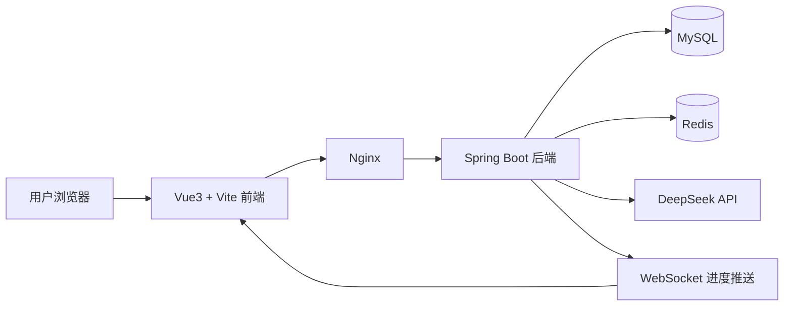

# InternPilot 项目全景复盘、架构理解与答辩/面试准备文档

## 1. 文档背景

InternPilot 智能实习领航员项目已经完成主要开发、部署和 Release 发布。当前系统已具备完整的前后端分离能力、AI 能力、权限体系、用户反馈体系和线上部署能力。

当前阶段不再以“继续堆功能”为主，而是进入：

```text
项目理解
  ↓
架构复盘
  ↓
答辩准备
  ↓
面试表达
  ↓
简历包装
  ↓
后续迭代规划
```

本文件用于帮助开发者系统掌握整个 InternPilot 项目，能够从项目背景、需求分析、架构设计、核心实现、测试部署、项目亮点、问题反思、后续优化等角度完整讲清楚项目。

---

## 2. 当前项目定位

### 2.1 项目名称

```text
InternPilot：智能实习领航员
```

也可以描述为：

```text
面向大学生的 AI 实习投递与简历优化平台
```

---

### 2.2 项目一句话介绍

InternPilot 是一个基于 Spring Boot + Vue3 + MySQL + Redis + Docker + DeepSeek API 构建的 AI 求职工作台，面向大学生实习求职场景，提供简历管理、岗位管理、AI 简历岗位匹配分析、岗位推荐、AI 面试题生成、RAG 岗位知识库问答、用户中心、管理员后台和用户反馈等功能。

---

### 2.3 项目解决的问题

当前大学生在找实习过程中常见问题包括：

```text
1. 不知道自己的简历和岗位要求是否匹配
2. 不知道简历应该怎么优化
3. 不知道哪些岗位更适合自己
4. 面试准备缺少针对性
5. 岗位信息和求职知识分散
6. 普通求职平台更偏信息展示，缺少个性化 AI 分析
```

InternPilot 试图解决的是：

```text
让学生能够基于自己的简历和目标岗位，获得 AI 驱动的求职分析、岗位推荐和面试准备建议。
```

---

## 3. 项目功能总览

### 3.1 普通用户功能

```text
1. 邮箱验证码注册
2. 邮箱 + 密码登录
3. 用户中心
4. 简历上传与管理
5. 岗位信息管理
6. AI 简历岗位匹配分析
7. WebSocket AI 分析进度展示
8. 全局 AI 任务中心
9. 岗位推荐
10. AI 面试题生成
11. RAG 岗位知识库问答
12. 用户反馈提交
```

---

### 3.2 管理员功能

```text
1. 管理员后台首页
2. 用户管理
3. 角色管理
4. 权限管理
5. 操作日志管理
6. RAG 知识库管理
7. 用户反馈管理
8. 系统数据查看
```

---

### 3.3 系统级能力

```text
1. JWT 登录认证
2. Spring Security 权限控制
3. RBAC 角色权限模型
4. Redis 缓存与验证码存储
5. WebSocket 实时任务进度
6. DeepSeek API 接入
7. Mock AI 测试能力
8. Docker Compose 部署
9. Nginx 前端部署与反向代理
10. MySQL 数据持久化
11. Git 分支开发与 Release 发布
```

---

## 4. 项目技术栈

### 4.1 后端技术栈

```text
Java 17
Spring Boot
Spring Security
MyBatis
MySQL
Redis
WebSocket
JWT
DeepSeek API
JUnit
Mockito / MockMvc
Gradle
Docker
```

---

### 4.2 前端技术栈

```text
Vue 3
Vite
TypeScript
Vue Router
Pinia
Element Plus
Axios
Nginx
```

---

### 4.3 部署技术栈

```text
Linux 服务器
Docker
Docker Compose
Nginx
MySQL 容器
Redis 容器
GitHub
Gitee
GitHub Release
```

---

## 5. 项目开发流程复盘

本项目可以按照完整软件开发生命周期进行复盘。

---

## 5.1 系统规划阶段

### 5.1.1 项目背景

大学生找实习时通常需要反复修改简历、筛选岗位、准备面试，但传统工具往往只提供岗位展示，缺少针对个人简历和岗位要求的智能分析。

InternPilot 以 AI 为核心，围绕“简历—岗位—分析—推荐—面试准备”形成完整闭环。

---

### 5.1.2 项目目标

```text
1. 帮助学生管理简历和岗位信息
2. 使用 AI 分析简历与岗位匹配度
3. 根据简历和岗位生成优化建议
4. 推荐更适合用户的实习岗位
5. 生成针对目标岗位的面试题
6. 提供 RAG 知识库问答能力
7. 提供管理员后台进行系统管理
8. 支持线上部署和演示
```

---

### 5.1.3 目标用户

```text
1. 普通学生用户
   - 上传简历
   - 管理岗位
   - 使用 AI 分析和推荐
   - 生成面试题
   - 提交反馈

2. 管理员
   - 管理用户
   - 管理角色和权限
   - 管理 RAG 知识库
   - 查看操作日志
   - 处理用户反馈
```

---

### 5.1.4 可行性分析

技术可行性：

```text
Spring Boot 适合构建后端 API 服务。
Vue3 适合构建前端交互页面。
MySQL 适合存储用户、简历、岗位、反馈等结构化数据。
Redis 适合存储验证码、任务状态和缓存。
DeepSeek API 可以提供 AI 文本生成能力。
Docker Compose 可以完成一体化部署。
```

时间可行性：

```text
项目按 docs/xx 设计文档逐步迭代，每一阶段聚焦一个功能模块，降低开发风险。
```

成本可行性：

```text
服务器、数据库、Redis、AI API 均可通过低成本方式部署和调用，适合作为学生项目。
```

团队能力可行性：

```text
项目采用主流 Java 全栈技术栈，适合软件工程学生学习和实践。
```

---

## 5.2 需求分析阶段

### 5.2.1 核心业务流程

#### 用户注册登录流程

```text
用户进入注册页
  ↓
输入邮箱和密码
  ↓
请求发送邮箱验证码
  ↓
后端生成验证码并存入 Redis
  ↓
QQ 邮箱 SMTP 发送验证码
  ↓
用户提交验证码
  ↓
后端校验验证码
  ↓
创建用户
  ↓
用户登录
  ↓
后端生成 JWT
  ↓
前端保存 token 并进入工作台
```

---

#### AI 简历岗位匹配分析流程

```text
用户上传简历
  ↓
用户创建或选择目标岗位
  ↓
点击 AI 分析
  ↓
后端创建分析任务
  ↓
WebSocket 推送任务进度
  ↓
后端构造 Prompt
  ↓
调用 DeepSeek API
  ↓
解析 AI 返回结果
  ↓
保存分析报告
  ↓
前端右下角任务中心提示完成
  ↓
用户查看分析报告
```

---

#### 岗位推荐流程

```text
用户选择简历
  ↓
点击生成岗位推荐
  ↓
前端创建全局 AI 任务
  ↓
后端读取简历和岗位信息
  ↓
调用 AI / 推荐逻辑
  ↓
返回推荐结果
  ↓
任务中心提示生成完成
  ↓
用户查看推荐岗位
```

---

#### 面试题生成流程

```text
用户选择简历和目标岗位
  ↓
点击生成面试题
  ↓
前端创建全局 AI 任务
  ↓
后端构造面试题 Prompt
  ↓
调用 DeepSeek
  ↓
解析并保存面试题
  ↓
任务中心提示完成
  ↓
用户查看面试题
```

---

#### 用户反馈流程

```text
用户点击反馈入口
  ↓
填写反馈类型、标题、内容
  ↓
提交反馈
  ↓
后端保存 user_feedback
  ↓
管理员后台查看反馈
  ↓
管理员修改状态或回复
```

---

## 5.3 系统设计阶段

### 5.3.1 总体架构

```text
浏览器
  ↓
Vue3 前端
  ↓
Nginx 反向代理
  ↓
Spring Boot 后端
  ↓
MySQL / Redis / DeepSeek API
```

---

### 5.3.2 架构图



---

### 5.3.3 后端分层设计

后端采用典型 Spring Boot 分层结构：

```text
controller
  接收 HTTP 请求，处理参数，返回统一响应

service
  编写业务逻辑，组织领域流程

mapper
  访问数据库

entity
  对应数据库表

dto
  接收前端请求参数

vo / response
  返回前端展示数据

config
  存放配置类，例如 Security、WebSocket、Redis

security
  处理 JWT、权限认证、用户身份解析

exception
  统一异常处理

common
  统一返回结果、分页结构、常量
```

---

### 5.3.4 前端分层设计

前端采用 Vue3 工程结构：

```text
views
  页面级组件

components
  可复用业务组件和通用组件

api
  封装后端接口请求

router
  前端路由配置

stores
  Pinia 全局状态管理

utils
  工具函数，例如 WebSocket、token、格式化

assets
  图片、图标、样式资源
```

---

### 5.3.5 数据库核心模块

主要表可以按领域分为：

```text
用户与权限：
- user
- role
- permission
- user_role
- role_permission

简历与岗位：
- resume
- resume_version
- job
- job_recommendation

AI 分析：
- analysis_task
- analysis_report

面试题：
- interview_question_report
- interview_question

RAG：
- rag_knowledge
- rag_document
- rag_chunk

系统管理：
- operation_log
- user_feedback
```

实际表名以项目代码为准。

---

## 6. 核心模块复盘

## 6.1 认证与登录模块

### 6.1.1 技术点

```text
Spring Security
JWT
Redis
QQ 邮箱 SMTP
BCrypt 密码加密
```

---

### 6.1.2 设计思路

登录认证采用 JWT 无状态认证。

流程：

```text
用户登录
  ↓
后端校验账号密码
  ↓
生成 JWT
  ↓
前端保存 token
  ↓
后续请求携带 Authorization Header
  ↓
后端 JWT Filter 解析 token
  ↓
设置 SecurityContext
  ↓
进入 Controller
```

---

### 6.1.3 面试讲法

可以这样讲：

```text
我在项目中使用 Spring Security + JWT 实现前后端分离认证。用户登录成功后，后端生成 JWT 返回给前端，前端在后续请求中通过 Authorization Header 携带 token。后端通过自定义 JWT 过滤器解析 token，获取用户身份和权限，并放入 SecurityContext。这样后端接口可以通过认证信息判断当前用户身份，并结合 RBAC 控制接口访问权限。
```

---

## 6.2 RBAC 权限模块

### 6.2.1 RBAC 模型

RBAC 的核心是：

```text
用户 User
  ↓
用户拥有角色 Role
  ↓
角色拥有权限 Permission
  ↓
权限控制接口和页面按钮
```

---

### 6.2.2 项目中的权限控制

后端：

```text
Spring Security + @PreAuthorize
```

前端：

```text
路由权限
菜单权限
按钮权限
```

---

### 6.2.3 权限示例

```text
admin:dashboard
user:read
user:update
role:read
role:update
permission:read
rag:read
rag:manage
operation-log:read
feedback:read
feedback:write
feedback:delete
```

---

### 6.2.4 面试讲法

```text
项目中我实现了 RBAC 权限模型。数据库中用户、角色、权限通过中间表建立多对多关系。后端接口使用 Spring Security 的 @PreAuthorize 进行权限校验，前端根据当前用户权限动态控制菜单和按钮显示。这样可以做到普通用户和管理员拥有不同的访问范围，同时避免只依赖前端隐藏菜单造成越权风险。
```

---

## 6.3 AI 简历分析模块

### 6.3.1 模块目标

AI 简历分析用于判断用户简历和目标岗位之间的匹配程度，并生成优化建议。

---

### 6.3.2 核心流程

```text
创建分析任务
  ↓
保存任务状态
  ↓
WebSocket 推送进度
  ↓
构造 Prompt
  ↓
调用 DeepSeek
  ↓
解析结果
  ↓
保存报告
  ↓
通知前端完成
```

---

### 6.3.3 为什么需要任务表

AI 分析是耗时操作，不能简单用同步接口处理。

任务表的作用：

```text
1. 保存任务状态
2. 支持页面刷新后查询任务
3. 支持 WebSocket 推送进度
4. 支持任务失败记录
5. 支持任务取消
6. 支持全局 AI 任务中心展示
```

---

### 6.3.4 面试讲法

```text
AI 分析属于耗时任务，如果直接同步等待，会导致用户体验差，也容易超时。因此我设计了 analysis_task 任务表，前端发起分析后，后端先创建任务并返回 taskNo，然后异步执行分析流程。执行过程中通过 WebSocket 推送 PENDING、PARSING_RESUME、BUILDING_CONTEXT、CALLING_AI、GENERATING_REPORT、SUCCESS、FAILED 等状态，前端根据状态实时更新进度条。后续又加入全局 AI 任务中心，使用户切换页面后任务状态仍然可见。
```

---

## 6.4 WebSocket AI 进度模块

### 6.4.1 使用原因

AI 任务不是瞬间完成的，用户需要知道当前进度。

WebSocket 适合：

```text
1. 实时推送任务状态
2. 避免前端频繁轮询
3. 提升用户等待体验
```

---

### 6.4.2 设计重点

```text
1. 后端任务状态变更时推送消息
2. 前端订阅对应任务
3. 页面进度条实时更新
4. Redis 保存任务状态作为兜底
5. 页面切换后任务中心继续显示
```

---

### 6.4.3 面试讲法

```text
我使用 WebSocket 实现 AI 分析进度实时展示。后端在任务执行的关键阶段发布进度消息，前端建立 WebSocket 连接并订阅任务状态。相比前端轮询，WebSocket 能减少无效请求，并且能让用户更及时地看到任务状态。为了避免页面切换导致状态丢失，我又把任务状态上移到 Pinia 全局任务中心，并使用 localStorage 做轻量持久化。
```

---

## 6.5 DeepSeek API 接入模块

### 6.5.1 设计目标

```text
1. 线上使用 DeepSeek 真接口
2. 测试环境保留 MockAiClient
3. 不在代码中硬编码 API Key
4. 不同 AI 场景可以使用不同 Prompt
5. 为后续模型路由预留扩展空间
```

---

### 6.5.2 Provider 设计思想

AI 调用应该抽象为接口：

```text
AiClient
  ↓
DeepSeekAiClient
  ↓
MockAiClient
```

这样可以实现：

```text
1. 测试环境用 Mock
2. 生产环境用 DeepSeek
3. 后续接入其他模型时不影响业务层
```

---

### 6.5.3 面试讲法

```text
我没有把 DeepSeek 调用直接写死在业务代码里，而是抽象了 AI Client。线上配置使用 DeepSeekAiClient，测试环境可以切换到 MockAiClient。这样做的好处是业务层不依赖具体模型供应商，后续如果接入其他大模型，可以通过新增 Provider 实现扩展。同时 API Key 通过环境变量配置，避免泄露到代码仓库。
```

---

## 6.6 RAG 岗位知识库模块

### 6.6.1 RAG 的作用

RAG 用于让系统基于已有岗位知识库和文档进行问答，而不是完全依赖模型自身记忆。

---

### 6.6.2 基本流程

```text
管理员上传知识文档
  ↓
后端解析文档
  ↓
切分 chunk
  ↓
存储知识片段
  ↓
用户提问
  ↓
检索相关 chunk
  ↓
拼接上下文
  ↓
调用 DeepSeek
  ↓
返回问答结果
```

---

### 6.6.3 面试讲法

```text
RAG 模块的核心思路是先把岗位相关知识文档解析并切分成 chunk，用户提问时先检索相关知识片段，再把检索结果和用户问题一起构造成 Prompt 发送给大模型。这样可以让回答更贴近系统知识库内容，而不是完全依赖模型自身知识。
```

---

## 6.7 全局 AI 任务中心模块

### 6.7.1 解决的问题

原本 AI 分析、岗位推荐、面试题生成等功能的 loading 状态只保存在页面组件里。用户切换页面后，组件卸载，任务状态就会消失。

全局 AI 任务中心解决：

```text
1. 页面切换后任务状态不丢失
2. 任务完成后右下角通知
3. 用户可以查看结果
4. 用户可以停止或放弃任务
5. 多个 AI 任务可以统一管理
```

---

### 6.7.2 设计思路

前端：

```text
Pinia aiTaskCenter Store
  ↓
localStorage 轻量持久化
  ↓
AiTaskFloat 右下角入口
  ↓
AiTaskDrawer 任务列表
```

后端：

```text
复用 analysis_task
支持 running / recent / cancel 接口
```

---

### 6.7.3 面试讲法

```text
我在项目后期发现 AI 功能存在一个体验问题：用户切换页面后，页面内 loading 状态会丢失。为了解决这个问题，我设计了全局 AI 任务中心，把任务状态从页面组件上移到 Pinia 全局 Store，并使用 localStorage 做轻量持久化。对于已有后端任务的 AI 分析，任务中心会同步后端任务状态；对于岗位推荐和面试题生成，先通过前端任务追踪实现体验统一。这样用户在任意页面都能看到 AI 任务进度，并在完成后收到右下角通知。
```

---

## 6.8 用户反馈模块

### 6.8.1 模块价值

用户反馈模块让系统形成产品闭环：

```text
用户发现问题
  ↓
提交反馈
  ↓
管理员查看
  ↓
处理或回复
  ↓
后续迭代优化
```

---

### 6.8.2 设计内容

普通用户：

```text
提交反馈
查看我的反馈
查看反馈详情
```

管理员：

```text
查看全部反馈
筛选反馈
修改状态
回复反馈
删除无效反馈
```

---

### 6.8.3 面试讲法

```text
用户反馈功能是为了让系统具备真实产品的迭代闭环。普通用户可以在使用过程中提交功能异常、使用建议、AI 结果不准确等反馈，系统会自动记录反馈类型、标题、内容、当前页面和浏览器信息。管理员可以在后台查看、处理和回复反馈。这个模块不仅提升用户体验，也能为后续产品迭代提供依据。
```

---

## 6.9 Docker 部署模块

### 6.9.1 部署结构

线上部署使用 Docker Compose 管理：

```text
frontend
backend
mysql
redis
```

---

### 6.9.2 请求链路

```text
用户浏览器
  ↓
Nginx 前端服务
  ↓
/api 反向代理到 Spring Boot
  ↓
Spring Boot 访问 MySQL / Redis / DeepSeek
```

---

### 6.9.3 重要经验

```text
Docker MySQL 使用 volume 后，init.sql 只会在第一次初始化时执行。
后续新增表、字段、权限，不能只改 init.sql，必须手动执行 migration SQL。
```

---

### 6.9.4 面试讲法

```text
项目使用 Docker Compose 部署，包含前端 Nginx、后端 Spring Boot、MySQL 和 Redis 四个服务。前端构建后由 Nginx 提供静态资源，并将 /api 请求反向代理到后端。后端通过环境变量读取数据库、Redis、DeepSeek API Key、邮箱授权码等配置。部署过程中我也处理了 MySQL volume 导致 init.sql 不重复执行的问题，后续数据库变更通过迁移 SQL 处理。
```

---

## 7. 项目亮点总结

### 7.1 技术亮点

```text
1. Spring Boot + Vue3 前后端分离架构
2. Spring Security + JWT + RBAC 权限控制
3. DeepSeek API 接入真实 AI 能力
4. WebSocket 实时展示 AI 分析进度
5. Redis 存储验证码和任务状态
6. RAG 岗位知识库问答
7. 全局 AI 任务中心优化长任务体验
8. Docker Compose 一体化部署
9. 管理员后台与权限控制
10. 用户反馈闭环
```

---

### 7.2 产品亮点

```text
1. 面向大学生实习求职，场景明确
2. 从简历、岗位、分析、推荐到面试题形成闭环
3. AI 长任务体验接近真实产品
4. 反馈系统支持后续迭代
5. 单管理员策略避免公开演示账号风险
6. 前端界面经过整体优化
```

---

### 7.3 工程亮点

```text
1. 使用 docs/xx 设计文档驱动开发
2. 使用 feature 分支进行功能隔离
3. 使用 dev 分支集成，main 分支发布
4. Trae + DeepSeek Pro 实现，Codex 复查修复
5. Mock 仅用于测试，线上使用真实 DeepSeek
6. 发布 Release 并打版本标签
7. README、部署文档、验收文档完整
```

---

## 8. 项目不足与后续优化方向

### 8.1 当前不足

```text
1. AI 结果质量仍依赖 Prompt 和模型稳定性
2. 岗位推荐和面试题生成还没有完全后端异步任务化
3. RAG 检索能力仍可以进一步优化
4. 缺少完整 CI/CD 自动部署流水线
5. 缺少更完善的运行监控和告警
6. 缺少 PDF 导出等结果沉淀能力
7. 移动端适配可以继续优化
```

---

### 8.2 后续优化方向

建议优先级：

```text
1. AI Prompt 优化和模型路由
2. AI 分析报告导出 PDF
3. Spring Boot Actuator 运行监控
4. CI/CD 自动部署
5. 统一后端 AI 任务表
6. 用户反馈数据统计
7. 投递进度看板
8. 简历优化版本对比
```

---

## 9. 答辩准备

## 9.1 30 秒项目介绍

```text
InternPilot 是一个面向大学生实习求职的 AI 求职工作台，使用 Spring Boot + Vue3 + MySQL + Redis + Docker + DeepSeek API 构建。系统支持邮箱验证码注册登录、简历管理、岗位管理、AI 简历岗位匹配分析、岗位推荐、AI 面试题生成、RAG 岗位知识库问答、全局 AI 任务中心、用户反馈和管理员后台。项目已经完成 Docker 部署和线上访问。
```

---

## 9.2 1 分钟项目介绍

```text
我的项目叫 InternPilot，定位是面向大学生的 AI 实习投递与简历优化平台。它解决的是学生找实习时不知道简历和岗位是否匹配、如何优化简历、如何准备面试的问题。

系统采用 Spring Boot + Vue3 前后端分离架构，后端使用 MySQL 存储业务数据，Redis 存储验证码和任务状态，使用 Spring Security + JWT + RBAC 做认证和权限控制。AI 能力通过 DeepSeek API 实现，包括简历岗位匹配分析、岗位推荐、面试题生成和 RAG 问答。

项目还实现了 WebSocket AI 分析进度展示和全局 AI 任务中心，用户切换页面后任务状态不会丢失，任务完成后会在右下角通知。系统也有管理员后台和用户反馈模块，已经通过 Docker Compose 部署到服务器。
```

---

## 9.3 3 分钟答辩讲稿结构

```text
1. 项目背景
   大学生实习求职过程中存在简历优化难、岗位匹配难、面试准备难的问题。

2. 项目目标
   构建一个 AI 求职工作台，围绕简历、岗位、分析、推荐、面试准备形成闭环。

3. 技术架构
   后端 Spring Boot，前端 Vue3，数据库 MySQL，缓存 Redis，AI 使用 DeepSeek，部署使用 Docker Compose。

4. 核心功能
   邮箱注册登录、用户中心、简历管理、岗位管理、AI 分析、岗位推荐、面试题生成、RAG 问答、管理员后台、用户反馈。

5. 技术亮点
   RBAC 权限控制、WebSocket AI 进度、全局 AI 任务中心、DeepSeek 接入、RAG、Docker 部署。

6. 项目成果
   系统已完成线上部署和 Release 发布，支持真实 DeepSeek 调用。

7. 后续优化
   继续优化 Prompt、模型路由、PDF 导出、CI/CD 和运行监控。
```

---

## 10. 面试高频问题准备

### 10.1 你这个项目是做什么的？

回答：

```text
这是一个面向大学生实习求职的 AI 求职工作台。用户可以上传简历、管理岗位，然后使用 AI 分析简历和岗位的匹配度，生成优化建议，也可以生成岗位推荐和面试题。系统还支持 RAG 岗位知识库问答、用户反馈和管理员后台。
```

---

### 10.2 为什么选择 Spring Boot + Vue3？

回答：

```text
Spring Boot 适合快速构建企业级后端服务，生态完善，和 Spring Security、MyBatis、Redis、WebSocket 集成方便。Vue3 适合构建前后端分离的交互页面，配合 Vite、Pinia、Element Plus 可以快速完成后台系统和用户工作台。这个组合适合中小型全栈项目，也符合企业常见技术栈。
```

---

### 10.3 JWT 登录流程怎么实现？

回答：

```text
用户登录时，后端校验邮箱和密码，校验通过后生成 JWT 返回给前端。前端保存 token，之后每次请求都在 Authorization Header 中携带 token。后端通过 JWT Filter 解析 token，获取用户 ID 和权限信息，并设置到 SecurityContext 中。接口再结合 Spring Security 判断是否允许访问。
```

---

### 10.4 RBAC 是怎么做的？

回答：

```text
项目中有用户表、角色表、权限表，以及用户角色关系表和角色权限关系表。用户登录后，后端查询用户拥有的角色和权限，生成认证信息。后端接口使用 @PreAuthorize 控制权限，前端根据权限动态显示菜单和按钮。这样普通用户和管理员可以访问不同的功能。
```

---

### 10.5 WebSocket 在项目里解决了什么问题？

回答：

```text
AI 分析是耗时任务，如果用户只看到一个 loading，会不知道执行到了哪一步。所以我使用 WebSocket 推送 AI 分析进度。后端在解析简历、构建上下文、调用 AI、生成报告等阶段推送状态，前端实时更新进度条。这样提升了等待体验。
```

---

### 10.6 为什么需要全局 AI 任务中心？

回答：

```text
最初 AI 任务的状态保存在页面组件里，用户切换页面后组件卸载，任务状态就会消失。为了解决这个问题，我把任务状态上移到 Pinia 全局 Store，并用 localStorage 做轻量持久化。同时结合后端任务状态查询和 WebSocket，用户在任意页面都可以看到任务进度，任务完成后右下角会提示查看结果。
```

---

### 10.7 DeepSeek API 是怎么接入的？

回答：

```text
项目中把 AI 调用抽象成 AiClient 接口，生产环境使用 DeepSeekAiClient，测试环境使用 MockAiClient。业务层不直接依赖具体模型实现，这样方便测试，也方便后续扩展其他模型。API Key 通过环境变量注入，避免写死在代码里。
```

---

### 10.8 RAG 是什么？你项目里怎么做的？

回答：

```text
RAG 是检索增强生成，核心思路是在调用大模型之前，先从知识库中检索相关内容，再把检索结果和用户问题一起放入 Prompt。我的项目中管理员可以维护岗位知识库，系统将文档切分成知识片段，用户提问时检索相关片段，再调用 DeepSeek 生成回答。
```

---

### 10.9 Redis 在项目里用来做什么？

回答：

```text
Redis 主要用于邮箱验证码存储、验证码过期控制、AI 任务状态缓存以及部分业务缓存。比如用户注册时，后端生成验证码后存入 Redis，并设置过期时间，注册时再从 Redis 中取出验证码进行校验。
```

---

### 10.10 Docker 部署过程中遇到过什么问题？

回答：

```text
一个典型问题是 MySQL 容器使用 volume 后，init.sql 只会在数据库首次初始化时执行。后续如果新增表或权限，单纯修改 init.sql 不会影响已有线上数据库。解决方案是编写 migration SQL，在部署时手动执行数据库迁移，并在部署文档中明确记录这个注意事项。
```

---

## 11. 简历写法建议

### 11.1 简历项目描述

```text
InternPilot 智能实习领航员：基于 Spring Boot + Vue3 + MySQL + Redis + Docker + DeepSeek API 的 AI 实习投递与简历优化平台，面向大学生实习求职场景，提供简历管理、岗位管理、AI 简历岗位匹配分析、岗位推荐、AI 面试题生成、RAG 岗位知识库问答、用户反馈和管理员后台等功能。
```

---

### 11.2 简历项目亮点

```text
- 使用 Spring Security + JWT + RBAC 实现登录认证、角色权限、菜单权限和接口权限控制
- 接入 DeepSeek API，实现简历岗位匹配分析、岗位推荐、AI 面试题生成和 RAG 问答
- 使用 WebSocket 实现 AI 分析任务实时进度推送，并设计全局 AI 任务中心解决页面切换后任务状态丢失问题
- 使用 Redis 实现邮箱验证码存储、过期控制和 AI 任务状态缓存
- 使用 Docker Compose 部署 Spring Boot、Vue/Nginx、MySQL、Redis，实现服务器在线访问
- 实现管理员后台、操作日志、用户反馈模块，形成完整系统管理与产品迭代闭环
```

---

## 12. 当前阶段学习重点

项目完成后，建议按以下顺序学习和复盘：

```text
1. 完整跑通项目所有核心流程
2. 画出系统架构图
3. 画出登录认证流程图
4. 画出 AI 分析任务流程图
5. 画出 RBAC 权限模型
6. 画出 Docker 部署结构
7. 整理 10 个面试问题
8. 整理 3 分钟答辩讲稿
9. 准备 README 和截图
10. 规划下一轮技术优化
```

---

## 13. 后续文档建议

完成本文档后，建议下一阶段文档为：

```text
docs/42-ai-model-router-and-prompt-optimization-design.md
```

目标：

```text
1. Prompt 版本管理
2. AI 场景枚举增强
3. 模型路由策略
4. DeepSeek Flash / Pro 场景区分
5. AI 结果质量评分
6. 失败重试与降级策略
7. Prompt 调试日志
8. 多模型 Provider 扩展预留
```

再下一阶段可以做：

```text
docs/43-spring-boot-engineering-enhancement-design.md
```

目标：

```text
1. Spring Boot Actuator
2. 接口耗时统计
3. AOP 操作日志增强
4. 统一参数校验
5. 缓存注解优化
6. 定时任务清理
7. 健康检查接口
8. 生产环境可观测性
```

---
